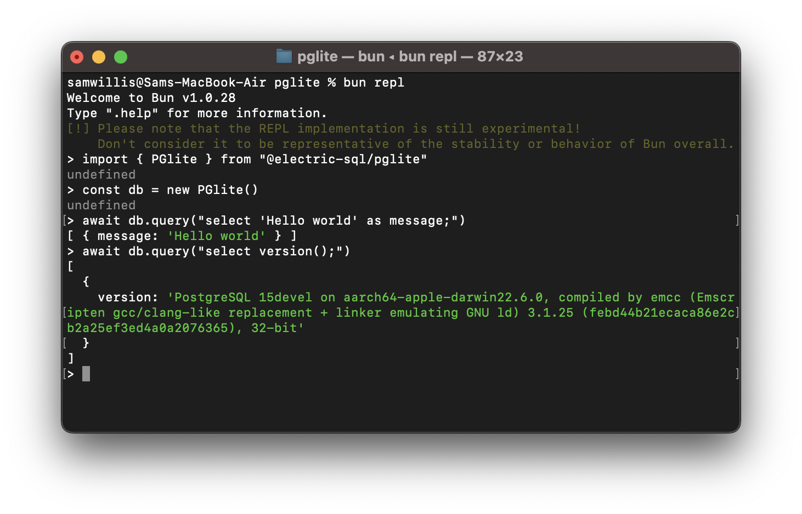

# PGlite - Postgres in WASM



PGlite is a WASM Postgres build packaged into a TypeScript client library that enables you to run Postgres in the browser, Node.js and Bun, with no need to install any other dependencies. It is only 3.7mb gzipped.

```js
import { PGlite } from "@electric-sql/pglite"

const db = new PGlite()
await db.query("select 'Hello world' as message;")
// -> [ { message: "Hello world" } ]
```

It can be used both as an ephemeral in-memory database or with persistance to the file system (Node/Bun) or indexedDB (Browser).

Unlike previous "Postgres in the browser" projects, PGlite does not use a Linux virtual machine - it is simply Postgres in WASM.

It is being developed at [ElectricSQL](http://electric-sql.com) in collaboration with [Neon](http://neon.tech). We plan to continue to build on this experiment, and aim to create a fully capable lightweight WASM Postgres with support for extensions such as pgvector.

## Node/Bun

Install into your project:

```sh
npm install @electric-sql/pglite
```

To use the in-memory Postgres:

```js
import { PGlite } from "@electric-sql/pglite"

const db = new PGlite()
await db.query("select 'Hello world' as message;")
// -> [ { message: "Hello world" } ]
```

or to persist to the filesystem:

```js
const db = new PGlite('./path/to/pgdata')
```

## Browser

It can be loaded via JSDeliver or your usual package manager, and for an in-memory Postgres:

```html
<script type="module">
import { PGlite } from "https://cdn.jsdelivr.net/npm/@electric-sql/pglite/dist/index.js";

const db = new PGlite()
await db.query("select 'Hello world' as message;")
// -> [ { message: "Hello world" } ]
</script>
```

or to persist the database to indexedDB:

```js
const db = new PGlite('idb://my-pgdata')
```

## Deno

To use the in-memory Postgres, create a file `server.ts`:

```ts
import { PGlite } from "npm:@electric-sql/pglite"

Deno.serve(async (_request: Request) => {
  const db = new PGlite()
  const query = await db.query("select 'Hello world' as message;")

  return new Response(JSON.stringify(query))
})
```

Then run the file with `deno run --allow-net --allow-read  server.ts`.

## Limitations

Parameterized queries are not currently supported, but this will be added soon.

## Building

There are a couple of prerequisites:

- the Postgres build toolchain - https://www.postgresql.org/download/
- emscripten version 3.1.25 - https://emscripten.org/docs/getting_started/downloads.html

To build, checkout the repo, then:

```
git submodule update --init
cd ./pglite/packages/pglite
emsdk install 3.1.25
emsdk activate 3.1.25
pnpm install
pnpm build
```

## Acknowledgments

PGlite builds on the work of [Stas Kelvich](https://github.com/kelvich) of [Neon](https://neon.tech) in this [Postgres fork](https://github.com/electric-sql/postgres-wasm).

## License

PGlite is dual licensed under the terms of the [Apache License 2.0](./LICENSE) and the [PostgreSQL License](./POSTGRES-LICENSE), you can choose which you prefer.

Changes to the [Postgres source](https://github.com/electric-sql/postgres-wasm) are licensed under the PostgreSQL License.
