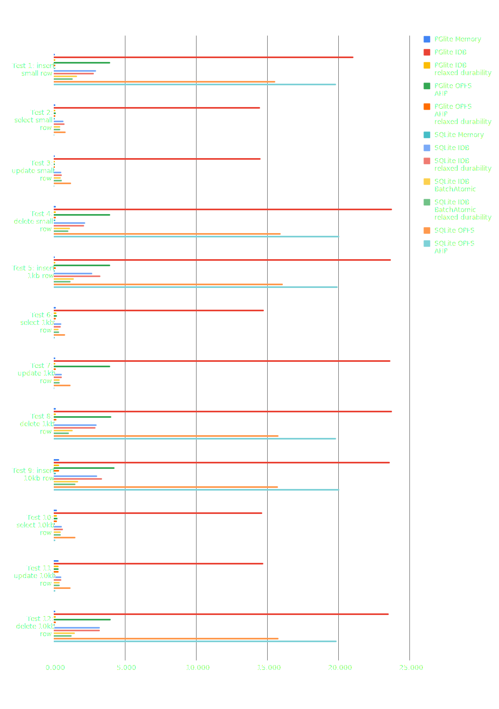
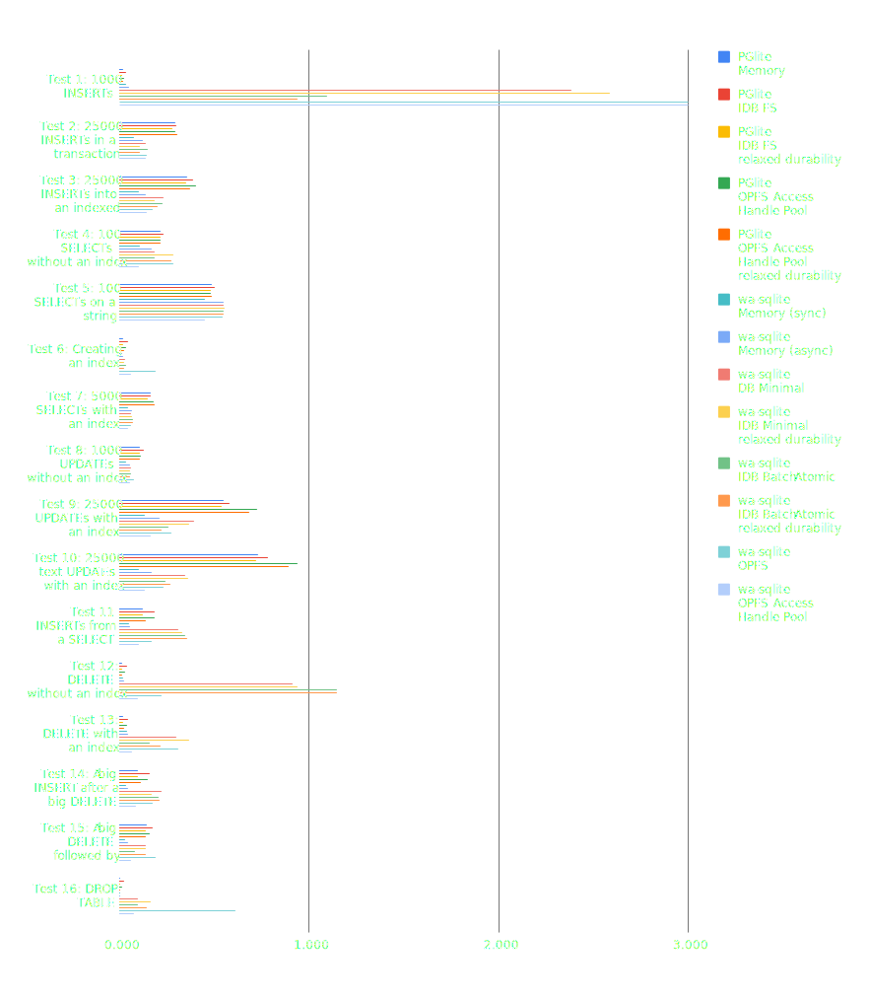
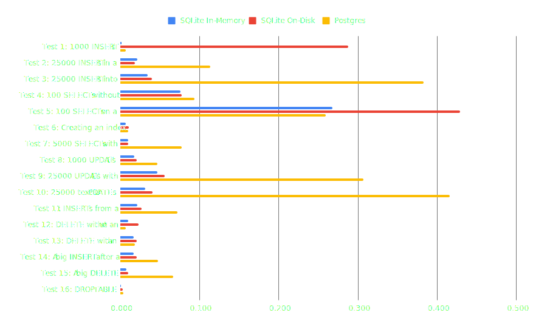

<style scoped>
  table :is(td, th) {
    white-space: nowrap;
  }
  thead th {
    vertical-align: top;
  }
  thead th:first-child {
    vertical-align: middle;
  }
  tbody td {
    text-align: right;
  }
  tbody td:first-child {
    text-align: left;
  }
</style>

# Benchmarks

There are two sets of micro-benchmarks: one testing [round trip time](#round-trip-time-benchmarks) for both PGlite and wa-sqlite, and [another](#sqlite-benchmark-suite) the other based on the [SQLite speed test](https://sqlite.org/src/file?name=tool/speedtest.tcl&ci=trunk) which was ported for the [wa-sqlite benchmarks](https://rhashimoto.github.io/wa-sqlite/demo/benchmarks.html).

We also have a set of [native baseline](#native-baseline) results comparing native SQLite (via the Node better-sqlite3 package) to full Postgres.

Comparing Postgres to SQlite is challenging, as they are quite different databases, particularly when you take into account the complexities of WASM. Therefore, these benchmarks provide a view of performance only as a starting point to investigate the difference between the two, and the improvements we can make going forward.

Another consideration when analysing the speed, is the performance of the various different VFS implementations providing persistance to both PGlite and wa-sqlite.

The key findings are:

1. wa-sqlite is faster than PGlite when run purely in memory. This is to be expected as it's a simpler database with fewer features; it's designed to go fast. Having said that, PGlite is not slow; it's well within the range you would expect when [comparing native SQLite to Postgres](#native-baseline).

2. For single row CRUD inserts and updates, PGlite is faster then wa-sqlite. This is likely due to PGlite using the Postgres WAL, whereas wa-sqlite is only using the SQLite rollback journal mode and not a WAL.

3. An fsync or flush to the underlying storage can be quite slow, particularly in the browser with IndexedDB for PGlite, or OPFS for wa-sqlite. Both offer some level of "relaxed durability" that can be used to accelerate these queries, and this mode is likely suitable for many embedded use cases.

We plan to continue to use these micro-benchmarks to feed back into the development of PGlite, and update them, and the findings, as we move forward.

These results below were run on an M2 Macbook Air.

## Round-trip-time benchmarks

These tests run a series of inserts/updates/deletes to find the average time to execute the type of CRUD operations that are regularly used in an app.

Values are average ms - lower is better.



| Test                     | PGlite Memory | PGlite IDB | PGlite IDB<br>_relaxed durability_ | PGlite OPFS AHP | PGlite OPFS AHP<br>_relaxed durability_ | SQLite Memory | SQLite IDB | SQLite IDB<br>_relaxed durability_ | SQLite IDB BatchAtomic | SQLite IDB BatchAtomic<br>_relaxed durability_ | SQLite OPFS | SQLite OPFS AHP |
| ------------------------ | ------------- | ---------- | ---------------------------------- | --------------- | --------------------------------------- | ------------- | ---------- | ---------------------------------- | ---------------------- | ---------------------------------------------- | ----------- | --------------- |
| Test 1: insert small row | 0.058         | 21.041     | 0.085                              | 3.946           | 0.079                                   | 0.083         | 2.948      | 2.813                              | 1.627                  | 1.321                                          | 15.535      | 19.816          |
| Test 2: select small row | 0.088         | 14.49      | 0.108                              | 0.126           | 0.082                                   | 0.042         | 0.673      | 0.744                              | 0.423                  | 0.458                                          | 0.819       | 0.03            |
| Test 3: update small row | 0.073         | 14.518     | 0.074                              | 0.076           | 0.071                                   | 0.036         | 0.524      | 0.538                              | 0.467                  | 0.546                                          | 1.185       | 0.016           |
| Test 4: delete small row | 0.145         | 23.746     | 0.142                              | 3.949           | 0.15                                    | 0.1           | 2.196      | 2.111                              | 1.118                  | 0.999                                          | 15.954      | 20.04           |
| Test 5: insert 1kb row   | 0.075         | 23.679     | 0.08                               | 3.963           | 0.115                                   | 0.04          | 2.701      | 3.247                              | 1.394                  | 1.16                                           | 16.072      | 19.934          |
| Test 6: select 1kb row   | 0.14          | 14.752     | 0.17                               | 0.192           | 0.131                                   | 0.034         | 0.505      | 0.475                              | 0.334                  | 0.35                                           | 0.801       | 0.071           |
| Test 7: update 1kb row   | 0.1           | 23.659     | 0.105                              | 3.959           | 0.121                                   | 0.022         | 0.549      | 0.539                              | 0.384                  | 0.383                                          | 1.171       | 0.017           |
| Test 8: delete 1kb row   | 0.125         | 23.752     | 0.124                              | 4.03            | 0.166                                   | 0.037         | 2.979      | 2.933                              | 1.314                  | 1.068                                          | 15.787      | 19.827          |
| Test 9: insert 10kb row  | 0.345         | 23.604     | 0.348                              | 4.251           | 0.363                                   | 0.122         | 3.02       | 3.371                              | 1.683                  | 1.501                                          | 15.74       | 20.041          |
| Test 10: select 10kb row | 0.2           | 14.656     | 0.192                              | 0.246           | 0.207                                   | 0.049         | 0.551      | 0.613                              | 0.482                  | 0.489                                          | 1.521       | 0.091           |
| Test 11: update 10kb row | 0.326         | 14.731     | 0.306                              | 0.328           | 0.325                                   | 0.072         | 0.506      | 0.504                              | 0.419                  | 0.418                                          | 1.182       | 0.083           |
| Test 12: delete 10kb row | 0.105         | 23.524     | 0.124                              | 3.981           | 0.134                                   | 0.039         | 3.24       | 3.214                              | 1.481                  | 1.238                                          | 15.794      | 19.884          |

## SQLite benchmark suite

The SQLite benchmark suite, converted to web for wa-sqlite - it performs a number of large queries to test the performance of the sql engine.

Values are seconds to complete the test - lower is better.



| Test                                                 | PGlite<br>Memory | PGlite<br>IDB FS | PGlite<br>IDB FS<br>_relaxed durability_ | PGlite<br>OPFS Access Handle Pool | PGlite<br>OPFS Access Handle Pool<br>_relaxed durability_ | wa-sqlite<br>Memory (sync) | wa-sqlite<br>Memory (async) | wa-sqlite<br>DB Minimal | wa-sqlite<br>IDB Minimal<br>_relaxed durability_ | wa-sqlite<br>IDB Batch Atomic | wa-sqlite<br>IDB Batch Atomic<br>_relaxed durability_ | wa-sqlite<br>OPFS | wa-sqlite<br>OPFS Access Handle Pool |
| ---------------------------------------------------- | ---------------- | ---------------- | ---------------------------------------- | --------------------------------- | --------------------------------------------------------- | -------------------------- | --------------------------- | ----------------------- | ------------------------------------------------ | ----------------------------- | ----------------------------------------------------- | ----------------- | ------------------------------------ |
| Test 1: 1000 INSERTs                                 | 0.016            | 0.035            | 0.015                                    | 0.025                             | \\                                                        | 0.035                      | 0.051                       | 2.384                   | 2.588                                            | 1.094                         | 0.939                                                 | 18.847            | 24.67                                |
| Test 2: 25000 INSERTs in a transaction               | 0.292            | 0.299            | 0.278                                    | 0.296                             | 0.304                                                     | 0.077                      | 0.12                        | 0.14                    | 0.105                                            | 0.15                          | 0.107                                                 | 0.141             | 0.137                                |
| Test 3: 25000 INSERTs into an indexed table          | 0.355            | 0.388            | 0.351                                    | 0.402                             | 0.374                                                     | 0.1                        | 0.138                       | 0.23                    | 0.185                                            | 0.228                         | 0.198                                                 | 0.174             | 0.143                                |
| Test 4: 100 SELECTs without an index                 | 0.218            | 0.229            | 0.217                                    | 0.215                             | 0.215                                                     | 0.104                      | 0.17                        | 0.185                   | 0.281                                            | 0.185                         | 0.275                                                 | 0.285             | 0.103                                |
| Test 5: 100 SELECTs on a string comparison           | 0.485            | 0.504            | 0.482                                    | 0.482                             | 0.484                                                     | 0.451                      | 0.546                       | 0.549                   | 0.553                                            | 0.546                         | 0.548                                                 | 0.545             | 0.452                                |
| Test 6: Creating an index                            | 0.018            | 0.043            | 0.018                                    | 0.035                             | 0.022                                                     | 0.012                      | 0.016                       | 0.031                   | 0.024                                            | 0.033                         | 0.024                                                 | 0.191             | 0.061                                |
| Test 7: 5000 SELECTs with an index                   | 0.162            | 0.163            | 0.149                                    | 0.178                             | 0.183                                                     | 0.042                      | 0.064                       | 0.06                    | 0.067                                            | 0.071                         | 0.068                                                 | 0.061             | 0.044                                |
| Test 8: 1000 UPDATEs without an index                | 0.106            | 0.129            | 0.104                                    | 0.113                             | 0.108                                                     | 0.032                      | 0.055                       | 0.062                   | 0.057                                            | 0.059                         | 0.056                                                 | 0.077             | 0.053                                |
| Test 9: 25000 UPDATEs with an index                  | 0.547            | 0.579            | 0.537                                    | 0.727                             | 0.685                                                     | 0.131                      | 0.211                       | 0.391                   | 0.364                                            | 0.258                         | 0.219                                                 | 0.274             | 0.163                                |
| Test 10: 25000 text UPDATEs with an index            | 0.729            | 0.781            | 0.72                                     | 0.936                             | 0.894                                                     | 0.101                      | 0.168                       | 0.348                   | 0.362                                            | 0.244                         | 0.267                                                 | 0.23              | 0.132                                |
| Test 11: INSERTs from a SELECT                       | 0.123            | 0.182            | 0.123                                    | 0.186                             | 0.14                                                      | 0.047                      | 0.057                       | 0.311                   | 0.33                                             | 0.347                         | 0.358                                                 | 0.171             | 0.102                                |
| Test 12: DELETE without an index                     | 0.014            | 0.038            | 0.014                                    | 0.027                             | 0.015                                                     | 0.02                       | 0.023                       | 0.915                   | 0.936                                            | 1.148                         | 1.146                                                 | 0.222             | 0.094                                |
| Test 13: DELETE with an index                        | 0.02             | 0.043            | 0.02                                     | 0.039                             | 0.024                                                     | 0.038                      | 0.044                       | 0.298                   | 0.365                                            | 0.161                         | 0.217                                                 | 0.31              | 0.065                                |
| Test 14: A big INSERT after a big DELETE             | 0.096            | 0.158            | 0.097                                    | 0.148                             | 0.112                                                     | 0.036                      | 0.045                       | 0.221                   | 0.169                                            | 0.207                         | 0.21                                                  | 0.175             | 0.084                                |
| Test 15: A big DELETE followed by many small INSERTs | 0.141            | 0.174            | 0.14                                     | 0.161                             | 0.14                                                      | 0.031                      | 0.043                       | 0.138                   | 0.138                                            | 0.083                         | 0.137                                                 | 0.189             | 0.058                                |
| Test 16: DROP TABLE                                  | 0.004            | 0.025            | 0.002                                    | 0.012                             | 0.004                                                     | 0.003                      | 0.002                       | 0.096                   | 0.163                                            | 0.098                         | 0.144                                                 | 0.61              | 0.077                                |

## Native baseline

All tests run with Node, [Better-SQLite3](https://www.npmjs.com/package/better-sqlite3) and [node-postgres](https://www.npmjs.com/package/pg) (via [embedded-postgres](https://github.com/leinelissen/embedded-postgres))



| Test                                                 | SQLite In-Memory | SQLite On-Disk | Postgres |
| ---------------------------------------------------- | ---------------- | -------------- | -------- |
| Test 1: 1000 INSERTs                                 | 0.002            | 0.288          | 0.007    |
| Test 2: 25000 INSERTs in a transaction               | 0.022            | 0.019          | 0.114    |
| Test 3: 25000 INSERTs into an indexed table          | 0.035            | 0.04           | 0.383    |
| Test 4: 100 SELECTs without an index                 | 0.076            | 0.078          | 0.094    |
| Test 5: 100 SELECTs on a string comparison           | 0.268            | 0.429          | 0.259    |
| Test 6: Creating an index                            | 0.007            | 0.011          | 0.01     |
| Test 7: 5000 SELECTs with an index                   | 0.01             | 0.01           | 0.078    |
| Test 8: 1000 UPDATEs without an index                | 0.018            | 0.021          | 0.047    |
| Test 9: 25000 UPDATEs with an index                  | 0.047            | 0.056          | 0.307    |
| Test 10: 25000 text UPDATEs with an index            | 0.032            | 0.041          | 0.416    |
| Test 11: INSERTs from a SELECT                       | 0.022            | 0.027          | 0.072    |
| Test 12: DELETE without an index                     | 0.01             | 0.023          | 0.007    |
| Test 13: DELETE with an index                        | 0.017            | 0.021          | 0.019    |
| Test 14: A big INSERT after a big DELETE             | 0.017            | 0.021          | 0.048    |
| Test 15: A big DELETE followed by many small INSERTs | 0.008            | 0.01           | 0.067    |
| Test 16: DROP TABLE                                  | 0.001            | 0.003          | 0.004    |

## Run the benchmarks yourself

We have a hosted version of the benchmark runners that you can run yourself:

- <a href="./benchmark/" target="_blank">Benchmark using the SQLite benchmark suite</a>
- <a href="./benchmark/rtt.html" target="_blank">Benchmark round-trim-time for CRUD queries</a>

Additionally, to run the native baseline, checkout the [PGlite monorepo](https://github.com/electric-sql/pglite), then:

```sh
cd ./packages/benchmark
pnpm install
npx tsx baseline.ts
```
