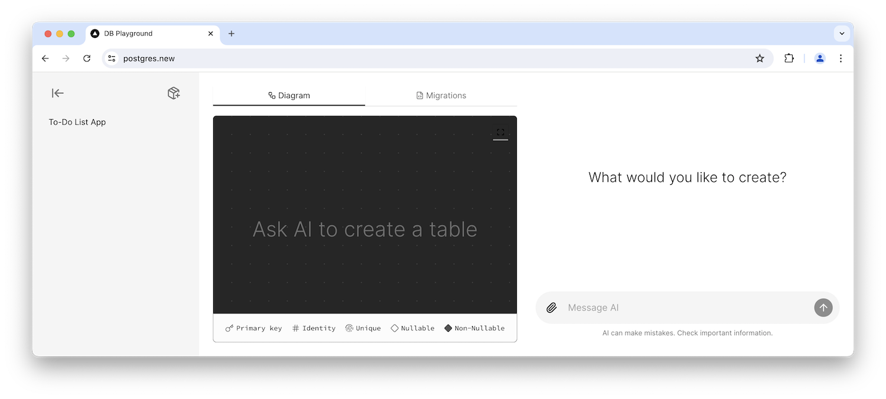

---
# https://vitepress.dev/reference/default-theme-home-page
layout: home

hero:
  name: 'PGlite'
  text: 'Embeddable Postgres'
  tagline: 'Run a full Postgres database locally in your app with reactivity and server sync'
  actions:
    - theme: brand
      text: Getting Started
      link: /docs/
    - theme: alt
      text: About
      link: /docs/about
    - theme: alt
      text: GitHub
      link: https://github.com/electric-sql/pglite
    - theme: alt
      text: Discord
      link: https://discord.com/channels/933657521581858818/1212676471588520006

features:
  - title: Lightweight
    details: A complete WASM build of Postgres that's under 3MB Gzipped.
  - title: Extendable
    details: Dynamic extension loading mechanism, including support for pgvector and PostGIS.
  - title: Reactive
    details: Built in support for data loading, synchronisation and live query primitives.
---

<!-- 

  

    <h3>Experience <a href="https://postgres.new">postgres.new</a></h3>
    
An AI Postgres assistant  built on PGlite.

    <a class="postgres-new-btn" href="/docs/about">What would you like to create?</a>
  

  

    
  

 -->

### Try PGlite Now

This is a full PGlite Postgres running in your browser - it even includes pgvector!

<ClientOnly>
  <Repl />
</ClientOnly>
