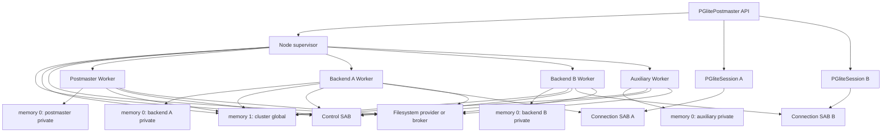

# PGlite Postmaster and Multi-Session Multi-Memory Architecture

Status: design proposal for a proof of concept  
Initial target: Node.js 22 or newer; server-class runtimes only  
Execution model: one Node Worker per PostgreSQL process  
Memory model: staged multi-memory; private plus cluster-global in v1, root-scoped later  
Last updated: 2026-07-12

## 1. Summary

This document proposes a new, opt-in PGlite architecture that runs PostgreSQL's normal postmaster and multi-process model in Node.js. Each PostgreSQL process is represented by a Node Worker and a separate WebAssembly instance. Unlike an architecture that places every process in one linear address space, this design gives each process an independently reclaimable private Wasm memory and imports separate memory for PostgreSQL shared state.

This is the lead multi-session design. The shared-single-memory architecture remains documented as a fallback but is not an implementation milestone. The experimental relocation/basement branches did not produce a working multi-instance shared runtime, while current Node/V8 has been verified to support the multi-memory and indexed-atomic operations this design requires.

The Wasm ABI exposes three logical memory domains:

```text
memory 0: current PostgreSQL process private memory
memory 1: cluster-global PostgreSQL shared memory
memory 2: root-backend scoped shared memory (tag reserved in v1)
```

The architecture is deliberately staged:

- v1 implements memory 0 and memory 1 only; all PostgreSQL DSM is global and parallel-query/parallel-maintenance GUCs remain disabled;
- the `11` pointer tag is reserved and never produced in v1;
- the module may bind an otherwise-unused memory-2 import to memory 0 to keep the future ABI shape without creating another backing store;
- a later tier activates root-scoped memory 2, hierarchical query/transaction scopes, DSA placement inheritance, and parallel query;
- compact aliasing is evaluated only after dedicated scoped memory works.

Memory 0 and memory 1 use shared `WebAssembly.Memory` types in the postmaster build. Memory 0 is private by ownership: only its process is normally given a reference. Declaring it shared keeps one consistent atomic-capable Wasm ABI and permits the future memory-2 alias binding.

The design preserves ordinary 32-bit C pointers by tagging the high bits with a memory selector. A custom Binaryen post-link transformation rewrites Wasm memory operations to select the correct memory. The correctness-first transform can ship with generic dispatch everywhere; provenance analysis is an optimizer that removes or hoists dispatch after the generic build is validated. The v1 two-domain build normally needs one sign-bit test, while the deferred scoped tier uses the full three-way selector. The transform covers scalar, SIMD, bulk-memory, and atomic instructions; JavaScript host imports use an explicit tagged-pointer decoder.

PostgreSQL starts fresh process images through `EXEC_BACKEND`, the path used on Windows where `fork()` is unavailable. The postmaster, ordinary backends, auxiliary processes, and background workers therefore start as clean Wasm instances, reconstruct process-local state, and attach to shared state rather than copying a parent heap.

The public entry point is a separate `PGlitePostmaster.create()`. Existing `PGlite` and its single-user-mode artifact remain unchanged. A postmaster creates sessions that implement the normal `PGliteInterface`.

The v1 memory-lifetime properties are:

- a backend or auxiliary process's memory 0 is released when its Worker and all references to that memory are gone;
- cluster-global memory 1 lives until the postmaster cluster shuts down;
- all v1 DSM lives in memory 1 and is reusable but not physically reclaimable before cluster shutdown;
- later, root-scoped memory 2 lives until its backend group ends and query/transaction arenas become reusable at their PostgreSQL lifecycle boundaries;
- current V8 has no memory-discard implementation, so the design does not depend on page discard.

This is a standalone architecture. It does not require a single-memory implementation, a relocatable process basement, or a migration through another memory model.

At a glance:

| Concern                  | Proposed choice                                                    |
| ------------------------ | ------------------------------------------------------------------ |
| Public entry point       | `PGlitePostmaster.create()`                                        |
| Runtime floor            | Node.js 22+; browser multi-session out of scope for v1             |
| Process boundary         | One Node Worker and Wasm instance per PostgreSQL process           |
| Process startup          | PostgreSQL `EXEC_BACKEND`, initially using its file parameter path |
| Private state            | One independently owned memory 0 per process                       |
| Cluster state            | One memory 1 shared by the cluster                                 |
| v1 DSM                   | Global in memory 1                                                 |
| Deferred parallel state  | Memory 2 per root group with hierarchical logical scopes           |
| C pointer representation | Tagged memory32 pointer; `11` reserved in v1                       |
| Wasm lowering            | Binaryen post-link transform; generic path is the baseline         |
| Optimization             | Outlined dispatch, provenance, root-cell flow, and hot cloning     |
| Signals and blocking     | Control SAB, target-side dispatch, `Atomics.wait/notify`           |
| Socket frontend          | Replacement `pglite-socket`; one OS socket per real backend        |
| Filesystem               | Direct NODEFS first; factories and broker for extensibility        |
| Extensions in v1         | Supported set statically linked into the postmaster artifact       |
| PostgreSQL test suites   | Native host drivers through socket and lifecycle adapters          |
| Existing `PGlite`        | Unchanged separate artifact and runtime                            |

## 2. Motivation

Current PGlite runs PostgreSQL in single-user mode. It is compact and portable, but it exposes one PostgreSQL session and cannot reproduce the semantics of independent server connections. A postmaster architecture enables:

- independent session GUCs, roles, prepared statements, portals, and temporary objects;
- concurrent transactions with normal MVCC visibility;
- row, table, advisory, and predicate locks across sessions;
- lock waits and deadlock detection;
- realistic backend cancellation and termination;
- `LISTEN`/`NOTIFY` between sessions;
- background workers and PostgreSQL auxiliary processes;
- parallel query and parallel maintenance;
- connection-pool and server-extension behavior.

The memory model matters because native PostgreSQL assumes two things that do not naturally coexist in a conventional single-memory Wasm module:

1. each process has a private address space for stacks, globals, allocators, memory contexts, and extension state;
2. selected regions are shared between processes and contain raw PostgreSQL pointers, atomics, locks, queues, buffers, and allocator metadata.

Putting all processes in one Wasm memory can emulate those properties with relocation and private ranges, but private process pages cannot be released independently and Wasm bounds checking does not isolate one process range from another. Multi-memory instead maps the process boundary onto a Wasm memory boundary. A backend's private heap can grow independently and its whole backing store can be dropped after exit.

The `origin/tdrz/fe-multiProc-emul` experiments proved that the existing syscall-shim and surgical PostgreSQL-refactor approach can reach a real postmaster, checkpointer, accepted connection, `BackendMain`, `PostgresMain`, and SQL query. They did so with cooperative single-thread scheduling, full heap copies, and shared-state copy-back rather than Workers, SABs, or atomics. The branch's `-D` syscall redirects, settable function pointers, and extraction of child/postmaster loop steps such as `after_fork_process_inchild` and `PostmasterServerLoopOnce` are reusable integration evidence; the normal accept/`ClientSocket`/backend-main flow needed comparatively little simulation. The later `origin/tdrz/fe-multiProc-emul-singlemem` and `origin/tdrz/fe-multiProc-emul-singlemem-basement` experiments were abandoned before working: slot growth, Emscripten runtime state, allocator state, function-table/GOT collisions, and heap restoration remained unresolved. Those results validate the process and shim integration points but do not validate Workers or atomics, and they are evidence against making relocation the lead implementation risk.

External precedents point the same way without proving this exact ABI. Browser PostgreSQL emulators based on syscall/process emulation demonstrate feasibility but report large overheads and do not provide this private/shared lifetime model. RLBox's production Firefox deployment uses separate Wasm memories per sandboxed instance rather than a software page table inside one memory. Both support treating an independently owned Wasm memory as the clean process boundary; neither removes the need for the tagged cross-domain transform described here.

Multi-memory alone is not sufficient. C pointers do not carry a Wasm memory index, Emscripten assumes a primary linear memory, sharedness is part of the Wasm import type, and JavaScript library code normally reads through one set of `HEAP*` views. This proposal treats the required compiler, runtime, and PostgreSQL changes as first-class work rather than assuming that adding two imports solves the problem.

## 3. Goals

The proof of concept should:

1. Add `PGlitePostmaster.create()` without changing existing `PGlite` behavior.
2. Target Node.js 22 or newer and Node Workers only for v1.
3. Run one PostgreSQL process per Worker and Wasm instance.
4. Use PostgreSQL `EXEC_BACKEND` rather than cloning a Wasm heap or resuming a post-`fork()` continuation.
5. Return session objects implementing `PGliteInterface`.
6. Support at least two genuinely concurrent sessions.
7. Give every process an independent private Wasm memory and function table.
8. Import a common cluster-global PostgreSQL memory into every process.
9. Implement private memory 0 plus cluster-global memory 1 first and reserve the memory-2 tag.
10. Represent the eventual three address domains with an explicit, documented memory32 pointer ABI.
11. Rewrite every relevant Wasm memory instruction soundly.
12. Validate a generic-everything transform first, then remove or hoist dispatch where optimization proves a memory domain.
13. Retain a correct generic fallback for unknown pointer provenance.
14. Preserve PostgreSQL shared-memory, DSM, DSA, lock, latch, and atomic semantics.
15. Keep all DSM global and parallel query disabled in v1.
16. Add session-, transaction-, subtransaction-, query-, and parallel-context scoped memory only in the deferred parallel tier.
17. Queue signals and dispatch them only in the target process.
18. Allow Workers to block with `Atomics.wait()` without unwinding Wasm stacks.
19. Preserve the existing pluggable PGlite filesystem contract.
20. Support direct NODEFS operation initially and a broker for non-cloneable third-party filesystems.
21. Provide explicit per-domain memory budgets and useful high-water telemetry.
22. Validate memory reclamation after backend churn in v1 and root-group churn in the deferred tier.
23. Preserve source maps and enough symbols to debug transformed code.
24. Statically link the supported extension set in v1 while versioning the tagged ABI for later side modules.
25. Produce measurements that permit an informed later choice between dedicated and compact root-scoped backing.
26. Replace `pglite-socket` with a thin TCP/Unix-socket frontend in which each client connection owns a real PostgreSQL backend.
27. Run PostgreSQL's native `make check` and `make check-world` regression machinery against the multi-session artifact, preserving upstream schedules, expected-output comparison, and concurrency.

## 4. Non-goals for the initial proof of concept

The first implementation will not attempt to provide:

- browser or Web Worker support;
- Safari support for the multi-session artifact;
- cooperative multitasking on one thread;
- Asyncify or JSPI scheduling;
- Wasm memory64;
- more than three C-addressable memory domains;
- a fresh replaceable `WebAssembly.Memory` for every query or transaction;
- transparent compaction of live C allocations;
- prompt operating-system decommit of freed pages without runtime support;
- a stable public memory-tuning API in the first milestone;
- a general security boundary between mutually untrusted SQL extensions;
- automatic compatibility with untransformed Wasm side modules;
- complete Emscripten multi-memory support before proving the approach locally;
- browser filesystems such as OPFS or IDBFS;
- WasmFS migration as a prerequisite;
- transparent migration of a live PostgreSQL session between Workers;
- connection multiplexing onto one PostgreSQL backend;
- production support for every auxiliary-process kind before basic sessions work;
- parallel query or root-scoped memory in v1;
- transformed dynamic side modules in v1;
- API or behavioral compatibility with the current single-user-multiplexing `pglite-socket` implementation;
- one Wasm binary shared with the existing unthreaded, single-user `PGlite` runtime.

## 5. Terminology

**Postmaster**  
The top-level PostgreSQL server process that owns cluster lifecycle and launches child processes.

**PostgreSQL process**  
A postmaster, ordinary backend, checkpointer, WAL writer, autovacuum worker, background worker, parallel worker, or another PostgreSQL process. It maps to one Node Worker and one Wasm instance.

**Supervisor**  
The Node-side controller that owns cluster resources, creates Workers and memories, allocates synthetic PIDs, maintains process and scope registries, and exposes the public API.

**Root backend**  
An independently created PostgreSQL backend or worker that owns a scoped-memory group. Ordinary client backends are roots. A parallel worker is not a new root; it inherits the leader's root.

**Root group**  
A root backend plus every descendant that is deliberately allowed to attach to its scoped memory. PostgreSQL currently prevents nested parallel query in a parallel worker, so the important initial topology is one root and one level of parallel workers.

**Memory 0 / private memory**  
The current process's static data, stack, allocator state, heap, PostgreSQL MemoryContexts, libc state, and process-local extension data. It is a shared Wasm memory by type but private by capability and ownership.

**Memory 1 / global memory**  
Cluster-global PostgreSQL shared memory: `PGShmemHeader`, shared buffers, process arrays, lock tables, signal state, WAL coordination, global registries, and genuinely global DSM.

**Memory 2 / scoped memory**  
Memory shared only inside one root group. It contains session, transaction, query, parallel-context, and other group-scoped DSM and DSA allocations.

**Dedicated scoped binding**  
Memory 2 is a separate `WebAssembly.Memory` owned by a root group.

**Compact scoped binding**  
The root backend's memory 0 is also imported as its memory 2; descendants import that same backing as memory 2. Only explicitly scoped ranges are semantically shared.

**Tagged pointer**  
A 32-bit C pointer whose high bits identify memory 0, 1, or 2 and whose remaining bits identify a byte offset in that memory.

**Shared scope**  
A logical lifetime and attachment domain inside memory 2, such as a session, transaction, subtransaction, statement, query, or `ParallelContext`. A scope owns extents but is not a separately importable Wasm memory.

**Control SAB**  
A small `SharedArrayBuffer` outside PostgreSQL Wasm memory containing process-control blocks, wake sequences, pending signals, spawn coordination, and exit state.

**Connection SAB**  
A bounded per-connection or pooled `SharedArrayBuffer` containing PostgreSQL protocol rings and synchronization words.

**Memory transformer**  
The build-stage program that adds memory imports, analyzes pointer provenance, and rewrites Wasm instructions to the correct memory indices.

## 6. Public API

### 6.1 Postmaster construction

The new execution architecture is explicitly selected:

```ts
const postmaster = await PGlitePostmaster.create({
  dataDir: 'file://./pgdata',
  maxConnections: 8,
})
```

The existing API continues to create the current single-user runtime:

```ts
const db = await PGlite.create({
  dataDir: 'file://./pgdata',
})
```

`PGlitePostmaster` represents a cluster and does not masquerade as a SQL session.

### 6.2 Session construction

```ts
const sessionA = await postmaster.createSession()
const sessionB = await postmaster.createSession({
  username: 'app_user',
  database: 'postgres',
})
```

Each session implements `PGliteInterface` and should reuse `BasePGlite` for protocol serialization, parsing, query templates, transactions, notices, notifications, and extension namespaces.

```ts
await sessionA.exec(`
  CREATE TABLE accounts (
    id bigint PRIMARY KEY,
    balance bigint NOT NULL
  )
`)

await sessionA.transaction(async (tx) => {
  await tx.query('UPDATE accounts SET balance = balance - 10 WHERE id = $1', [
    1,
  ])
})
```

Different sessions may execute concurrently. Operations within one session remain serialized where required by the PostgreSQL protocol and `BasePGlite` transaction semantics.

### 6.3 Lifecycle

```ts
await sessionA.close()
await postmaster.close()
```

Closing a session sends a PostgreSQL termination message and waits for the backend Worker to exit. The backend's memory 0 is then eligible for collection. In the deferred scoped-memory tier, memory 2 is released only after every descendant has stopped and the supervisor has dropped its final reference.

Cluster shutdown should eventually expose PostgreSQL's smart, fast, and immediate modes:

```ts
await postmaster.close({ mode: 'smart' })
await postmaster.close({ mode: 'fast' })
await postmaster.close({ mode: 'immediate' })
```

### 6.4 Database-wide operations

Methods such as `dumpDataDir()` are cluster-wide even when exposed through `PGliteInterface`. A session delegates them to `PGlitePostmaster`, which must coordinate active transactions, checkpointing, filesystem serialization, and admission of new work.

The POC may reject a dump while multiple sessions are active, but it must not silently create a logically inconsistent archive.

### 6.5 Initial memory options

The exact names are provisional, but the internal configuration needs distinct budgets:

```ts
interface PGlitePostmasterMemoryOptions {
  maxConnections?: number

  privateInitialMemory?: number
  privateMaximumMemory?: number

  globalInitialMemory?: number
  globalMaximumMemory?: number
  maximumClusterMemory?: number
}
```

Deferred scoped-memory experiments add internal `scopedInitialMemory`, `scopedMaximumMemory`, and `scopedMemoryMode` controls. They should not become stable public options until parallel-query measurements identify safe semantics and defaults.

## 7. High-level architecture



This is the v1 topology: each process owns memory 0 and every process imports memory 1. The memory-2 import/tag is reserved and may alias memory 0 without being used. Parallel workers and root-scoped memory are added later:

```text
backend A memory 0       parallel worker memory 0
          \                    /
           +-- backend A memory 2 --+
                       |
                query/transaction scopes
```

The supervisor, protocol transport, and filesystem broker exchange opaque IDs, handles, descriptors, parameter-file references, and byte messages. They do not interpret arbitrary PostgreSQL data structures.

## 8. PostgreSQL process creation

### 8.1 Use `EXEC_BACKEND`

PostgreSQL normally uses `fork()` on Unix and inherits process-local state. In PostgreSQL 18.3, `EXEC_BACKEND` is enabled only for Windows by `pg_config_manual.h`; enabling that existing path for the PGlite target is the intended switch. It starts a fresh executable and reconstructs state that would otherwise have been inherited.

The upstream shape is:

```text
postmaster_child_launch
  -> internal_forkexec
  -> save_backend_variables
  -> fwrite BackendParameters to PG_TEMP_FILES_DIR
  -> execv(postgres, "--forkchild=<kind>", tmpfile)
  -> SubPostmasterMain
  -> read_backend_variables and unlink tmpfile
  -> restore_backend_variables
  -> PGSharedMemoryReAttach
  -> InitShmemAccess
  -> reload required libraries and local state
  -> child_process_kinds[child_type].main_fn
```

A new Node Worker plus Wasm instance is a natural fresh process image. The architecture should enable non-Windows `EXEC_BACKEND` and provide PGlite process-spawn and parameter transport rather than emulating `fork()`.

The POC retains the existing file transport. PGlite already gives each process filesystem access, so replacing it with a SAB parameter record does not de-risk the first backend. SAB records remain a later startup optimization.

### 8.2 PGlite spawn operation

Conceptually, the PGlite port replaces only the process-creation step after PostgreSQL has written the existing parameter file:

```c
static pid_t
internal_forkexec(const char *child_kind,
                  const char *parameter_file,
                  ClientSocket *client_sock)
{
    return pgl_spawn_process(child_kind,
                             parameter_file,
                             client_sock,
                             pgl_scope_policy_for_child(...));
}
```

`pgl_spawn_process()` is an imported host operation backed by the Control SAB. It synchronously reserves a synthetic PID and process record, writes an argv/parameter-file spawn request, wakes the supervisor, and returns. The Worker calls PostgreSQL `main()` with `--forkchild=<kind>` and the existing temporary filename. Worker startup remains asynchronous, matching native process creation where the parent returns before child initialization completes.

### 8.3 Deferred scope inheritance policy

Every spawn request states whether the child:

- creates a new root scope;
- inherits the parent's root scope;
- has no scoped-sharing requirement and aliases memory 2 to its own memory 0;
- attaches to an explicitly identified root scope through an authorized DSM handle.

Ordinary client backends create new roots. Parallel-query and parallel-maintenance workers inherit their leader's root. Independent background and auxiliary workers normally create their own root or use a self-alias, rather than sharing the postmaster's memory 2 by accident.

Scope inheritance is inactive in v1 because parallel workers and root-scoped DSM are disabled. When enabled, it must be derived from PostgreSQL process intent, not merely from the Node parent/child relationship. A dynamic background worker can be independent or can belong to a parallel operation.

### 8.4 Backend parameter transport

`BackendParameters` remains a PostgreSQL-owned ABI written and read by PostgreSQL through the temporary file. TypeScript treats the filename and child kind as opaque process-start arguments.

The PostgreSQL 18.3 structure contains at least these raw shared-memory pointers, which are the ground truth for the initial audit:

```text
UsedShmemSegAddr
ShmemLock
NamedLWLockTrancheArray
MainLWLockArray
ProcStructLock
ProcGlobal
AuxiliaryProcs
PreparedXactProcs
PMSignalState
ProcSignal
ActiveInjectionPoints (when enabled)
```

`PGSharedMemoryReAttach()` requires the same numeric shared-memory address and fails when it changes. The tagged ABI satisfies that requirement: every process restores the same tag plus memory-1 offset.

The pointer audit must classify every pointer-like field:

- process-private pointers must be reconstructed, not copied;
- memory-1 pointers retain their tagged numeric value in every process;
- memory-2 pointers may only cross to a child in the same root group;
- DSM references crossing a scope boundary use handles, not raw pointers;
- function references are reconstructed through the child's private table.

### 8.5 Inherited descriptors and process plumbing

Fresh Workers cannot inherit native pipe/socket state as a forked process would. The port must replace or reconstruct:

- `postmaster_alive_fds` and parent-death detection;
- `ClosePostmasterPorts` behavior;
- inheritable client/listener sockets and `read_inheritable_socket`;
- self-pipes used by latches and WaitEventSet;
- process-local descriptor-table entries.

The experiment branches showed that Emscripten `FS.dupStream` plus its current poll behavior is not a sufficient inheritance mechanism. Child-side descriptor re-creation and explicit virtual descriptor records are the selected pattern.

Postmaster-mode backends must also restore PostgreSQL's standard `pqsignal` registration block. The current single-user pump refactor suppresses parts of that setup under `__PGLITE__`; those shortcuts are not valid for independent backend Workers.

### 8.6 Worker model

Every live PostgreSQL process has:

- one Node Worker;
- one Wasm instance;
- one memory 0;
- one imported memory 1;
- one reserved memory-2 import or alias when the artifact retains the three-import shape;
- one private `WebAssembly.Table`;
- one process-control block;
- one synthetic PID and generation;
- zero or more virtual descriptors;
- optionally one client connection.

Workers are persistent PostgreSQL processes, not interchangeable query executors. Work does not migrate between them.

### 8.7 Worker bootstrap

```ts
interface MultiMemoryWorkerBootstrap {
  processId: number
  processGeneration: number
  processKind: PostgresProcessKind

  module: WebAssembly.Module
  table: WebAssembly.Table

  privateMemory: WebAssembly.Memory
  globalMemory: WebAssembly.Memory
  scopedMemory?: WebAssembly.Memory

  scopeRootId?: number
  scopeRootGeneration?: number
  scopeBinding?: 'reserved' | 'dedicated' | 'self-alias' | 'inherited-alias'

  controlBuffer: SharedArrayBuffer
  connection?: ConnectionDescriptor
  filesystem: WorkerFilesystemDescriptor
  debug: number
}
```

The supervisor compiles the transformed module once and structured-clones the `WebAssembly.Module` and shared memory objects into Workers. In v1, a retained memory-2 import is bound to memory 0 and no scoped pointer is legal. Process generations reject stale startup, exit, and signal events; scope generations are added with the deferred tier.

## 9. Core memory architecture

### 9.1 Staged memory imports

The eventual postmaster Wasm module imports:

```wat
(memory $private (import "pglite" "private_memory") P0 PMAX shared)
(memory $global  (import "pglite" "global_memory")  G0 GMAX shared)
(memory $scoped  (import "pglite" "scoped_memory")  S0 SMAX shared)
```

Import limits are encoded in pages and runtime-created memories must be type-compatible with them. Shared Wasm memories require declared maximums. Compact mode must create one memory object whose limits satisfy both the memory-0 and memory-2 import types; the initial compact profile therefore uses the stricter 1 GiB maximum.

All active data segments, static C data, the stack, and the Emscripten heap initialize memory 0. Memories 1 and 2 are initialized through PostgreSQL/PGlite allocator code exactly once for their ownership domain; repeated Wasm instantiation must not replay data segments into them.

The v1 implementation has only two active domains:

```text
memory 0: private
memory 1: cluster global, including every DSM segment
tag 11: invalid/reserved
```

If retaining three imports simplifies artifact and extension ABI work, the v1 loader binds the unused memory-2 import to memory 0. This creates no additional backing store and does not make tag-`11` pointers valid. Debug builds trap if such a tag reaches a dereference; release generic helpers may use the proven two-domain sign-bit fast path.

### 9.2 Verified runtime baseline

The review's checked-in fixtures under [`experiments/multi-memory-tests`](experiments/multi-memory-tests) establish the runtime baseline:

| Capability                                                       | Result                                                                  |
| ---------------------------------------------------------------- | ----------------------------------------------------------------------- |
| Three imported shared memories                                   | Node 22.13 and 24.15 pass; Node 20.18 rejects multi-memory              |
| Atomic RMW on memory index 1                                     | Validates and executes                                                  |
| `memory.atomic.notify` and `wait32` on memory index 1            | Validates and executes                                                  |
| Same memory bound at indices 0 and 2                             | Works, including overlapping cross-index `memory.copy`                  |
| Structured-cloned module and shared memories in `worker_threads` | Cross-thread visibility works                                           |
| Shared growth observed by live instances                         | Works                                                                   |
| Distinct memory 0 objects                                        | Private writes remain isolated                                          |
| Shared-memory virtual reservation                                | About 10 GiB on Node 22 and 8 GiB on Node 24 per backing; near-zero RSS |

Node 22 is therefore the v1 floor. Chrome 120+, Firefox 125+, Deno 1.38+, and several server Wasm runtimes support multi-memory, but the shipped target remains Node until their process, filesystem, and Worker contracts are designed and tested. Safari has no multi-memory or memory64 support as of July 2026, so browser multi-session is explicitly outside v1.

### 9.3 Deferred three-domain process views

For root backend `B` and parallel worker `W`:

| Wasm index | Root backend `B` | Parallel worker `W` | Ownership          |
| ---------- | ---------------- | ------------------- | ------------------ |
| 0          | `B.private`      | `W.private`         | Current process    |
| 1          | `cluster.global` | `cluster.global`    | Postmaster cluster |
| 2          | `B.scope`        | `B.scope`           | Root group         |

For an unrelated backend `C`, memory 2 is `C.scope`; a memory-2 pointer meaningful to group `B` must never be interpreted by `C`.

### 9.4 Dedicated scoped binding

The reference implementation creates a separate scoped memory for each root:

```text
B memory 0  -> B.private
B memory 2  -> B.scope
W memory 0  -> W.private
W memory 2  -> B.scope
```

Benefits:

- Wasm bounds checks isolate scoped bytes from the root's stack and heap;
- the scoped allocator owns an uncomplicated linear range;
- memory 0 and memory 2 can grow independently;
- a worker bug using memory 2 cannot overwrite ordinary root-private state;
- allocator and correctness failures are easier to diagnose.

Costs:

- another Wasm backing-store reservation per root backend;
- private and scoped historical peaks cannot reuse one another's free pages;
- a large scoped query can retain a root-level high-water mark until the session closes.

### 9.5 Compact scoped binding

The optional compact mode binds the same memory object twice in a root:

```text
B memory 0 --+
             +-> B.private backing
B memory 2 --+

W memory 0 ----> W.private backing
W memory 2 ----> B.private backing
```

Scoped allocations still always use memory-2-tagged pointers, including in `B`. Ordinary allocations use memory-0 pointers. This avoids two pointer representations crossing the group boundary.

Compact mode can avoid one V8 memory reservation per root and can eventually return complete scoped extents to the root's private allocator. It does not permit workers to use arbitrary root pointers or manipulate root allocator metadata.

Compact mode has weaker fault isolation. Because memory indices 0 and 2 resolve to the same backing, Wasm's bounds check protects the whole backing rather than the semantic scoped arena. The initial compact profile should either cap the entire aliased memory at the memory-2 aperture or add explicit scoped-aperture checks.

### 9.6 No dynamically replaceable query memory

Memory imports are fixed when a Wasm instance is created. A long-lived backend cannot bind a newly created memory at the start of each transaction or query. Pre-importing a finite set of slots also retains every memory for the backend lifetime and therefore does not provide collection.

Transaction and query lifetimes are represented as logical arenas inside memory 2. A truly fresh query backing would require reinstantiating or replacing the leader, executing the entire transaction in another process, or lowering every access to an indirect host call. None is an initial design goal.

### 9.7 Control and protocol buffers remain outside

The Control SAB and Connection SABs are not additional C pointer domains. Host shims copy between them and a selected Wasm memory. Keeping them outside the three-memory ABI avoids consuming pointer tag space and decouples process orchestration and protocol transport from PostgreSQL memory placement.

## 10. Pointer ABI

### 10.1 Encoding

The initial memory32 ABI divides the 4 GiB pointer-value space asymmetrically:

```text
pointer range                 memory       offset range
0x00000000..0x7fffffff        memory 0     0..2 GiB - 1
0x80000000..0xbfffffff        memory 1     0..1 GiB - 1
0xc0000000..0xffffffff        memory 2     0..1 GiB - 1
```

Conceptually:

```c
#define PGL_MEMORY_TAG_MASK       UINT32_C(0xc0000000)
#define PGL_SHARED_OFFSET_MASK    UINT32_C(0x3fffffff)
#define PGL_GLOBAL_TAG            UINT32_C(0x80000000)
#define PGL_SCOPED_TAG            UINT32_C(0xc0000000)

static inline unsigned
pgl_pointer_memory(uint32_t p)
{
    if ((p & UINT32_C(0x80000000)) == 0)
        return 0;
    return (p & UINT32_C(0x40000000)) == 0 ? 1 : 2;
}

static inline uint32_t
pgl_pointer_offset(uint32_t p)
{
    return (p & UINT32_C(0x80000000)) == 0
        ? p
        : p & PGL_SHARED_OFFSET_MASK;
}
```

This preserves a 2 GiB private address range, matching Emscripten's common memory32 operating envelope, while reserving 1 GiB each for global and scoped shared memory. The limits are part of the artifact ABI and must not drift independently between C, the transformer, and TypeScript.

In v1, allocators produce only `0x00000000..0x7fffffff` and `0x80000000..0xbfffffff`. A generic dereference therefore reduces to one sign-bit test followed by a memory-1 tag mask. Tag `11` remains reserved so enabling memory 2 later does not renumber existing pointers. Debug builds reject it; release builds may rely on the v1 allocator invariant for the two-way fast path.

### 10.2 Null and guards

The only null pointer is numeric zero and therefore belongs to memory 0. Each physical memory should reserve a low poison area even though memory-1 and memory-2 offset zero have nonzero tagged pointer values. Allocators must not return the poison pages.

Null tests continue to be ordinary integer tests. The transformer must not classify null as an addressable private pointer and issue a successful access to memory 0 offset zero.

The upper end of every aperture also reserves guard pages and sentinel values. In particular, `0xffffffff` is commonly used as `(void *) -1`/`MAP_FAILED` and must never be a valid memory-2 allocation. PostgreSQL, libc, and extensions require an audit for other pointer-shaped sentinels.

### 10.3 Pointer arithmetic

Adding or subtracting an in-object byte displacement leaves the high tag bits unchanged as long as the result remains inside the allocation and memory aperture. Subtracting two pointers with the same tag cancels the tag naturally.

C only defines relational comparison and subtraction meaningfully for pointers into the same object or array. PostgreSQL and extension code that orders arbitrary pointers, hashes pointer integers, strips high bits, or assumes all valid pointers are positive signed integers requires an audit.

One-past pointers are permitted only when the allocation does not end at its aperture boundary. Allocators should leave a guard margin at the maximum address so common immediate load/store offsets cannot wrap through the tag bits.

### 10.4 Canonical pointer representation

Every allocation has one canonical pointer domain:

- normal `malloc`, stack, static data, MemoryContext, and process-local extension allocations are memory 0;
- primary PostgreSQL shared-memory allocations are memory 1;
- all v1 DSM allocations are memory 1;
- root/session/transaction/query shared allocations become memory 2 only in the deferred scoped tier.

In compact mode, memory 0 and memory 2 may refer to the same physical bytes, but a scoped extent is exposed to PostgreSQL only through memory-2-tagged pointers. Any untagged allocator handle remains private to the scoped-memory provider and is not stored in PostgreSQL structures.

### 10.5 Cross-domain rules

The following are hard invariants:

1. A memory-0 pointer is never stored in memory 1 or 2 for another process to dereference.
2. A memory-2 pointer is never stored in memory 1 for an unrelated root to dereference.
3. A memory-2 raw pointer crosses a Worker boundary only when both Workers import the same scope memory and have the same root generation.
4. Cross-root references use DSM/scope handles containing ownership and generation, not raw pointers.
5. A memory-1 pointer may be shared cluster-wide because all processes import the same memory at index 1 and use the same tag.
6. Function references are never represented as data pointers and are meaningful only with the owning instance's table unless reconstructed by name.

### 10.6 Aperture bounds

Physical memory maximums must normally enforce the pointer apertures:

- memory 0 maximum is at most 2 GiB;
- memory 1 maximum is at most 1 GiB;
- dedicated memory 2 maximum is at most 1 GiB.

This allows the engine's normal bounds check to catch an access whose decoded offset leaves its pointer domain.

Compact mode is special because memory 2 may alias a memory 0 whose maximum exceeds 1 GiB. An access at the end of the 1 GiB scoped aperture could otherwise cross the semantic boundary while remaining inside the physical memory. The first compact implementation should cap the aliased memory at 1 GiB. A later 2 GiB compact profile requires an explicit effective-address aperture check or a proven allocation/layout rule that provides equivalent protection.

### 10.7 Pointer-bearing structures

PostgreSQL already distinguishes many relocatable shared structures:

- `shm_toc` stores offsets relative to a segment base;
- DSA uses `dsa_pointer` segment/index encodings;
- DSM is discovered through `dsm_handle`;
- relative-pointer helpers are used by shared allocators.

Those mechanisms should remain intact. Tagged pointers solve memory selection; they do not justify introducing raw process-local pointers into structures designed to be relocatable.

An audit tool should classify every pointer-sized field written to shared memory and flag stores whose provenance is private or unknown.

## 11. Wasm memory transformation

### 11.1 Why a transformation is required

Clang lowers ordinary C pointers to `i32`, and Wasm load/store instructions contain a static memory index. Emscripten currently builds its C runtime around one principal memory. Merely adding two imports does not cause a load through `0x80000020` to target memory 1.

The postmaster artifact is therefore linked first as a conventional memory-0 module and then transformed. The transformer:

1. adds or normalizes the three memory imports;
2. leaves data segments and private runtime initialization on memory 0;
3. identifies the address operand of every memory operation;
4. emits a sound generic selector for every potentially tagged dereference;
5. optionally computes conservative pointer provenance;
6. replaces generic helpers with direct or hoisted operations where proven;
7. validates limits, sharedness, data-segment targets, and exported ABI metadata;
8. emits provenance and dispatch statistics for review.

The generic-everything transform is the correctness baseline and the first deliverable. It is validated against the existing single-user PGlite artifact before postmaster integration begins. Provenance is not a prerequisite for semantic correctness. Phase 1 subsequently showed that it is a performance dependency for this design: generic dispatch at every site is correct but too expensive.

### 11.2 Required instruction coverage

The transform must inventory and correctly handle every instruction that names or accesses memory:

- integer and floating-point loads and stores;
- sign- and zero-extending loads;
- narrow stores;
- SIMD loads, stores, splats, lanes, and zeroing forms;
- atomic loads and stores;
- atomic read-modify-write and compare/exchange;
- `memory.atomic.wait32`, `memory.atomic.wait64`, and `memory.atomic.notify`;
- `memory.copy`;
- `memory.fill`;
- `memory.init` and active/passive data-segment initialization;
- `memory.size`;
- `memory.grow`.

It must also audit generated helper functions whose behavior is memory-dependent even when their bodies contain ordinary loads and stores, including `memcpy`, `memmove`, `memset`, atomics, stack checks, sanitizers, exception support, and dynamic-linker relocations.

The current release artifact contains about 395,210 memory operations across 14,262 functions and a 6.7 MB code section, with about 302,000 loads and 93,000 stores. It currently contains zero `memory.copy` instructions and one `memory.fill`, although the shared build enables bulk memory and will introduce more. These counts make code-size strategy as important as the branch itself.

### 11.3 Generic scalar access

An unknown `i32.load offset=N` is conceptually lowered to:

```text
if bit31(pointer) == 0:
    i32.load memory=0 address=pointer offset=N
else if bit30(pointer) == 0:
    i32.load memory=1 address=(pointer & 0x3fffffff) offset=N
else:
    i32.load memory=2 address=(pointer & 0x3fffffff) offset=N
```

The implementation must evaluate the original address exactly once and preserve traps, alignment metadata, signedness, result type, and source location.

Known memory-1 and memory-2 accesses still remove the tag before issuing the instruction. Known memory-0 accesses use the original address after any required debug assertion.

The v1 profile has no valid memory-2 pointer. Its generic helper performs one sign-bit test and selects memory 0 or memory 1, with a debug assertion that bit 30 is clear on shared pointers. The full three-way helper is enabled with scoped memory.

### 11.4 Outlined generic helpers

Inlining a selector at roughly 395,000 sites would add several megabytes of repeated control flow and increase register pressure. Generic operations are therefore lowered to small per-shape helper functions by default:

```text
pgl_load_i32(offset, alignment, pointer)
pgl_store_i64(offset, alignment, pointer, value)
pgl_atomic_rmw_add_i32(offset, pointer, value)
...
```

The concrete helper set is generated by opcode, width, extension mode, immediate offset/alignment class, and active two- or three-domain profile. Measured V8 behavior inlined small Wasm helper callees in hot code, producing effectively the same throughput as hand-inlined dispatch while adding only a small call encoding at each site.

The transformer may inline selectors at profile-proven hot sites. Helper semantics remain continuously tested because engine inlining is an optimization, not a correctness dependency.

### 11.5 Stores and side effects

A generic store evaluates address and value expressions in Wasm's specified order exactly once, saves them into locals, then dispatches. The rewrite must not duplicate calls, volatile operations, trapping expressions, or atomic computations.

The same constraint applies to atomic RMW operations: each branch returns exactly one result and preserves the original sequentially consistent or ordered semantics.

### 11.6 Bulk memory

`memory.copy` has independent destination and source domains. A fully unknown copy has nine combinations:

```text
0 <- 0    0 <- 1    0 <- 2
1 <- 0    1 <- 1    1 <- 2
2 <- 0    2 <- 1    2 <- 2
```

Static provenance should normally collapse one or both selectors. The generic implementation evaluates destination, source, and length once and dispatches to the appropriate indexed `memory.copy`.

The WebAssembly operation supports copying between different memories and handles overlap when the indices resolve to the same memory instance. This is required for compact mode, where memory 0 and memory 2 can alias.

`memory.fill` has one destination selector. `memory.init` should remain memory-0-only for compiler-emitted static/runtime data unless a deliberately scoped initializer is introduced.

### 11.7 Memory size and growth

Implicit Emscripten heap operations continue to target memory 0. Global and scoped allocators use explicit functions or intrinsics naming memory 1 or 2.

Unannotated `memory.grow` must never be converted into runtime pointer dispatch. Growth is a memory-provider operation, not a dereference. The build should reject unexpected growth instructions outside an allowlist:

```text
private heap grow       -> memory.grow 0
global arena grow       -> controlled memory.grow 1
root scope arena grow   -> controlled memory.grow 2
```

Shared-memory growth must refresh JavaScript typed-array views in every runtime that uses them. Wasm code sees the updated memory directly, but cached `HEAP*` or custom views can be stale.

### 11.8 Provenance lattice

The initial analysis uses a conservative lattice:

```text
Bottom
Private
Global
Scoped
Null
PrivateOrNull
GlobalOrNull
ScopedOrNull
Unknown
```

Joins never guess. Any operation that combines incompatible domains becomes `Unknown` unless semantics prove the value cannot be dereferenced.

Provenance seeds include:

- stack pointer, static addresses, private globals, `malloc`, and MemoryContext allocators: `Private`;
- primary shmem and global DSM allocator results: `Global`;
- scoped allocator, session DSM, and root-scoped DSM results: `Scoped`;
- `GOT.mem` globals and ordinary static-data addresses: `Private`;
- literal zero: `Null`;
- imported values and integer-to-pointer casts without metadata: `Unknown`.

### 11.9 Propagation

The analysis propagates through:

- local and global gets/sets;
- block, loop, `if`, and `select` results;
- function parameters and returns using summaries;
- constant additions/subtractions and lowered GEP-like arithmetic;
- pointer-preserving casts;
- PHI-like structured joins;
- known allocator and accessor calls;
- loads from pointer-bearing fields when compiler metadata is available.

The hardest cases are pointer values loaded from memory and values crossing indirect calls, varargs, integer storage, or untransformed side modules. They remain `Unknown` in the correctness-first implementation.

`Datum` and fmgr plumbing are a reason to retain binary-level analysis: PostgreSQL deliberately round-trips pointers through integer-shaped `Datum` values. At Wasm level both are `i32`, so the generic path remains correct and value-flow analysis can follow operations that a source-level pointer type system would reject or erase. LLVM metadata is additive rather than authoritative.

### 11.10 Fixed-address root cells

PostgreSQL stores many high-value pointer roots in process-global cells at fixed memory-0 addresses, including `BufferBlocks`, `ProcGlobal`, `MyProc`, `MainLWLockArray`, `ShmemBase`, and `CurrentMemoryContext`.

The transformer should build a whole-module store set for each fixed-address cell. Root-cell inference is allowed only when the cell's address constant provably does not escape: it is never stored as data, passed to an import/unknown/indirect callee, or arithmetic-combined into an address the analysis cannot enumerate. Every observed exact or constant-derived access must remain in the cell's store/load set. If the address escapes or an access cannot be accounted for, the cell remains `Unknown` unless a separately checked source annotation applies.

Within that non-escaping set, if every possible store has one domain, a load from the cell inherits the domain. This is an optimizer-grade checked assumption rather than a proof against arbitrary corrupted pointers: wild writes through invalid C pointers are treated as undefined behavior, as in ordinary alias-based compiler optimization. The build report identifies every specialized root cell and the facts used to admit it. Debug instrumentation asserts loaded tags at use sites, and differential generic/direct builds exercise the assumption. This binary-level analysis requires no source metadata and can specialize some of PostgreSQL's hottest buffer, process-array, and LWLock address calculations without pretending that every unknown store can be disambiguated.

### 11.11 Interprocedural summaries

Every transformed module should carry a custom section containing function summaries:

```text
parameter 0: Private
parameter 1: AnyPointer
return: ScopedOrNull
effects: reads memory 2, may grow memory 2
```

Summaries can be generated from known runtime functions, PostgreSQL annotations, and an optional LLVM pass. Unknown imported or indirect functions conservatively invalidate affected provenance.

Recursive strongly connected components are analyzed to a fixed point. The build records how many operations remain generic per function and rejects unsound explicit annotations.

### 11.12 Source-level annotations

The C portability layer should expose semantic annotations without requiring most PostgreSQL code to understand Wasm tags:

```c
PGL_PRIVATE_PTR(void *)
PGL_GLOBAL_PTR(void *)
PGL_SCOPED_PTR(void *)

void *pgl_global_shmem_alloc(Size size);
void *pgl_scoped_shmem_alloc(PglSharedScope *scope, Size size);
```

The first implementation may use `__attribute__((annotate))`, named wrapper functions, or generated function-summary manifests. A later LLVM address-space or provenance pass can retain richer C type information through optimization and mark direct memory operations before Wasm lowering.

Annotations are optimization claims, not trust escapes. Debug builds should dynamically assert the pointer tag at annotated boundaries.

### 11.13 Irreducible mixed-domain paths and hot cloning

Some hot functions are genuinely bimodal. Tuple deforming and expression evaluation can dereference `t_data` in memory 1 for a shared-buffer tuple and in memory 0 for copied, materialized, or otherwise private tuples. No sound context-insensitive provenance pass can assign one domain to that dereference.

The designed mitigation is curated hot-function cloning with hoisted dispatch:

```text
slot_deform_heap_tuple(pointer)
  -> test pointer tag once
  -> slot_deform_heap_tuple_private(...direct memory 0...)
  -> slot_deform_heap_tuple_global(...direct memory 1...)
```

The transformer or a source-level wrapper clones only profile-proven functions and keeps a generic original for indirect/unclassified calls. Hoisting one tag test per tuple avoids a test per attribute and is expected to determine whether final workload overhead is near single digits or remains around 15%.

### 11.14 Static specialization goals

The hot private paths must not pay a three-way branch on every dereference. The transform should report at least:

- total memory operations;
- direct private/global/scoped operations;
- generic operations;
- generic operations by hot function;
- bulk-memory domain combinations;
- operations specialized by source annotation versus inferred provenance.

Before Phase 1, dispatch microbenchmarks projected a generic-everything whole-workload cost of roughly 15–35%, with a 1.26x latency-bound pointer-chase as the observed worst case. Phase 1 falsified that whole-workload projection for the release artifact. The original staged expectation and the now-applicable targets are:

- generic-everything: correct, but measured at up to 2.16x and retained only as the correctness oracle;
- private-only oracle: no worse than 1.15x on every agreed steady-state workload before provenance work continues;
- basic allocator/static/interprocedural provenance: approximately 50–70% of sites and 70–85% of dynamic accesses direct;
- fixed-root store sets, annotations, and hot cloning: 90% or more of dynamic accesses direct where profiles justify it;
- Phase 2 exit target: no worse than 1.35x on every agreed workload, with a stretch target of single-digit overhead and remaining generic sites concentrated in genuinely mixed-domain code.

These are measurement targets, not soundness assumptions. Release readiness requires workload profiles demonstrating that executor, tuple, buffer, lock, allocator, and expression-evaluation paths meet them.

### 11.15 Soundness rule

A missed optimization costs performance. A false specialization corrupts memory. Therefore:

```text
uncertain provenance -> generic dispatch
contradictory annotation -> build or debug failure
known provenance -> direct indexed operation
```

The generic path remains compiled and continuously tested even if release builds achieve near-complete specialization.

## 12. Build and toolchain

### 12.1 Separate postmaster artifact

The architecture requires a distinct artifact, tentatively:

```text
packages/pglite/release/pglite-postmaster.wasm
packages/pglite/release/pglite-postmaster.js
```

The existing single-user artifacts remain unchanged:

```text
packages/pglite/release/pglite.wasm
packages/pglite/release/pglite.js
```

Sharedness is part of a Wasm memory import type, atomic instructions require shared memory, and Emscripten emits materially different runtime support for threaded/shared builds. JavaScript monkey-patching cannot make one import accept both shared and unshared memories. The goal is one multi-memory postmaster Wasm for all postmaster Workers and both scoped binding modes, not one binary for both the existing and postmaster architectures.

### 12.2 Proposed pipeline

```text
PostgreSQL + libc + bundled extensions
    |
    | clang / emcc, shared-memory-capable build
    v
LLVM IR
    |
    | optional PGlite provenance pass and metadata emission
    v
wasm-ld / Emscripten finalization
    |
    | conventional imported memory-0 artifact
    v
PGlite Binaryen multi-memory transformer
    |
    | add memories, rewrite accesses, emit ABI metadata
    v
wasm-opt with multi-memory enabled
    |
    | validation, source-map emission, ABI audit
    v
pglite-postmaster.wasm
```

The transformer version, pointer ABI version, input hash, output hash, Binaryen version, and feature set should be embedded in a custom section and build manifest.

### 12.3 Binaryen

Binaryen is the preferred initial implementation platform because it:

- parses and writes Wasm with multi-memory instructions;
- exposes structured IR for loads, stores, atomics, and bulk memory;
- supports custom C++ passes and validation;
- provides `wasm-opt`, `wasm-dis`, `wasm-reduce`, and source-map handling;
- is already part of the Emscripten toolchain.

It is also the only currently viable production route. LLVM exposes a multi-memory target feature but has no code generation for memory indices other than zero; LLVM bitcode has no native multiple-memory model; `wasm-ld` lays out one linear memory; and Emscripten maintainers currently point users toward post-link module surgery rather than planned multi-memory support.

Binaryen's `--multimemory-lowering` performs the reverse transformation and is useful as a semantic reference. `LocalGraph` provides local def-use infrastructure, and GUFA demonstrates conservative whole-module value flow to a fixed point with `call_indirect` handling by type class. The CCSW'25 WebAssembly memory-tagging work is external evidence that a Binaryen-style instrumentation pass is practical, although no shipped pass implements this tagged-pointer ABI.

The transform should live as a small version-pinned C++ tool or upstream-quality Binaryen pass, not as textual WAT rewriting. Reducer-compatible failing test cases are required for every transformer bug.

WABT currently cannot parse atomic instructions carrying a nonzero memory-index immediate. Transformer fixtures involving indexed atomics must be authored through Binaryen APIs or generated/hand-encoded binaries rather than relying exclusively on `wat2wasm`.

### 12.4 Optional LLVM pass

Binary-level Wasm has only numeric types, so it loses much of Clang's distinction between pointers and integers. This is beneficial for `Datum` transparency but loses source provenance. An LLVM pass can improve precision by:

- tracking address-space or allocation provenance before lowering;
- annotating pointer-bearing loads and stores;
- producing interprocedural function summaries;
- converting deliberately shared hot operations to marker intrinsics;
- warning when private pointers are stored into shared objects.

The POC must not block on LLVM multi-memory lowering because it does not exist. LLVM metadata improves specialization; Binaryen's generic path provides correctness and the actual indexed-memory code generation.

### 12.5 Emscripten settings

The postmaster build needs, at minimum:

- imported memory;
- shared-memory/atomics-compatible code generation;
- explicit initial and maximum memory constraints;
- memory growth only where the provider supports it;
- Node and Worker environments;
- `EXEC_BACKEND` PostgreSQL configuration;
- separate function tables per process;
- no Emscripten pthread pool or assumption that Workers share one Emscripten runtime.

This design uses Node Workers as PostgreSQL processes, not Emscripten pthreads. Emscripten's shared-memory compilation facilities are used for valid atomic/shared instructions and libc behavior, while process creation and scheduling remain PGlite-owned.

The current PGlite build uses `USE_PTHREADS=0` and lacks Wasm atomics code generation. It also passes `--disable-spinlocks`, but PostgreSQL 17 removed that configure option; the PostgreSQL 18.3 fork warns that it is unrecognized and already compiles real TAS spinlocks and `pg_atomic_*` builtins. No PostgreSQL spinlock source redesign is required.

The required work is a whole-world rebuild with atomics, bulk memory, and shared-memory code generation. Emscripten's standalone `-sSHARED_MEMORY=1` mode supplies shared memory plus atomics/bulk-memory without bringing in the pthread Worker runtime, and is the selected build mode. Every object and dependency must be compatible, including ICU, libxml2/libxslt, uuid, zlib, and the PostGIS dependency chain; mixing objects compiled without atomics/bulk-memory into a shared-memory link fails or produces invalid semantics.

The builder currently pins Emscripten 3.1.74. The postmaster build first evaluates that version, records exact compiler/Binaryen revisions in the artifact manifest, and treats any toolchain bump as a measured build-profile decision.

### 12.6 JavaScript runtime and host imports

Generated Emscripten JavaScript normally exposes one family of `HEAP8`, `HEAPU8`, and related views. Those helpers are valid only for memory 0 unless replaced.

The postmaster loader should own explicit view sets:

```ts
interface PgliteMemoryViews {
  private: WasmViews
  global: WasmViews
  scoped?: WasmViews
}

function decodePointer(
  ptr: number,
  length: number,
): {
  memory: 0 | 1 | 2
  offset: number
  views: WasmViews
}
```

Every host import accepting a pointer must have a manifest describing which parameters are pointers, whether they may be null, their lengths, and whether a returned pointer is private or tagged. JavaScript bit operations must normalize pointers with `>>> 0`.

The postmaster runtime cannot use Emscripten's common assumption that every pointer is a positive signed JavaScript integer below 2 GiB: every memory-1 or memory-2 pointer has bit 31 set. Generated glue, dynamic-link relocation code, and extension loaders must consistently treat pointer values as unsigned 32-bit quantities before decoding.

The preferred long-term boundary is a narrow PGlite syscall layer with explicit `(memoryKind, offset, length)` operations. Generic Emscripten JS libraries that silently use memory-0 `HEAP*` views require replacement or audit.

This is especially important for filesystem and socket calls: PostgreSQL can pass a buffer located in shared memory to `read`, `write`, WAL, or IPC code. Assuming every syscall buffer is private would be unsound.

### 12.7 Exported runtime helpers

Helpers such as `UTF8ToString`, `stringToUTF8`, `getValue`, and `setValue` are memory-0-only in their generated form. Postmaster-facing TypeScript must use tagged equivalents or guarantee through a typed wrapper that an argument is private.

Public query transport should not expose raw pointers. Protocol rings, extension bundle loading, and VFS operations should cross through byte-oriented APIs.

### 12.8 Staged extension ABI

The tagged ABI is necessarily the postmaster extension ABI. PostgreSQL fmgr can pass a by-reference `Datum` pointing directly into a shared buffer page. An untransformed side module interprets that tagged memory-1 value as a memory-0 offset and traps or corrupts state on ordinary types such as `text`; compatibility cannot be recovered with a loader shim alone.

POC and v1 therefore statically link the supported extension set into `pglite-postmaster.wasm`. The existing tree already builds contrib and major bundled extensions in-tree, making this a bounded route to useful coverage. Dynamic transformed side modules are a later, explicit phase.

The future side-module contract is:

- `EXEC_BACKEND`-clean and rebuilt for the versioned postmaster tagged ABI;
- transformed with the same compatible toolchain;
- imports the private, global, and reserved scoped memories with compatible types;
- receives the current process's private function table;
- treats `GOT.mem` statics as private provenance seeds;
- keeps mutable globals private unless PostgreSQL explicitly allocates shared state;
- avoids private pointers or process-local function references in shared structures;
- carries a custom ABI section checked by `dlopen` before relocation.

`__wasm_apply_data_relocs` and related dylink relocation paths write absolute memory-0 addresses and require explicit transformer allowlisting and fixtures.

A transformed extension is also correct in classic single-user mode as a degenerate tagged ABI: allocators produce only memory-0 pointers and generic dispatch selects memory 0. The classic stamping declares compatible non-shared memory imports, so the loader binds the classic module's own memory object at indices 0, 1, and 2. Tags `10` and `11` are never produced, and the aliases add no backing stores or V8 guard reservations. However, shared and unshared import types are invariant and mismatches fail instantiation; the stampings differ by only memory limit-flag bytes but still require either a verified load-time restamp or dual-stamped artifacts.

Unified transformed artifacts also inherit the multi-memory engine floor. Initial rollout therefore dual-publishes untransformed classic and statically linked/transformed postmaster families from one build pipeline. Node convergence can occur when classic support no longer includes Node 20; browser convergence waits for Safari multi-memory. Running transformed extensions in classic mode and diffing them against untransformed builds provides an ongoing transform-soundness harness.

### 12.9 Debug information

The transform should retain source locations on replacement instructions, write source maps, preserve a symbol-rich debug artifact, and emit a mapping from transformed functions to generic dispatch sites.

Debug builds should optionally add:

- tag assertions on direct operations;
- aperture checks;
- private-to-shared store detection;
- scope-generation checks;
- red zones around shared extents;
- deterministic zeroing or poisoning on free.

### 12.10 Upstream strategy

The local transform is a way to prove the architecture, not an argument for indefinitely maintaining a private compiler fork. Successful components should be proposed upstream where appropriate:

- Emscripten support for multiple imported memories and view management;
- LLVM/WebAssembly address-space-to-memory mapping;
- Binaryen provenance/specialization utilities;
- Emscripten library annotations for pointer-bearing host imports;
- support for future `memory.discard` or memory-control operations.

Upstream work should follow a running PGlite POC so proposals are backed by concrete requirements and test cases.

### 12.11 Repository integration points

The first implementation work is concentrated in these existing areas:

- [`postgres-pglite/build-pglite.sh`](postgres-pglite/build-pglite.sh): add the postmaster/shared build profile, compile the complete dependency world with atomics and bulk-memory features, invoke the transformer, and produce separate artifacts;
- [`postgres-pglite/pglite/src/pglitec/pglitec.c`](postgres-pglite/pglite/src/pglitec/pglitec.c): narrow process, signal, wait, socket, shared-memory, and tagged host-import shims;
- [`packages/pglite/src/pglite.ts`](packages/pglite/src/pglite.ts): keep the current single-user loader unchanged while extracting reusable protocol/session behavior;
- [`packages/pglite/src/base.ts`](packages/pglite/src/base.ts): reuse the existing `BasePGlite` session behavior;
- [`packages/pglite/src/fs`](packages/pglite/src/fs): add direct-worker factory descriptors and broker capability definitions;
- [`packages/pglite-socket`](packages/pglite-socket): replace the single-user query multiplexer with a raw, backpressured OS-socket-to-virtual-connection bridge and new postmaster-owned CLI;
- a new private `packages/pglite-pg-test` or equivalent tool directory: provide host regression-driver builds, PGlite lifecycle adapters, suite manifests, and `make` orchestration;
- PostgreSQL `launch_backend.c` and postmaster code: enable and route `EXEC_BACKEND` into the PGlite spawn layer;
- PostgreSQL's test makefiles and `src/test/perl/PostgreSQL/Test/Cluster.pm`: add a narrowly scoped `PGLITE_TEST_PROVIDER` hook where executable shims cannot preserve the native test contract;
- [`postgres-pglite/src/backend/storage/ipc/dsm.c`](postgres-pglite/src/backend/storage/ipc/dsm.c): put v1 DSM in memory 1; add global/root placement only with the deferred scoped tier;
- [`postgres-pglite/src/backend/access/common/session.c`](postgres-pglite/src/backend/access/common/session.c): use global DSM in v1 and root scope later;
- [`postgres-pglite/src/backend/access/transam/parallel.c`](postgres-pglite/src/backend/access/transam/parallel.c): deferred query/parallel-context scopes and scoped DSM;
- [`postgres-pglite/src/backend/utils/mmgr/dsa.c`](postgres-pglite/src/backend/utils/mmgr/dsa.c): global v1 DSA growth and deferred placement inheritance;
- [`postgres-pglite/src/backend/storage/ipc/shm_toc.c`](postgres-pglite/src/backend/storage/ipc/shm_toc.c): retain relative-offset behavior and test it with tagged bases.

The transformer and postmaster supervisor should be new, isolated packages or build tools rather than being embedded in the existing `PGlite` class.

### 12.12 PostgreSQL submodule commit discipline

The main PGlite repository and the `postgres-pglite` fork use matching implementation branches. Any change under the PostgreSQL fork must follow this order:

1. commit the PostgreSQL source change inside the `postgres-pglite` repository;
2. verify that the submodule checkout is at that committed revision, with no required uncommitted source changes;
3. commit the updated `postgres-pglite` gitlink in the main PGlite repository together with, or immediately after, the main-repository code that depends on it;
4. verify a fresh recursive checkout resolves the recorded PostgreSQL commit and passes the relevant build/tests.

The main repository must never depend on uncommitted submodule state or leave its gitlink pointing at an earlier PostgreSQL revision. Reviews and CI should report both commit IDs when a change spans the two repositories.

### 12.13 PostgreSQL source-change policy

Changes to the PostgreSQL fork must be kept to the minimum required to expose stable portability hooks. Process creation, signals, timers, waits, semaphores, sockets, shared-memory mapping, filesystem behavior, and other host-dependent semantics should be implemented in the PGlite libc/portability layer wherever possible. PostgreSQL should call a familiar libc or narrowly defined PGlite platform interface rather than contain Node, Worker, SAB, tagged-pointer, or JavaScript runtime logic itself.

Prefer, in order:

1. existing PostgreSQL portability interfaces and `EXEC_BACKEND` extension points;
2. PGlite libc implementations or build-time symbol redirection with no PostgreSQL source change;
3. small platform hooks whose implementation lives outside PostgreSQL core code;
4. narrowly fenced PostgreSQL changes only when the previous options cannot preserve the required semantics.

Necessary source changes should use short, obvious `__PGLITE__` fences and leave the upstream path structurally intact. Prefer an early hook or substituted operation:

```c
#ifdef __PGLITE__
    return pgl_spawn_process(child_kind, parameter_file, client_sock);
#endif

/* Unmodified upstream implementation follows. */
```

Avoid duplicating whole upstream functions inside `#ifdef`/`#else` blocks, broad refactors made only for the Wasm port, or PGlite conditionals scattered through PostgreSQL algorithms. If a larger refactor is genuinely useful outside PGlite, design it as an upstreamable PostgreSQL change and keep the PGlite-specific implementation behind the resulting generic hook.

Every PostgreSQL-fork patch should document why the libc/portability layer alone was insufficient, identify the smallest fenced surface, and include a focused test. Review should treat growth in the fork diff and merge-conflict surface as an architectural cost, not routine implementation detail.

### 12.14 Containerized tooling policy

All tooling used to build, transform, stamp, inspect, or package the Wasm artifacts must live inside the same Docker builder used for the PGlite Wasm build. A developer machine or CI runner should not need a separately installed Emscripten, LLVM, Binaryen, WABT, PostgreSQL build tool, or custom transformer.

The pinned builder image must contain and version:

- Emscripten/LLVM, `wasm-ld`, Binaryen, and any WABT utilities;
- the PGlite Binaryen multi-memory transformer and optional LLVM analysis pass;
- fixture generators, ABI validators, opcode inventories, artifact stampers, reducers, and debug/source-map tools;
- dependency and statically linked extension build tooling;
- scripts that build the exact-revision host regression drivers or their distributable test artifacts;
- manifest generation recording every relevant input and tool version.

Repository commands may use thin host wrappers to invoke Docker, mount source/cache/output directories, and run the resulting artifacts. Runtime and platform tests may execute Node, browsers, or native clients on the target host when that environment is the subject of the test, but they must consume container-produced artifacts and must not relink, rewrite, restamp, or otherwise create a second implicit Wasm build path.

The container build must be reproducible from a documented image definition, work in CI without developer-global tools, and emit enough version/hash metadata to reconstruct an artifact. Tooling changes are changes to the builder image and manifest, not undocumented workstation setup instructions.

## 13. PostgreSQL shared-memory integration

### 13.1 Current PGlite baseline

The PostgreSQL 18.3 fork currently selects `USE_SYSV_SHARED_MEMORY` and redirects the SysV calls through `-D` macros to the malloc-backed shim in `pglitec.c`. That shim ignores the requested attach address. Because `HAVE_SHM_OPEN` is absent, `dynamic_shared_memory_type` also defaults to SysV and DSM flows through the same shim; `munmap` is a no-op.

Single-user mode already runs `CreateSharedMemoryAndSemaphores()` and initializes the complete PostgreSQL shared image—ProcArray, LWLocks, shared buffers, PMSignal, ProcSignal, and related structures—with one occupant. The v1 port does not redesign those structures. It replaces the malloc-backed shmem/DSM implementation with a memory-1 provider that returns tagged addresses and honors exact reattachment.

### 13.2 Primary shared memory

The postmaster initializes PostgreSQL's primary shared-memory segment inside memory 1. It contains, among other cluster-wide structures:

- `PGShmemHeader`;
- shared buffers and buffer descriptors;
- `ProcGlobal`, `PGPROC`, and process arrays;
- lock manager and predicate-lock state;
- shared invalidation queues;
- postmaster and process signal state maintained by PostgreSQL;
- WAL, checkpoint, replication, and statistics coordination;
- global shared allocator and DSM registry metadata.

The segment base is a tagged memory-1 pointer and therefore has the same numeric value in every process. Internal raw shared pointers retain their normal PostgreSQL behavior because every instance imports the same memory at the same index and uses the same tag.

### 13.3 Shared-memory creation and reattachment

The PGlite port provides primary shared-memory operations rather than relying on POSIX, SysV, or Windows mappings:

```c
PGShmemHeader *pgl_pg_shared_memory_create(...);
PGShmemHeader *pgl_pg_shared_memory_reattach(...);
void pgl_pg_shared_memory_detach(...);
```

Creation allocates or initializes a range in memory 1 and returns a tagged pointer. Reattachment:

1. reads the segment identifier and expected tagged address from `BackendParameters`;
2. verifies the cluster and memory ABI generations;
3. verifies the requested range and primary-segment identity;
4. returns the same tagged memory-1 pointer;
5. reconstructs process-local roots and callbacks;
6. never copies the segment into memory 0.

The supervisor supplies the memory object before Wasm instantiation; `PGSharedMemoryReAttach()` validates and initializes PostgreSQL state rather than dynamically installing a memory.

### 13.4 DSM in v1 and deferred placement classes

In v1 every DSM segment is allocated from memory 1. This includes DSM that is session- or query-shaped in upstream PostgreSQL, because parallel query and scoped sharing are disabled and the priority is proving multi-session process semantics. The global allocator reuses freed ranges but cannot return their pages before cluster shutdown. Auxiliary and supported background workers still use global DSM through the normal process path.

The later scoped-memory tier adds an explicit DSM placement class:

```c
typedef enum PglDsmScopeKind
{
    PGL_DSM_GLOBAL,
    PGL_DSM_ROOT
} PglDsmScopeKind;

dsm_segment *dsm_create_in_scope(Size size,
                                 int flags,
                                 PglSharedScope *scope);
```

`dsm_create()` remains global by default for compatibility. Callers with a natural root/session/transaction/query lifetime use `dsm_create_in_scope()` only after memory 2 is activated.

Global DSM is appropriate when unrelated backends may discover and attach to a segment independently or when its lifetime is cluster-owned. Root-scoped DSM is appropriate when every attaching worker belongs to one backend group and the segment must not raise the cluster memory high-water mark.

### 13.5 DSM handles

A `dsm_handle` remains a small transferable identifier, but the PGlite registry entry resolves it to:

```text
placement: global or root scoped
cluster generation
root process ID and generation, if scoped
shared-scope ID and generation, if scoped
segment slot and generation
offset in memory 1 or 2
mapped length
reference count and pin state
```

The existing 32-bit public handle can index a generation-protected registry rather than packing every field into the handle itself.

`dsm_attach()` verifies:

- the registry slot still matches the handle generation;
- a global segment belongs to the current cluster;
- a scoped segment belongs to the current Worker's root;
- the Worker imported the expected memory-2 backing;
- the containing logical scope is still `ACTIVE`;
- offset and length fit the relevant aperture.

It returns a tagged memory-1 or memory-2 pointer through the normal `dsm_segment_address()` API.

### 13.6 Main-region DSM

PostgreSQL can reserve `min_dynamic_shared_memory` inside its main shared region and use `FreePageManager` to suballocate DSM pages. In this architecture that facility remains memory 1 and should be reserved for truly global DSM or bounded cluster-level needs.

In v1, all DSM is deliberately global. Once scoped placement exists, transient parallel-query segments must not opportunistically fall back into the global main region simply because space is available. Placement policy then takes precedence over the native main-region optimization.

### 13.7 Session-scoped DSM

Current PostgreSQL has a per-session DSM containing a DSA area and shared record typmod registry. It is created lazily, shared between a leader and its parallel workers, and reused for the backend lifetime.

It remains global memory-1 DSM in v1. The deferred scoped tier maps it to the root session scope in memory 2:

```text
root scope memory
└── session scope
    ├── session DSM TOC
    ├── session DSA
    └── shared record typmod registry
```

The segment is pinned for the root lifetime but does not keep query allocations alive.

### 13.8 Parallel context DSM

`InitializeParallelDSM()` estimates a segment, creates it, initializes a `shm_toc`, serializes state, and passes its handle to dynamic background workers. `DestroyParallelContext()` terminates remaining workers, detaches the segment, and waits for worker shutdown.

Parallel query remains disabled in v1. When the scoped tier is enabled, the call creates memory-2 DSM in a query or parallel-context scope:

```c
pcxt->shared_scope = pgl_shared_scope_create_query(CurrentTransactionScope);
pcxt->seg = dsm_create_in_scope(segsize,
                                DSM_CREATE_NULL_IF_MAXSEGMENTS,
                                pcxt->shared_scope);
```

Workers inherit the root memory at creation, attach the handle, and resolve the query TOC through a memory-2 pointer.

### 13.9 DSA inheritance

Parallel executor state creates a DSA in place inside the query DSM. When a DSA needs another segment, current PostgreSQL's `make_new_segment()` calls generic `dsm_create()`.

That extension path must inherit placement from its containing segment. Otherwise a large parallel hash or another dynamic DSA user can place extension segments in memory 1 and recreate cluster-lifetime high-water retention.

The DSA control object should record a placement/scope descriptor. Every extension segment, attach, trim, pin, and release operation uses the same scope unless an API explicitly requests otherwise.

### 13.10 Other DSM users

Every `dsm_create()` and `dsa_create()` call site requires classification. Likely root-scoped candidates include:

- parallel query;
- parallel index build;
- parallel vacuum and other parallel maintenance;
- a logical replication apply worker group whose lifetime is owned by one leader;
- per-session typmod state;
- root-owned TID stores or shared execution structures.

Likely global candidates include:

- named DSM registries intended for unrelated processes;
- cluster statistics or registries;
- the PostgreSQL 18 cumulative statistics DSA, created in place in primary shmem and extended through DSM under pressure;
- state pinned beyond one backend/root lifetime;
- segments whose discoverability contract is explicitly cluster-wide.

The cumulative statistics case is important: DSM/DSA is not synonymous with parallel query. The v1 global policy is therefore correct for more than staging. When scoped placement is added, the default remains global until a caller's ownership is understood. Scope classification is a correctness decision, not only a memory optimization.

### 13.11 Shared raw-pointer audit

Native PostgreSQL already supports DSM mappings at different virtual addresses, so most DSM structures bootstrap through offsets, handles, or DSA pointers. Nevertheless, the postmaster build must audit:

- raw memory-0 pointer stores into memory 1 or 2;
- raw memory-2 pointers stored in memory 1;
- shared structs containing function pointers;
- pointer/integer casts that drop tags;
- code relying on primary shmem and DSM being one address range;
- extensions that use backend-private static storage from shared callbacks.

Debug instrumentation should trap at the offending store where possible rather than waiting for another Worker to dereference the value.

## 14. Deferred hierarchical root-shared scopes

### 14.1 Memory domain versus lifetime scope

This entire section is deferred beyond v1 with memory 2 and parallel query. Once enabled, all root-shared allocations live in memory 2, but they do not share one lifetime. The intended ownership tree is:

```text
root backend scope
└── session scope
    ├── persistent session state
    └── transaction scope
        ├── transaction-wide shared state
        ├── subtransaction scope
        └── statement or portal scope
            └── parallel-context scope
                ├── fixed query DSM
                ├── error queues
                ├── shared executor state
                └── dynamic DSA segments
```

Scope is allocator and attachment metadata. It is not encoded in additional pointer tag bits and does not require another Wasm memory import.

### 14.2 Scope control structure

A conceptual control object is:

```c
typedef enum PglSharedScopeKind
{
    PGL_SCOPE_ROOT,
    PGL_SCOPE_SESSION,
    PGL_SCOPE_TRANSACTION,
    PGL_SCOPE_SUBTRANSACTION,
    PGL_SCOPE_PORTAL,
    PGL_SCOPE_QUERY,
    PGL_SCOPE_PARALLEL_CONTEXT
} PglSharedScopeKind;

typedef enum PglSharedScopeState
{
    PGL_SCOPE_ACTIVE,
    PGL_SCOPE_CLOSING,
    PGL_SCOPE_DEAD
} PglSharedScopeState;

typedef struct PglSharedScopeControl
{
    PglSharedScopeKind kind;
    pg_atomic_uint32 state;

    uint64 scope_id;
    uint64 generation;
    uint64 parent_scope_id;

    pg_atomic_uint32 attachments;
    pg_atomic_uint32 active_workers;

    PglScopeExtentList extents;
} PglSharedScopeControl;
```

The concrete representation should minimize fixed overhead and use PostgreSQL/Wasm atomics with explicit ordering.

### 14.3 Query and portal lifetime

Query memory is not necessarily tied to one JavaScript method call. PostgreSQL portals and cursors may retain executor or result state. Scope ownership should follow PostgreSQL's `ResourceOwner`, Portal, executor, and transaction cleanup paths.

A non-holdable cursor cannot outlive its transaction. A holdable cursor must materialize or transfer its surviving state to a longer-lived owner at commit rather than accidentally pinning a query shared arena.

### 14.4 Transaction scope

A transaction scope is created lazily at transaction start or on first shared allocation. It is the parent of statement/query scopes and can eventually hold state reused by workers across statements.

The first implementation should be conservative. Existing parallel code serializes snapshots, GUCs, Combo CIDs, libraries, and transaction state into each parallel context. That behavior can remain while the transaction scope initially supplies ownership, budgets, and cleanup. Moving canonical state into the transaction scope is a later optimization requiring versioning and invalidation rules.

### 14.5 Subtransactions

A subtransaction can own a child scope or tag extents with its `SubTransactionId`. Abort transitions descendant scopes to `CLOSING`, stops their workers, runs detach callbacks, and bulk-releases their extents. Commit reparents eligible surviving allocations or closes the child according to PostgreSQL ownership semantics.

### 14.6 Scope close protocol

Closing a query, transaction, or root scope follows a state machine:

1. atomically transition `ACTIVE` to `CLOSING`;
2. prevent new handles and attachments;
3. signal or cancel descendant workers as required;
4. wait for active workers and attachments to reach zero;
5. execute DSM detach callbacks in PostgreSQL-defined order;
6. release every owned segment and extent;
7. zero or poison ranges according to build mode;
8. increment generations before reuse;
9. mark the scope `DEAD`;
10. wake waiters and publish accounting changes.

No extent may return to a parent allocator while a Worker can still hold a pointer into it.

### 14.7 Error and crash cleanup

Normal errors use ResourceOwner cleanup and `AtEOXact`/parallel cleanup. A root Worker crash is different: the supervisor must terminate every descendant importing its scoped memory before dropping the memory object.

If a child crashes while holding a scoped lock or mutating a shared structure, the root follows PostgreSQL's existing error policy. Memory can be reclaimed only after correctness policy decides whether the root or entire cluster must also terminate.

## 15. Allocation, growth, and reclamation

### 15.1 Memory 0

Each Worker receives a new private memory containing:

```text
low guard
active data and mutable static data
Emscripten runtime data
C stack
private allocator metadata
private heap and PostgreSQL MemoryContexts
```

Memory 0 grows independently up to a per-process maximum below 2 GiB. Ordinary backend memory pressure cannot consume another backend's heap aperture.

After process exit:

1. the Worker is stopped and joined;
2. no descendants are allowed to import that memory as memory 0;
3. compact-mode descendants, if any, are stopped first;
4. the supervisor drops its registry reference;
5. the backing store becomes collectible when V8 has no remaining wrappers or instances.

This is hard process-level reclamation rather than reusable slots inside a cluster-lifetime memory.

### 15.2 Memory 1

Memory 1 uses a global page/extent provider protected by PostgreSQL locks. Primary shared memory is planned at postmaster startup; genuinely global DSM can grow or suballocate within its configured maximum.

Because memory 1 lives for the cluster lifetime and cannot shrink, global free pages are reusable but one exceptional allocation can establish a cluster high-water mark. V1 accepts this for all DSM while parallel workers are disabled. The deferred placement policy moves transient parallel-query allocations out of memory 1.

### 15.3 Deferred dedicated memory 2

A dedicated root memory begins small and contains:

```text
low guard
scope directory
root allocator metadata
session DSM
transaction/query extents
free-page and segment metadata
```

The allocator can reuse PostgreSQL's `FreePageManager` for coarse pages and DSA for fine-grained dynamic objects. Query scopes own lists of extents so teardown is a bulk operation even if an error bypasses individual frees.

Memory 2 may grow under a root allocator lock. Multiple workers can request allocations, but growth and publication of new pages must be serialized and must refresh host views where necessary.

When the root and all descendants exit, the whole backing becomes collectible.

### 15.4 Deferred compact memory 2

Compact mode needs a scoped allocator layered over root-private backing. Children never call the root's ordinary `malloc` and never receive ordinary memory-0 pointers.

The first viable compact allocator uses bounded extents:

1. before launching workers, the root obtains one or more coarse extents from a private provider;
2. it exposes them only through memory-2-tagged pointers;
3. workers suballocate DSM/DSA pages using shared allocator metadata inside those extents;
4. dynamic operations consume pre-provisioned or root-authorized extents;
5. after every worker detaches, complete extents are converted back to private allocator handles and released.

The fixed/session DSM needs a small root-lifetime extent. Query extents should remain separate so they can return to the private heap at query end.

A fully unified page allocator beneath Emscripten `malloc` and scoped DSM could improve reuse further, but it is a deeper toolchain/runtime project and not required to validate the pointer ABI.

### 15.5 Deferred dynamic DSA capacity in compact mode

DSA growth can be initiated by any attached worker. Such a worker must not invoke the leader's private allocator. Options are:

- provision a bounded query arena before workers launch;
- maintain a pool of pre-provisioned geometric extents;
- send an allocation request to a root-owned service point that can safely allocate;
- eventually use a common atomic extent provider beneath both allocators.

The POC should use a configurable bounded arena and set DSA limits explicitly. It must measure whether PostgreSQL operations spill, batch, fall back, or error when the limit is reached.

### 15.6 High-water behavior

| Allocation                    | Logical release    | Physical backing release                         |
| ----------------------------- | ------------------ | ------------------------------------------------ |
| Worker private memory 0       | Process exit       | After Worker/instance/memory references are gone |
| Global DSM in memory 1        | DSM detach         | Cluster shutdown, absent page discard            |
| Query arena in memory 2       | Query/portal close | Root exit, absent page discard                   |
| Transaction arena in memory 2 | Commit/abort       | Root exit, absent page discard                   |
| Root memory 2                 | Root-group exit    | After every descendant and reference is gone     |

Logical release immediately makes pages reusable in the relevant allocator. It does not guarantee an RSS decrease.

### 15.7 Memory discard

The WebAssembly memory-control proposal defines `memory.discard`, which would zero a range while allowing a virtual-memory host to release resident pages. It is the right long-term primitive for query and transaction scope teardown.

The allocator should expose:

```c
void pgl_discard_free_pages(unsigned memory_index,
                            uint32_t offset,
                            uint32_t length);
```

As of July 2026 the proposal remains Phase 1. SpiderMonkey prototyped it behind a flag in 2023, but V8 has no implementation and no engine can provide the required shared-memory discard path in production. Availability is plausibly years away. The initial implementation zeros or poisons and records the opportunity; memory discard is not a v1 dependency or scheduling assumption.

### 15.8 V8 backing-store considerations

On current 64-bit V8, a Wasm memory normally reserves a large guarded virtual region while physical pages become resident as they are touched. The exact reservation and fallback behavior is implementation-defined.

Local macOS arm64 measurements showed roughly 10 GiB of additional VSZ per shared memory on Node 22 and 8 GiB on Node 24, with negligible initial RSS. Dedicated memory 2 would therefore use roughly 16–20 GiB of virtual address space per backend group before other memories. This is not physical RAM, but it makes connection admission and `ulimit -v`/container virtual-memory configuration explicit deployment concerns.

Node without the browser V8 sandbox is primarily bounded by operating-system virtual address space. Chromium's approximately 1 TiB V8 sandbox implies an order-of-100 guarded-memory ceiling per renderer, with V8 able to fall back to slower explicit-bounds-check memories. V1 is Node-only, but server runtimes and container limits still require measurement rather than assuming address space is infinite.

The runtime must measure:

- number of live Wasm backing stores;
- virtual size and RSS;
- memory byte lengths and maximums;
- active, free, reusable, and high-water allocator pages;
- reclamation delay after Worker termination;
- behavior when V8 falls back from full guard regions or reaches internal limits.

### 15.9 Admission control and PostgreSQL GUCs

The supervisor enforces both per-memory and total-cluster budgets before creating a Worker or root memory. PostgreSQL configuration must be reconciled with those limits, including:

- `shared_buffers`;
- `work_mem`;
- `hash_mem_multiplier`;
- `maintenance_work_mem`;
- `temp_buffers`;
- maximum sessions and worker processes;
- parallel workers per operation, fixed at zero in v1;
- autovacuum memory;
- extension caches.

Private sorts and hashes should spill to the filesystem rather than exhaust memory 0. The v1 memory-1 maximum imposes a documented `shared_buffers` and global-DSM ceiling; 1 GiB is sufficient for intended PGlite defaults, not an unrestricted server configuration. Deferred shared parallel structures need explicit root-scope budgets rather than silently growing memory 1.

## 16. Process control, signals, and waits

### 16.1 Control SAB

The Control SAB contains fixed-size process-control records, spawn and exit queues, signal bitsets, and wake sequences. A conceptual record is:

```ts
interface ProcessControlBlock {
  generation: number
  pid: number
  parentPid: number
  kind: PostgresProcessKind
  state: ProcessState

  scopeRootId: number
  scopeRootGeneration: number

  pendingSignals: number
  blockedSignals: number
  wakeSequence: number

  exitKind: ProcessExitKind
  exitCode: number
  connectionId: number
}
```

Concrete fields use atomically accessible integer layouts rather than JavaScript object representation.

Possible states include:

```text
FREE
RESERVED
STARTING
RUNNABLE
WAITING
STOPPING
EXITED
FAILED
```

### 16.2 Synthetic PIDs

PIDs are PostgreSQL-visible synthetic integers. Generation values protect supervisor messages, process records, descriptors, and root-scope references from PID reuse.

The process layer must support at least:

- exact PID lookup;
- parent/child relationships;
- `kill(pid, 0)` existence checks;
- `waitpid(pid, ...)` and `waitpid(-1, ...)`;
- the negative-PID process-group operation used by PostgreSQL cancellation;
- normal and abnormal exit status;
- `SIGCHLD` notification;
- postmaster parent-death detection.

### 16.3 Signal delivery

Signals are queued state, not calls into another instance. `kill(target, signal)`:

1. verifies PID and generation;
2. atomically sets a pending-signal bit;
3. increments the target wake sequence;
4. calls `Atomics.notify()`;
5. returns to the sender.

The target dispatches its own handlers:

- before blocking;
- immediately after waking;
- at PostgreSQL `CHECK_FOR_INTERRUPTS()` points;
- at selected safe runtime boundaries.

This ensures handlers run with the target's memory 0, memory 2 binding, stack, table, globals, and signal masks. No Worker calls a function pointer in another instance.

PostgreSQL's `procsignal.c` already matches this model: it publishes shared flags, wakes the target with `SIGUSR1`, and drains work at interrupt checkpoints. The port preserves that logic and emulates the wake. The cancellation path also calls `kill(-pid, signal)` for a process group, so the synthetic process layer implements the minimal group semantics needed by that call rather than treating negative PIDs as unsupported.

### 16.4 Signal state

Each process needs:

- handler/default/ignore state for supported signals;
- pending standard-signal bitset;
- blocked bitset;
- the subset of `sigaction` semantics PostgreSQL uses;
- target-side dispatch through its private function table;
- timeout/alarm integration.

The PostgreSQL 18.3 inventory includes:

- `SIGHUP`, `SIGINT`, `SIGQUIT`, and `SIGTERM`;
- `SIGALRM` for timeout delivery;
- `SIGCHLD` for process lifecycle;
- `SIGURG` for latch wakeups (`WakeupOtherProc()`);
- `SIGUSR1` and role-dependent `SIGUSR2`;
- `SIGFPE` for `FloatExceptionHandler`;
- ignored/default handling for `SIGPIPE`, `SIGTTIN`, `SIGTTOU`, and `SIGXFSZ`.

Signal numbers come from the Wasm PostgreSQL/libc build rather than host Node constants.

### 16.5 CPU-bound cancellation

A Worker executing Wasm cannot service ordinary Node messages until it returns to JavaScript. Signal state therefore lives in atomically visible SAB words and is checked from Wasm-safe points.

Dispatch sets the same PostgreSQL flags that native handlers set. PostgreSQL remains responsible for interrupt holdoff, critical sections, and deciding when to raise an error.

### 16.6 Supervisor timers and `SIGALRM`

PostgreSQL `timeout.c` drives `statement_timeout`, `lock_timeout`, and `deadlock_timeout` through `setitimer(ITIMER_REAL)` and `SIGALRM`. A Worker executing Wasm cannot service an in-Worker JavaScript `setTimeout`, so timers are supervisor-owned.

`setitimer`/alarm operations publish a monotonic deadline through a host import. The supervisor timer expiry:

1. validates process generation;
2. sets the pending-`SIGALRM` bit;
3. increments the process wake sequence;
4. calls `Atomics.notify()`.

A blocking Worker passes `min(requested wait, next local timer deadline)` to `Atomics.wait` and rechecks pending timers after every wake or timeout. This is load-bearing for deadlock detection: a backend asleep in `ProcSleep` must wake at `deadlock_timeout` and run `CheckDeadLock` even if no other event occurs.

### 16.7 WaitEventSet, latches, and poll

One Worker per process can block with `Atomics.wait()` without unwinding its Wasm stack. A wait follows:

```text
read wake sequence
check latch, descriptor, signal, timer, and parent-death conditions
if none are ready:
  Atomics.wait(wake sequence, previous value, timeout)
recheck every condition
```

Wakers increment the sequence before notifying. Sequence counters prevent lost wakeups when different event sources share one futex word.

`SetLatch()` retains PostgreSQL ordering:

1. publish protected state;
2. set the latch in memory 1 or 2 as appropriate;
3. read the owner PID;
4. increment and notify that process's Control SAB wake sequence.

The current Emscripten target compiles `WAIT_USE_POLL` plus `WAIT_USE_SELF_PIPE`, while `pgl_poll` is a dummy shim. The postmaster port uses these splice points explicitly:

- replace `pgl_poll` with the check/sleep/recheck futex block;
- replace `WakeupMyProc` and `WakeupOtherProc` with wake-sequence increments and `Atomics.notify`;
- make virtual-listener and Connection SAB readiness WaitEventSet wake sources;
- remove self-pipe creation and inheritance;
- treat signal, timer, latch, parent death, socket/ring, and postmaster-listener readiness uniformly during the recheck.

### 16.8 PostgreSQL semaphores

PostgreSQL semaphores are a separate blocking primitive from latches and are load-bearing for lock contention. With unnamed POSIX semaphores, `sem_t` resides in shared memory; LWLock contention sleeps through `PGSemaphoreLock(proc->sem)`.

The POC should implement a small PGlite semaphore in the portability layer rather than depend on opaque musl `sem_t` layout:

```c
typedef struct PglSemaphore
{
    pg_atomic_uint32 count;
    pg_atomic_uint32 wake_sequence;
} PglSemaphore;
```

`PGSemaphoreLock` performs an atomic decrement/claim loop and waits on a shared word when the count is unavailable. `PGSemaphoreUnlock` publishes the increment and notifies a waiter. The futex/host path decodes the tagged `sem_t *` and waits on the correct memory-1 backing. Reset, interruptibility, spurious wakeups, and postmaster reinitialization follow PostgreSQL semaphore semantics.

The current fork's single-user `PGSemaphoreReset` workaround is removed in postmaster mode. Contended LWLock tests are not valid until the semaphore path works.

### 16.9 Wasm atomics

PostgreSQL atomics, spinlocks, and barriers that target memory 1 or 2 must lower to Wasm atomic instructions naming the correct memory index. The transformer must not replace an atomic access with non-atomic branches and operations.

Memory 0 is also shared by Wasm type, so private atomic objects remain valid. Only the owning Worker should normally access them.

Contention tests must cover:

- LWLocks across Workers;
- row-lock blocking and wakeup;
- ProcArray and snapshots;
- buffer locks;
- DSA and scope allocator locks in memory 2;
- latch ownership;
- deadlock detection;
- PGSemaphore sleep/wake;
- postmaster child-state changes.

## 17. Virtual connection transport

### 17.1 Internal listener

PGlite sessions do not require TCP or a native Unix-domain socket. PostgreSQL sees a virtual listener and accepted descriptors backed by connection records and bounded SAB rings.

`createSession()`:

1. reserves a connection ID and generation;
2. allocates or resets protocol input/output rings;
3. writes a PostgreSQL startup packet;
4. queues a virtual-listener connection request;
5. wakes the postmaster;
6. lets PostgreSQL accept and launch a normal backend through `EXEC_BACKEND`;
7. associates the accepted descriptor with the backend parameter block;
8. waits for authentication/startup and `ReadyForQuery`;
9. returns a `PGliteSession`.

### 17.2 Ring buffers

Each direction contains:

- byte storage;
- read and write cursors;
- closed and error flags;
- wake sequence;
- bounded capacity and backpressure.

Large query results and COPY streams must not accumulate without bound. Host shims copy between the connection ring and decoded memory-0 or memory-1 buffers in v1; the deferred tier adds memory 2 to the same decoder.

PostgreSQL Workers may block on ring wake words with `Atomics.wait()`. JavaScript running in the supervisor or socket frontend must never block the Node main thread; its ring readers and writers await `Atomics.waitAsync()` on the corresponding SAB sequence word, then recheck cursors, close/error flags, and generations. A small wrapper handles both the synchronous and Promise-valued results allowed by the `Atomics.waitAsync()` API. The Node capability suite must assert main-thread `waitAsync` wake, timeout, and close behavior even though the Node 22 floor is already newer than the feature.

### 17.3 Descriptor ownership

Descriptor tables are process-private and live in memory 0 or Worker runtime state. Connection and broker handles include process generations so unexpected Worker exit cannot leak or reassign an old handle.

### 17.4 Session-side API reuse

`PGliteSession` should derive from `BasePGlite` and implement the protocol primitives over rings. Parser, serializer, transaction, notice, notification, and query-exclusivity behavior remains in the existing TypeScript layer, but the single-user assumption that bytes arrive only while a query call is pumping must be removed.

Every session starts exactly one continuous outbound-ring reader after startup. That reader is the sole owner of backend-protocol framing for the connection; query methods never race it by reading the ring directly. The dispatcher routes:

- `NotificationResponse`, `NoticeResponse`, and asynchronous `ParameterStatus` to session-level state/events whether the backend is busy or idle;
- query result, error, copy, and `ReadyForQuery` messages to the currently registered operation state machine;
- backend EOF/error to both the active operation and the session lifecycle.

A query registers its response sink before publishing request bytes, then waits until the dispatcher observes the matching completion/`ReadyForQuery`. Between queries the dispatcher continues draining, so another backend's `NOTIFY`, an extension notice, or a parameter change cannot fill the outbound ring and deadlock an idle listener. COPY installs a temporary operation mode in the same dispatcher rather than creating another reader. Messages that are neither asynchronous nor valid for the current operation are protocol errors. Session close stops the dispatcher only after EOF or an explicit abort and cannot strand already-framed asynchronous messages.

### 17.5 Replacement `pglite-socket`

The next `@electric-sql/pglite-socket` is a replacement, not a compatibility release. The current package multiplexes parsed frontend messages through one single-user `PGlite`, has a global query queue, manually preserves transaction affinity, and ignores `CancelRequest`. None of that machinery belongs in the postmaster design.

The replacement has one rule:

```text
one accepted TCP or Unix socket
    <-> one virtual postmaster connection
    <-> one PostgreSQL backend Worker after startup
```

It is a transport frontend, not a session multiplexer or PostgreSQL protocol implementation. Concurrent sockets execute concurrently in independent backends; PostgreSQL owns transaction state, admission through `max_connections`, authentication, errors, cancellation, and disconnect cleanup.

### 17.6 Raw postmaster connection API

The socket package needs a lower-level API beneath the normal `PGliteInterface` session wrapper:

```ts
interface PGliteProtocolConnection {
  readonly readable: AsyncIterable<Uint8Array>

  // Resolves only after bounded inbound transport accepts the bytes.
  write(data: Uint8Array): Promise<void>

  // Client EOF: let PostgreSQL finish normal backend cleanup.
  end(): Promise<void>

  // Transport failure or forced shutdown.
  abort(reason?: unknown): void

  readonly closed: Promise<void>
}

interface ProtocolPeerInfo {
  transport: 'tcp' | 'unix'
  remoteAddress?: string
  remotePort?: number
}

interface PGlitePostmaster {
  openProtocolConnection(
    peer?: ProtocolPeerInfo,
  ): Promise<PGliteProtocolConnection>
}
```

`openProtocolConnection()` allocates a Connection SAB, registers its generation, and enqueues it on the virtual listener exactly as an accepted native socket would be. It does not eagerly create a public `PGliteSession`; PostgreSQL reads the startup packet, handles the requested database/user/options, and launches the backend through its normal postmaster path. The ordinary session API is implemented over the same primitive by an internal protocol client.

The public abstraction is byte-oriented and backpressured. It does not expose SAB layouts, synthetic descriptors, or Worker objects to `pglite-socket`.

### 17.7 Socket bridge and backpressure

For every Node `net.Socket`, the package runs two bounded pumps:

```text
net.Socket readable -> await protocolConnection.write() -> inbound SAB ring
outbound SAB ring   -> for await protocolConnection.readable -> socket.write()
```

Both pumps run without blocking the Node event loop: waits for SAB ring state use the main-thread `Atomics.waitAsync()` wrapper defined in Section 17.2, while Node-stream pressure uses pause/resume and `drain`.

The inbound pump pauses the Node socket while the ring is full. The outbound pump waits for `drain` when `socket.write()` applies backpressure. No unbounded `Buffer.concat`, per-query queue, protocol-message reassembly, or whole-result buffering is allowed. Half-close and failure propagation are explicit:

- client EOF calls `connection.end()` and lets the backend observe EOF;
- backend/protocol EOF ends the OS socket;
- socket errors abort the virtual descriptor and wake the backend;
- backend failure destroys the OS socket after any already-published error bytes are flushed;
- server shutdown stops admission first, then drains or aborts connections according to the selected PostgreSQL shutdown mode.

Full duplex is an invariant: inbound and outbound pumps have separate wake sequences and make progress independently. Neither pump may hold a shared JavaScript mutex, await the other direction becoming empty, or make ring capacity available only after completing its own transfer. Close coordination may publish shared state and wake both pumps, but it cannot serialize them. This prevents bidirectional saturation—such as COPY FROM input while notices or other backend output are pending—from deadlocking the connection.

The frontend may impose a hard host-resource ceiling, but normal PostgreSQL connection admission remains inside the postmaster so excess clients receive a valid PostgreSQL `ErrorResponse`, not arbitrary plaintext.

### 17.8 Startup, TLS negotiation, and cancellation

Raw startup traffic is forwarded to the virtual postmaster. The frontend does not parse ordinary frontend messages. In particular:

- PostgreSQL parses `StartupMessage` and performs HBA/authentication policy;
- the no-TLS v1 postmaster responds `N` to `SSLRequest` and, where relevant, `GSSENCRequest`;
- a future TLS mode may terminate TLS in `pglite-socket`, but is not required for the first regression harness;
- PostgreSQL emits and the frontend forwards `BackendKeyData` unchanged;
- a `CancelRequest` arriving on its own short-lived OS socket becomes its own virtual-listener connection, allowing the postmaster to validate the real backend PID/secret and signal the target backend normally.

This is materially more correct and simpler than teaching the socket package to maintain a duplicate backend-key registry. It also makes native `psql`, libpq, drivers, and PostgreSQL's regression tools exercise the same startup and cancel paths.

### 17.9 Replacement package API and CLI

The primary embedding API accepts an already-created postmaster:

```ts
const postmaster = await PGlitePostmaster.create({
  dataDir: 'file://./pgdata',
  maxConnections: 20,
})

const server = new PGliteSocketServer({
  postmaster,
  listen: { host: '127.0.0.1', port: 5432 },
})

await server.start()
```

A convenience `PGliteSocketServer.create()` may own both resources, but ownership must be explicit so `server.stop()` cannot unexpectedly close a caller-owned postmaster.

Listening modes are:

- TCP host/port, including port zero with the selected port reported after bind;
- an exact Unix-socket path;
- a PostgreSQL-style Unix-socket directory plus port, producing `.s.PGSQL.<port>` and its lifecycle metadata.

The replacement `pglite-server` CLI accepts postmaster/data-directory options, PostgreSQL configuration overrides, connection limits, TCP or Unix-socket selection, logging, shutdown mode, and an optional command to run once ready. Extension selection is limited to the statically linked artifact manifest; the old dynamic JavaScript-extension loading and query-multiplexing options are removed.

Readiness means both that PostgreSQL reports listener readiness and that the OS socket is bound. The CLI prints a machine-readable ready record and can export `PGHOST`, `PGPORT`, and `DATABASE_URL` to a child command. Signals received by the CLI request the corresponding smart, fast, or immediate postmaster shutdown and preserve a useful process exit status.

## 18. Filesystem architecture

### 18.1 Public contract

The current PGlite `Filesystem` abstraction remains the user-facing contract. Multi-memory is an internal execution concern and must not require third parties to understand pointer tags or Wasm memories.

JavaScript filesystem objects cannot generally be cloned into Workers, and current implementations may retain a PGlite instance. Postmaster mode therefore needs direct-worker and brokered strategies.

### 18.2 Direct NODEFS

NODEFS is the initial route:

```text
postmaster Worker    -> NODEFS -> shared native PGDATA
backend Workers      -> NODEFS -> shared native PGDATA
auxiliary Workers    -> NODEFS -> shared native PGDATA
parallel Workers     -> NODEFS -> shared native PGDATA  (deferred tier)
```

Each process owns its descriptor table and offsets while Node supplies common filesystem visibility.

The Emscripten/JS syscall layer must decode tagged buffers. PostgreSQL may write a page or WAL buffer residing in memory 1; a NODEFS implementation that always reads `HEAPU8` from memory 0 is incorrect.

### 18.3 Direct third-party factories

A cloneable factory descriptor can instantiate a local adapter in every Worker:

```ts
interface WorkerFilesystemFactory {
  module: string
  export?: string
  options?: unknown
}
```

The backing store must support concurrent multi-process access, locking, visibility, and durability appropriate for PostgreSQL.

### 18.4 Brokered filesystems

An existing runtime `Filesystem` object can remain in the supervisor realm. Workers submit synchronous SAB requests; the supervisor calls the object and returns results.

This is slower but preserves compatibility for stateful or non-cloneable third-party implementations. The broker owns global backing handles, validates process generations, and closes every handle on Worker failure.

### 18.5 Initialization ownership

Only `PGlitePostmaster` initializes, restores, dumps, or replaces PGDATA. Child Workers attach to an already initialized directory. The supervisor prevents two independent clusters from opening the same directory without an explicit safe ownership mechanism.

### 18.6 WasmFS

WasmFS is not required for the POC. It is designed primarily as a multithreaded Emscripten filesystem, while this architecture has separate Emscripten instances and needs compatibility with existing TypeScript backends.

An experimental WasmFS adapter can be evaluated later against PostgreSQL syscall, concurrent-process, extension, durability, dump/restore, and tagged-host-pointer requirements. It does not remove the need for a multi-memory-aware host boundary.

## 19. Extensions and dynamic code

### 19.1 PostgreSQL libraries

`EXEC_BACKEND` reloads required libraries in fresh processes. V1 statically links the supported extension set into the postmaster artifact, so every Worker instantiates identical code. Extension installation is cluster-owned; extension runtime globals are process-owned unless PostgreSQL deliberately allocates shared state.

The compatibility contract is “`EXEC_BACKEND`-clean and rebuilt for the postmaster ABI.” Windows-tested extensions already avoid many killer patterns: process statics are reconstructed, shared-memory callbacks are resolved by library/symbol name, and private pointers cannot be expected to survive into a child. Extensions not tested under `EXEC_BACKEND` require audit.

### 19.2 Function tables

Every process receives a separate `WebAssembly.Table`. Sharing a table would allow one instance's dynamic-link operations to invalidate another's function indices or closures.

Shared PostgreSQL memory must not contain a function reference meaningful only in one table. Where PostgreSQL's `EXEC_BACKEND` path stores a library/function name, the child resolves that name locally.

### 19.3 Extension memory behavior

Extension compatibility requires:

- private mutable globals in memory 0;
- explicit PostgreSQL/PGlite APIs for memory 1 or 2;
- no private pointers in shared structures;
- compatible pointer/integer assumptions;
- static inclusion in v1 and transformed side modules later;
- host imports with tagged-pointer manifests.

Shared-memory extensions such as `pg_stat_statements` should map naturally: `ShmemInitStruct` returns tagged memory-1 pointers, GUCs/globals remain private, and background workers use the normal process path.

Extensions written in memory-safe languages still need the same Wasm memory ABI if linked into the PostgreSQL module.

### 19.4 Client namespaces

Session-side extension parsers, serializers, and namespace methods use the existing PGlite client initialization path. They communicate through protocol bytes and do not gain direct access to backend memories.

## 20. Initialization lifecycle

The regression provider also needs an internal init-only operation. It runs PostgreSQL's normal PGlite bootstrap against a NODEFS directory, writes a complete PGDATA plus the selected locale/encoding/auth configuration, performs a clean shutdown if bootstrap temporarily instantiates the module, and exits without binding a socket or leaving Workers. It is the implementation behind the provider's `initdb` adapter; it need not become part of the stable application API.

`PGlitePostmaster.create()` follows:

1. Validate Node, Worker, `SharedArrayBuffer`, Wasm atomics, multi-memory, and module-cloning support.
2. Validate pointer-ABI and transformed-module metadata.
3. Normalize postmaster, connection, filesystem, and memory options.
4. Acquire exclusive PGDATA ownership.
5. Initialize or restore PGDATA.
6. Verify that the statically linked extension bundle and core artifact carry the expected transform ABI metadata.
7. Compile or obtain the transformed postmaster `WebAssembly.Module`.
8. Allocate the Control SAB and process registry.
9. Create memory 1 with explicit initial and maximum sizes.
10. Create a private memory and, if the artifact retains three imports, bind the reserved scoped import to that same object.
11. Spawn the postmaster Worker with a private table.
12. Let PostgreSQL initialize primary shared memory in memory 1.
13. Wait for listener readiness and required auxiliary processes.
14. Resolve `PGlitePostmaster.create()`.

Creating an ordinary session backend later performs:

1. reserve process, PID, and connection records;
2. create memory 0;
3. bind the reserved memory-2 import to memory 0 if present;
4. create a private table;
5. spawn the Worker with memory 1 and the parameter-file argv;
6. enter `SubPostmasterMain()` through `EXEC_BACKEND`;
7. attach primary shared memory at the exact tagged address;
8. complete PostgreSQL startup protocol.

Any failure unwinds created Workers, memories, descriptors, filesystem ownership, and registry references in reverse order.

## 21. Shutdown and failure handling

### 21.1 Session close

Graceful v1 close sends protocol termination, waits for PostgreSQL cleanup, and joins the backend Worker, releasing its memory 0. A deadline escalates to a virtual signal and eventually Worker termination according to PostgreSQL crash policy. Deferred parallel mode also waits for descendants and closes the root scope.

### 21.2 Deferred root-group teardown

The supervisor owns a root-group record containing every Worker and memory wrapper. Teardown order is:

1. prevent new descendants and scope attachments;
2. request PostgreSQL-native worker shutdown;
3. terminate stragglers if policy permits;
4. join all descendants;
5. join the root;
6. clear process, DSM, and scope registries;
7. drop the scoped memory reference;
8. drop the root private memory reference;
9. publish memory-reclamation telemetry.

A scoped backing remains alive if any descendant or cached wrapper still references it. Registry ownership must be explicit rather than relying on nondeterministic garbage collection alone.

### 21.3 Postmaster shutdown

Cluster shutdown asks PostgreSQL to perform smart, fast, or immediate shutdown, waits for all roots and auxiliary processes, joins the postmaster, releases memory 1, and finally releases PGDATA ownership.

### 21.4 Unexpected Worker exit

Unexpected exit:

- transitions the PCB to failed/exited;
- closes virtual descriptors and connection rings;
- removes or quarantines DSM attachments;
- reports child exit to the PostgreSQL parent;
- wakes `waitpid` and postmaster state machines;
- rejects the affected session;
- terminates descendants if the failed Worker is a root;
- follows native postmaster policy when shared state may be inconsistent.

Dropping memory 0 is safe only as memory reclamation; it does not prove that memory 1 or 2 is consistent. A backend dying while holding a spinlock or changing shared buffers may require cluster-wide restart.

Native PostgreSQL crash recovery commonly keeps the postmaster process alive, kills remaining children, calls `reset_shared()`, and runs `CreateSharedMemoryAndSemaphores()` again. A surviving Wasm postmaster cannot replace its imported memory 1. The memory-1 provider must therefore support in-place cluster reinitialization:

1. stop and join every child that imports memory 1;
2. transition the cluster memory registry to `RESETTING`;
3. reset global DSM/DSA allocators and semaphore state;
4. zero or reinitialize the primary shared range as PostgreSQL expects;
5. increment the cluster shared-memory generation;
6. rerun `CreateSharedMemoryAndSemaphores()` in the same memory object;
7. reject stale process, DSM, and descriptor generations;
8. launch replacement auxiliary processes and resume admission.

If in-place reinitialization cannot be proven safe, the supervisor terminates the surviving postmaster and performs a full cluster restart instead. It must not continue with half-reset shared state.

### 21.5 Cluster restart

A future `postmaster.restart()` can drain or terminate sessions, checkpoint where possible, destroy every Worker and memory, and reopen PGDATA. Full cluster restart remains the portable mechanism that guarantees release of memory-1 high-water pages.

## 22. Correctness invariants

The implementation must preserve:

1. One live PostgreSQL process maps to one Worker, Wasm instance, memory 0, and private table.
2. No memory-0 object is given to another process except as an explicitly authorized compact memory-2 binding.
3. Every process imports the same cluster memory at index 1.
4. In v1, tag `11` is never produced; any reserved memory-2 import aliases memory 0 and is semantically inaccessible.
5. In the deferred tier, a root and its descendants agree on root ID, generation, and memory-2 backing.
6. Private pointers have bit 31 clear and remain below the private aperture.
7. Global pointers use tag `10` and resolve only in memory 1.
8. Scoped pointers use tag `11` and resolve only inside the current root group.
9. Null is zero and is never dereferenced successfully.
10. Unknown pointer provenance always uses sound generic dispatch.
11. Direct specialization is emitted only after proof or checked annotation.
12. Every Wasm memory operation, including atomics and bulk memory, has been transformed or explicitly allowlisted.
13. Active data and process static initialization target only memory 0.
14. Raw memory-0 pointers never enter shared state for another process.
15. Raw memory-2 pointers never cross root groups or enter globally interpreted state.
16. V1 DSM and DSA resolve only in memory 1 and validate the cluster generation.
17. Deferred scoped DSM handles validate root, scope, slot, and generation.
18. Deferred DSA extension segments inherit the containing scope, and a scope cannot free extents while attachments remain.
19. Signals execute only in the target process.
20. Blocking waits recheck every condition after wakeup.
21. Connection and filesystem handles belong to at most one live process generation.
22. Only one postmaster cluster owns a PGDATA directory.
23. After crash reset, no child, handle, or descriptor from the old shared-memory generation remains usable.

Debug builds should assert these at allocation, attach, detach, host import, process, and scope boundaries.

## 23. Observability

Development diagnostics should expose:

```ts
interface PGlitePostmasterDiagnostics {
  processes: ProcessDiagnostic[]
  connections: ConnectionDiagnostic[]

  memory: {
    global: MemoryDiagnostic
    privateByProcess: MemoryDiagnostic[]

    liveBackingStores: number
    activeBytes: number
    reusableBytes: number
    configuredMaximumBytes: number
  }

  transform: {
    directPrivateOps: number
    directGlobalOps: number
    genericOps: number
    genericHotSites: TransformSiteDiagnostic[]
  }

  // Added as one unit by the deferred scoped-memory tier.
  deferredScoped?: {
    rootScopes: RootScopeDiagnostic[]
    scopedByRoot: MemoryDiagnostic[]
    directScopedOps: number
  }
}
```

Useful runtime counters include:

- process spawns/exits by kind;
- deferred root-scope creation and destruction;
- Worker and memory creation latency;
- private and global byte lengths, plus scoped lengths when the deferred tier is enabled;
- allocator active/free/high-water pages;
- deferred query and transaction scope creation, bulk free, and reuse;
- DSM allocation by placement class;
- DSA extension and trim counts;
- signal delivery and dispatch latency;
- wait/wake and spurious wake counts;
- connection-ring high-water marks;
- accepted TCP/Unix sockets, active socket-to-backend mappings, bridge backpressure time, bytes in each direction, and cancellation connections;
- filesystem operation latency;
- Node RSS, VSZ, external-memory, and heap metrics;
- time from Worker exit to observable backing-store reclamation.

Regression runs additionally record the PostgreSQL source revision, artifact/ABI hash, suite capability decision, temporary-cluster count, peak concurrent clusters, and links to each cluster's server and memory diagnostics.

Node `arrayBuffers` or external-memory accounting is not authoritative for shared Wasm memory. Platform RSS/VSZ measurements and allocator-internal counters are required.

## 24. Performance model

The important costs are:

- generic pointer-selector branches;
- tag masking on known global accesses and, later, scoped accesses;
- extra code size from generic paths and bulk-memory combinations;
- memory-1 atomic contention and, in the deferred tier, memory-2 contention;
- Worker startup and Wasm instantiation;
- copying at protocol, VFS, and host-import boundaries;
- additional V8 memory reservations;
- reduced locality when private and shared data use separate backings.

Expected benefits are:

- independent backend heap growth and release;
- no private-slot relocation or basement bounds checks;
- Wasm-level isolation between dedicated private and shared memories;
- smaller per-process private working sets;
- no cluster-wide address-space consumption by every backend heap;
- natural parallel-worker private memory reclamation;
- an explicit route to transient DSM placement after v1.

The review's Node 24 arm64 dispatch microbenchmark produced the following ratios relative to a direct memory-0 load:

| Lowering shape                         | Relative time |
| -------------------------------------- | ------------: |
| Known memory 1                         |          1.00 |
| Inline three-way generic, private case |          0.94 |
| Inline three-way generic, global case  |          1.09 |
| Outlined generic helper                |          0.93 |
| Additional pointer chase               |          1.26 |

These are lower bounds: they do not include register pressure, code-size growth, or PostgreSQL's workload mix. They do, however, bound the mechanism much more usefully than the old asm.js `SPLIT_MEMORY` result. `SPLIT_MEMORY` used chunk-table translation and per-access masking and reported roughly 2.5x in Firefox and 5x in Chrome; this design uses a predictable two-way tag branch in v1. They originally supported a provisional whole-workload expectation of roughly 1.15–1.35x for a generic-everything build. Phase 1 tested and rejected that expectation for the release artifact. Provenance remains unnecessary for semantic viability but is now a prerequisite for performance viability.

Benchmarks must distinguish startup cost, steady-state SQL throughput, lock-heavy workloads, extension calls, and long-lived memory behavior. Deferred-tier benchmarks add parallel queries and scoped allocation. A microbenchmark showing fast known private loads is insufficient by itself. After the recorded generic-everything failure, the continuation gate is a private-only oracle no worse than 1.15x, followed by a sound specialized artifact no worse than 1.35x on every agreed workload.

## 25. Proof-of-concept implementation phases

The ordering deliberately resolves transform correctness and cost before expensive postmaster integration. The process portability layer can be developed against mock modules in parallel, but it does not delay the first go/no-go result.

### Phase 0: transformer MVP and fixtures

Implement a Binaryen pass in generic-everything mode. Do not wait for provenance analysis. Cover every scalar, SIMD, atomic, wait/notify, and bulk-memory operation; side-effecting addresses; null and aperture traps; aliasing indices; and source-map retention. Author fixtures with Binaryen or generated binaries because WABT does not currently parse atomics carrying a nonzero memory index.

Turn the experiments in `experiments/multi-memory-tests/` into CI capability assertions. They already establish on macOS arm64 that Node 22.13 and 24.15 support the required imports, atomics, wait/notify, aliasing, structured cloning, and growth, while Node 20.18 rejects multi-memory. Add a main-thread `Atomics.waitAsync()` fixture covering notification, timeout, the API's synchronous-result case, and ring-close wakeup.

### Phase 1: transformed current single-user PGlite

Run today's single-user artifact through the generic transformer, with memory 0 as the real heap and the compatible non-shared imports at indices 1 and 2 aliased to that same object. Keep the existing build, VFS, and single-user execution model unchanged without paying for unused guard reservations.

- pass the existing PGlite suite and applicable single-user regression corpus; reserve canonical unmodified `pg_regress` execution for the socket-backed provider phase;
- differentially compare SQL results with the untransformed artifact;
- measure regression and pgbench-style workloads, code size, compile time, and startup;
- emit an inventory of all rewritten sites and assert that none remain outside explicit allowlists;
- require generic-everything throughput no worse than 1.35x the current artifact on the agreed suite.

This is the earliest decisive Gates B/C result and has no postmaster dependency.

#### Phase 1 result and decision

Phase 1 completed on 12 July 2026. Transform soundness passed: the release artifact transformed deterministically, the fail-closed inventory accounted for 395,210 rewritten sites and 4,425 helper shapes, differential SQL passed, and the unchanged PGlite basic and Node/VFS suites passed. The canonical `make check` driver remains part of the socket-backed regression-provider phase because today's single-user API cannot host unmodified `pg_regress` clients.

Gate C did not pass. On the stabilized Node 22 arm64 Docker suite, the inline generic-private-fast-path artifact was 2.16x on the worst workload, with the other measured workloads at 1.83x and 1.61x. The artifact was 1.71x the original size. The result invalidates the assumption that a branch at every dereference is an acceptable implementation baseline, even though generic dispatch remains a sound correctness fallback.

Do not start Phase 3, PostgreSQL process integration, or production host-ABI work from this result. Phase 2 is now a bounded performance-rescue phase. It may justify continuing only by producing a sound specialized artifact that passes revised Gate C. Failure of the Phase 2 exit gate rejects this multi-memory lowering strategy before expensive postmaster work.

### Phase 2: bounded provenance and specialization rescue

Phase 2 is ordered to answer viability as cheaply as possible. Later steps do not proceed merely because an earlier implementation exists.

#### Phase 2A: establish the performance ceiling and dynamic profile

Build and compare four artifacts from the same input and pinned toolchain:

1. the unmodified classic artifact;
2. a private-only oracle that adds the multi-memory ABI but leaves every current single-user dereference as a direct memory-0 operation;
3. the correctness-first outlined generic artifact;
4. the inline generic-private-fast-path artifact from Phase 1.

The private-only oracle is an experiment, not a postmaster-compatible artifact. It determines whether direct specialization can recover the lost performance and separates transformation overhead from dispatch, helper-call, compilation, and code-size costs. Run each artifact in alternating isolated processes using the Phase 1 suite. Report code size, Wasm compile time, startup, steady-state workloads, and variance. The provisional continuation criterion is a private-only oracle no worse than 1.15x on every agreed steady-state workload, leaving engineering margin beneath the final 1.35x gate. If it misses that bound, or the remaining cost cannot be attributed, stop and reject the approach.

The oracle experiment completed on 13 July 2026 and passed. Three independent runs each used five alternating isolated-process pairs. Taking the most conservative result across all three runs, the worst workload ratio was 1.073x; the recursive, indexed-aggregate, and pgbench-style maxima were 1.008x, 1.000x, and 1.073x. The artifact grew by only 1,617 bytes, a 1.00014x ratio. In the same comparison suite, outlined generic dispatch was 3.86x worst case and inline generic dispatch was 1.52x. The result shows that the multi-memory imports and transformed module do not impose a material inherent throughput penalty: repeated dynamic dispatch is the measured problem, and sound direct specialization has sufficient ceiling to continue. This passes only the Phase 2A oracle checkpoint; it authorizes dynamic profiling and provenance work, not Phase 3.

Create a profiling-only build that ranks functions and dereference sites by dynamic access count and observed tag. Prefer low-distortion engine sampling and per-function counters first; add targeted site counters only within the ranked hot functions. Report cumulative coverage so optimization is driven by dynamic accesses rather than the 395,210-site static total. The profile must also attribute generated code size and generic-helper calls by function.

The function and CPU profiling continuation completed on 13 July 2026. It observed 6,431,434 entries across 1,379 memory-using functions and attributed 753 of 760 samples in the main Wasm module. A separately linked `--profiling-funcs` artifact supplied source-level names through structural fingerprints; 1,555 of the 1,725 functions observed by either profiler had an exact unique match, while ambiguous or unmatched functions remained labeled as such. `ExecInterpExpr`, `pglz_compress`, `__memset`, `BootstrapModeMain`, `qsort_interruptible`, and `ExecScan` led the CPU sample ranking. Function-entry count multiplied by static sites is retained only as a prioritization estimate because it cannot measure loop or branch frequency within a function.

A diagnostic whole-function sweep established the optimization quantity. Making the top 512 CPU-ranked functions direct removed dispatch from 98,145 of 395,210 static operations and measured 1.314x worst-case throughput: 1.197x recursive, 1.179x indexed aggregate, and 1.314x pgbench-style. Making all 1,379 workload-observed functions direct measured 1.044x worst-case. The top-512 artifact is the first measured result below the 1.35x exit threshold, but it is not the Phase 2 exit candidate: its whole-function private assumption is explicitly unsound for tagged postmaster values. These results demonstrate that the performance target is reachable and that roughly a quarter of the right static operations, or equivalent dynamic coverage through hoisting, must become soundly direct. Phase 2B must now replace diagnostic selection with proofs and remeasure the same workloads.

#### Phase 2B: conservative direct-access provenance

Implement the lattice `Private | Global | Scoped | Null | Unknown`. Start with Binaryen local def-use analysis and progress to conservative whole-module summaries:

- constants, stack addresses, data addresses, and private GOT roots;
- private allocator results and explicitly global/scoped allocator results;
- local copies, selects, phis, checked pointer arithmetic, and direct calls;
- parameter, return, and memory-effect summaries to a fixed point;
- conservative invalidation at unknown imports, indirect calls, varargs, ambiguous integer operations, and escaping addresses.

A proven value lowers to an original-sized direct indexed-memory operation with no tag branch. `Unknown` remains on the sound generic path. Emit the proof source and direct/generic classification for every site. A debug build asserts the expected tag immediately before annotation- or inference-derived direct operations. Compare generic and specialized builds differentially.

The first target is 70–85% of dynamic accesses direct, not a percentage of static sites. Measure before adding more analysis machinery.

The first conservative tranche completed on 13 July 2026. Binaryen local reaching definitions, constants and select/phi agreement, loop-carried local flow, Emscripten private stack/memory-base and `GOT.mem` roots, a validated private-allocator return manifest, and direct-only internal parameter propagation prove 127,735 of 395,210 static operations (32.3%) private; 2,313 internal i32 parameters reached a private fixed point. Exported and table-referenced parameters remain unknown, and the allocator manifest explicitly excludes shared-memory, DSM, DSA, and `shm_toc` allocation. The Phase 0 provenance fixture and release differential SQL pass.

This static result does not yet buy sufficient throughput. The candidate measured 3.260x worst case, with 2.939x recursive, 3.260x indexed aggregate, and 1.428x pgbench-style ratios. Its residual profile explains the miss: only a minority of `ExecInterpExpr`'s operations are direct, while hot pointer-bearing executor, compression, tuple, and comparison paths remain generic. Phase 2B therefore has not reached its 70–85% dynamic target. Further broad, unprofiled local inference is unlikely to close the gap; proceed directly to sound function-boundary hoisting or private/global clones for the ranked bimodal paths, retaining generic exported entry points.

#### Phase 2C: fixed roots and minimal metadata

For dynamically important unresolved loads, add the fixed-address root-cell store-set analysis described above. Infer a domain only when the root address does not escape and every store is accounted for. Rank remaining unknown sites again.

Only then add metadata. Prefer allocator/function summaries and annotations in PGlite libc or generated build manifests. Keep PostgreSQL-fork changes minimal and fenced; add a PostgreSQL annotation only when a ranked hot site cannot be expressed through the PGlite abstraction layer. Every annotation must have debug tag assertions and a generic/direct differential test. Introduce an LLVM pass only if Wasm-level information loss is measured as the blocker.

#### Phase 2D: hoist or clone genuinely bimodal hot paths

Do not inline both dispatch arms at every unknown dereference. Use this lowering policy:

```text
proven private/global/scoped -> direct indexed operation
cold unknown                 -> outlined shape-deduplicated helper
hot bimodal function         -> one hoisted test or profile-justified clones
```

Tuple deformation and expression evaluation are the leading cloning candidates. Produce private and global clones only for profile-proven hot functions, dispatch once at a caller or function boundary, and retain the generic original for indirect or unclassified calls. The objective is one tag test per tuple or operation, not per field dereference. Selective inlining is allowed only when measurement shows that the code-size and compilation tradeoff is positive.

The first guarded-clone experiment completed on 13 July 2026. An input-hash-pinned manifest selects 37 exported or internal hot functions and their pointer parameters. Each original entry performs one signed private-tag check per declared pointer, calls the private clone only when every check succeeds, and retains its generic body for null, global, scoped, indirect, or otherwise unclassified calls. Phase 0 includes private and tagged-global loop tests for this dispatch, and release differential SQL passes. The candidate improved the sound baseline to 3.089x worst case: 2.665x recursive, 3.089x indexed aggregate, and 1.395x pgbench-style, with a 1.028x artifact-size ratio. A separate sound inline-private fallback reached 1.872x but grew the artifact to 1.442x. Neither passes the gate. The clone result shows that entry parameters alone do not classify enough pointers loaded from executor, tuple, compression, and comparison structures; Phase 2C root/field metadata or an LLVM provenance pass is now the measured prerequisite to further Phase 2D specialization.

The checked-source Phase 2C tranche completed on 13 July 2026 and passes the
performance rescue target. PGlite libc provides a checked private-pointer
identity; narrowly fenced executor annotations classify private control,
slot/deformation arrays, and dynamically indexed cells, while shared-capable
tuple payloads retain generic fallback. Binaryen accepts a parameter-wide
annotation only when the marker assignment dominates every other parameter
read in the function CFG. Release output removes the marker calls; a matched
classic artifact removes the same calls without applying multi-memory
lowering. Three independent five-pair series measured worst ratios of 1.303x,
1.281x, and 1.264x. Conservative per-workload maxima were 1.242x recursive,
1.303x indexed aggregate, and 1.212x pgbench-style, with 9/9 differential SQL
cases passing and deterministic transformed and optimized artifacts. This
passes Phase 2C's performance bound. Phase 2E remains mandatory before the
Phase 2F exit gate is claimed.

#### Phase 2E: host ABI hardening

After the specialized single-user candidate has demonstrated adequate margin, build the tagged JavaScript view sets and complete pointer-bearing import manifests. Wrap Emscripten helpers that assume memory 0, add typed-array refresh rules, and make unknown pointer-bearing imports fail closed. This work must not be used to hide or defer the Phase 2 performance decision.

The Phase 2E host ABI gate completed on 13 July 2026. The checked manifest is
pinned to the optimized Phase 2C Wasm and generated Emscripten glue hashes and
is regenerated from the real import section plus Emscripten signature metadata.
Because Emscripten `p` also represents pointer-width sizes and handles, an
explicit policy classifies every such parameter rather than inferring that it
is a dereferenceable pointer. The candidate has 136 imports, 129 function
imports, 50 pointer-bearing functions, and 84 data-pointer parameters. Function
classes are 22 scalar, 57 opaque indirect calls, 12 guarded private-only
Emscripten helpers, and 38 imports requiring tagged memory-aware replacements.
Any unknown or stale import, incomplete pointer-width classification, or
missing tagged implementation fails before instantiation.

The reusable TypeScript host layer now owns lazy view refresh after shared or
unshared memory growth, unsigned tag and aperture decoding, current v1 scoped
tag rejection with explicit deferred-tier opt-in, tagged UTF-8/get/set helpers,
branded memory-aware import adapters, private-only guards, exact manifest
auditing, and hardened import construction. Seven focused tests cover active
and reserved domains, null and boundary failures, memory growth, tagged values
and strings, legacy memory-0 rejection, unknown imports, and missing tagged
implementations. The gate runs tests, typecheck, lint, formatting, and manifest
verification in the pinned builder container. Phase 2F remains required before
claiming the overall Phase 2 exit.

#### Phase 2F: exit gate

Re-run Phase 0, the complete Phase 1 differential and package suites, debug tag assertions, and the alternating-process performance suite. Report static and dynamic direct/generic counts, ranked residual generic sites, artifact size, compile time, startup, and each workload ratio.

Phase 2 passes only if the specialized artifact is sound and no worse than 1.35x on every agreed steady-state workload. Generic dispatch remains the correctness oracle and fallback for unknown values; it is no longer expected to satisfy the release throughput bound when exercised at every site. If the specialized artifact misses the bound after fixed-root analysis and profile-justified hoisting/cloning, stop. Do not advance to Phase 3 by relaxing the threshold, selecting only favorable workloads, or treating annotations as unchecked assumptions.

The result should improve a sound generic baseline. A lack of precision is a performance issue, not a correctness escape hatch.

The combined Phase 2F gate completed on 13 July 2026 and passes without
changing the 1.35x limit. Transformer 0.8.0 reproduced byte-identical release
artifacts before and after optimization, Phase 0 passed, and both the release
and debug-assertion artifacts passed 9/9 differential SQL cases. The exact
host manifest still accounts for 136 imports, 129 function imports, 50
pointer-bearing functions, and 84 data-pointer parameters. All 57 basic PGlite
test files passed (276 tests, one skip, no type errors), as did both Node
runtime files (10 tests).

The static report contains 128,328 proven-direct and 265,900 generic memory
operations. The diagnostic memory-access build measured 119,959,566 direct
and 718,918 generic runtime branches across setup, recursive, indexed
aggregate, and pgbench-style workloads, or 99.404% direct. Three independent
five-pair alternating-process series measured worst ratios of 1.276x, 1.275x,
and 1.280x. Conservative per-workload maxima were 1.228x recursive, 1.280x
indexed aggregate, and 1.239x pgbench-style. The candidate is 1.414x the
matched classic size; median compile measurements were 14.48-14.59 ms versus
10.48-10.53 ms, median startup was 1308-1329 ms versus 889-897 ms, and the
transformation took 57.5 seconds in the pinned container.

Phase 2 and Gate C are complete. This result authorizes Phase 3's
shared/atomics world rebuild; it does not weaken the rule that every unproved
pointer retains sound generic dispatch.

### Phase 3: shared/atomics world rebuild

Rebuild the complete dependency world and PostgreSQL with the pinned Emscripten toolchain, `-matomics`, `-mbulk-memory`, and `-sSHARED_MEMORY=1`, but still run one process. Import the shared global memory, validate tagged global allocations synthetically, and pass `pg_regress` again. This phase catches build-flag, libc, and host-loader assumptions independently of process emulation.

The Phase 3 build/lowering POC gate completed on 13 July 2026 on a native
Apple Silicon Docker builder. The architecture selector chose
`emscripten/emsdk:3.1.74-arm64`; both resulting images inspect as `linux/arm64`
and report `aarch64` at runtime, with no emulated fallback. A clean dependency,
PostgreSQL, and contrib rebuild passed binary feature/import audits for the
main module and 50 side modules, deterministic transformation, a synthetic
tagged global allocation using ordinary, bulk, and atomic accesses, a
disposable-package build, and 9/9 matched-classic differential SQL cases. The
candidate rewrote 250,397 operations and remained free of the Emscripten
pthread runtime. This passes the POC gate only. Full Phase 3 remains open until
the `pg_regress` requirement above runs through the planned regression harness.

### Phase 4: process portability layer

Build this against small mock modules from day one, then integrate it with the transformed artifact:

- enable PostgreSQL's `EXEC_BACKEND` path;
- replace `fork_process()` plus `execv()` with host Worker spawn;
- retain the existing temporary-file `BackendParameters` transport;
- create the Control SAB registry and wait/exit protocol;
- implement queued signals, SIGURG latch wakeups, negative-PID process-group delivery, and per-process function tables;
- implement futex latches, the shared-word `PGSemaphore`, and supervisor-owned SIGALRM timers;
- implement connection rings, the virtual listener, and exact `WaitEventSet` integration;
- create per-Worker NODEFS state and restore inherited descriptors by identity.

SAB parameter records are a later startup optimization, not a Phase 4 prerequisite.

### Phase 5: one backend session with two memory domains

- build exact-revision host-native libpq, `psql`, `pg_isready`, and `pgbench` as client/prerequisite tools;
- start the postmaster and required auxiliary Workers;
- initialize primary shared memory and every v1 DSM/DSA allocation in memory 1;
- start one backend through `SubPostmasterMain()` with a fresh memory 0;
- reach `ReadyForQuery` through the virtual connection;
- expose the normal `PGliteInterface` from `PGlitePostmaster.create()` sessions;
- replace `pglite-socket`'s queue/multiplexer with one raw socket-to-postmaster connection and connect native `psql` over TCP and a PostgreSQL-style Unix socket;
- execute `SELECT 1` and basic DDL/DML;
- close the session and demonstrate that memory 0 becomes reclaimable.

Tag `11` remains invalid, the optional third import aliases memory 0, and all parallel-query GUCs remain zero.

### Phase 6: multi-session correctness and memory value

- adopt PostgreSQL's `src/test/isolation` suite as the primary MVCC, lock-wait, and deadlock bar;
- cover independent GUCs, roles, prepared statements, portals, and temporary objects;
- cover advisory locks, `LISTEN`/`NOTIFY`, cancellation, termination, and statement/lock/deadlock timeouts;
- exercise those semantics through concurrent native socket clients, including a genuine libpq `CancelRequest` routed through the virtual postmaster;
- run single- and multi-client `pgbench` workloads through `pglite-socket` as the first user-path concurrency and throughput baseline;
- exercise auxiliary/background-worker startup and PG18 cumulative statistics DSA;
- run the core `make check` regression and isolation schedules through the socket frontend using the host-native test drivers;
- validate unexpected-exit handling and the selected in-place-reset or full-restart policy;
- churn at least 10,000 sequential sessions under bounded concurrency and demonstrate private-memory reclamation;
- run Linux x64/arm64, macOS arm64, and Windows x64 across the supported Node matrix.

Passing this phase is a useful v1: persistent real sessions with process-private heaps and cluster-global shared state, without parallel query.

### Phase 7: `make check-world` lifecycle harness

- extend Phase 5's host-tool build with `pg_regress`, `pg_isolation_regress`, TAP/Perl support, and the additional client utilities required by selected suites, all from the exact PostgreSQL source revision;
- implement PGlite-aware `initdb`, foreground `postgres`, and `pg_ctl` lifecycle adapters so upstream recipes can create, configure, start, stop, restart, and destroy isolated temporary clusters;
- make `PGLITE_TEST_PROVIDER=/absolute/path/to/provider make check` and the corresponding `make check-world` invocation canonical rather than maintaining a copied schedule;
- preserve per-suite temporary PGDATA, port/socket allocation, configuration edits, parallel `make -j`, logs, result files, and upstream exit status;
- build a test-only postmaster artifact statically containing every configured extension that can participate in the world build;
- classify every suite as supported, unsupported by an explicit capability, or blocked by a defect; never convert unexpected failures into skips;
- publish machine-readable and human summaries with upstream pass/fail/skip counts, regression diffs, server logs, peak Workers, and memory high-water metrics.

The milestone is first that the complete applicable world runner executes reliably, then that the supported-suite set passes. Replication, SSL/GSS/LDAP, external daemons, dynamic-library loading, `pg_upgrade`, locale inventories, and tests that require native child OS PIDs are expected to expose separate capabilities rather than being silently emulated.

### Phase 8 and later: deferred capabilities

These are separately gated projects rather than hidden v1 prerequisites:

1. Add memory 2, scoped DSM/DSA, session/transaction/query/parallel-context lifetimes, and parallel workers.
2. Evaluate compact binding by aliasing a root memory at indices 0 and 2, including bounds, allocator integration, RSS/VSZ, and corruption containment.
3. Transform dynamic side modules, handle dylink relocations, publish the postmaster ABI toolchain, and converge dual-published extension artifacts where engine floors allow.
4. Harden serializable and brokered third-party filesystem adapters beyond direct NODEFS.
5. Explore browser multi-session only as a distinct product project, including COOP/COEP, OPFS brokering, and Safari capability tracking.

## 26. Test plan

### 26.1 Feature and loader tests

- reject Node runtimes below 22 or without multi-memory or required atomics;
- validate the two active v1 import types and limits, plus the harmless alias used when a reserved third import is retained;
- instantiate the same compiled module in multiple Workers;
- assert that supervisor/main-thread `Atomics.waitAsync()` wakes on ring notification and close, returns on timeout, and handles both synchronous and asynchronous result forms;
- run active data segments only against memory 0;
- use a distinct table per instance;
- assert that v1 never produces tag `11`; test dedicated, self-alias, and inherited scope bindings only in the deferred tier;
- refresh host views after growth;
- reject a module with a mismatched pointer ABI custom section.

### 26.2 Transformer semantic tests

- each load/store opcode selects the correct memory;
- immediate offsets preserve effective-address semantics;
- values and addresses with side effects execute once;
- atomics preserve return values and ordering;
- waits and notifications target the selected memory;
- every active v1 `memory.copy` combination works; the deferred tier expands this to all nine combinations;
- overlapping alias copies work;
- fill/init target the intended memory;
- out-of-bounds and null accesses trap;
- deferred compact-aperture crossings trap;
- no untransformed memory instructions remain outside allowlists.

### 26.3 Provenance tests

- allocator returns seed correct provenance;
- null joins remain optimizable;
- mixed-domain joins become generic;
- pointer arithmetic preserves known tags;
- integer round trips become unknown unless annotated safely;
- loaded pointer fields use metadata or generic dispatch;
- indirect calls are conservative;
- recursive summaries converge;
- false annotations fail in debug tests;
- generic and direct paths produce identical results.

### 26.4 Shared-pointer integrity tests

- private pointers cannot be published into memory 1;
- v1 rejects every memory-2 pointer; the deferred suite proves that memory-2 pointers cannot attach from another root;
- deferred scope handles fail after generation reuse;
- raw global pointers retain identity across Workers;
- `shm_toc` lookup reconstructs correct tagged addresses;
- DSA pointers resolve in every attached process;
- extension shared structs pass pointer audits.

### 26.5 PostgreSQL session tests

- independent users, search paths, application names, and GUCs;
- prepared statement name reuse across sessions;
- independent temporary objects;
- commit/rollback and isolation levels;
- sequence and catalog changes;
- row, table, predicate, and advisory locks;
- deadlock reporting through a real blocked `ProcSleep` → supervisor SIGALRM → `CheckDeadLock` path;
- cancellation and backend termination;
- backend PID reporting;
- notifications across sessions, including delivery to a `LISTEN` session that is otherwise idle;
- idle and in-query `NoticeResponse`/`ParameterStatus` dispatch without a competing ring reader or stalled outbound ring;
- portal and cursor cleanup.

The full PostgreSQL `src/test/isolation` suite is the acceptance baseline for multi-session semantics, not a substitute for a few bespoke examples. PGlite-specific tests add protocol, cancellation, Worker-failure, and memory-lifecycle coverage.

### 26.6 DSM and scope tests

- global DSM attaches from unrelated roots;
- all v1 DSM and DSA segments resolve through memory 1;
- PG18 cumulative-statistics DSA is visible to every required process;
- global DSM generations reject stale handles after cluster reset;
- the deferred-tier suite proves root rejection, session/query/transaction/subtransaction lifetimes, inherited DSA placement, parallel-worker failure cleanup, and handle generation safety.

### 26.7 Process tests

- postmaster starts required children;
- PIDs and parent PIDs are stable;
- `kill(pid, 0)` works;
- signals queue while blocked;
- blocked signals remain pending;
- SIGURG wakes latches without running a handler in another Worker;
- negative PIDs deliver to the intended virtual process group;
- CPU-bound query cancellation reaches an interrupt checkpoint;
- `statement_timeout`, `lock_timeout`, and `deadlock_timeout` fire while the target Worker is executing or blocked in a futex wait;
- `PGSemaphoreLock` sleeps on a memory-1 futex and `PGSemaphoreUnlock` wakes it without lost wakeups;
- child exit produces correct wait status;
- postmaster observes unexpected death;
- deferred root death terminates descendants;
- stale PID, timer, descriptor, and scope messages are ignored.

### 26.8 Filesystem tests

- two backends observe the same files;
- descriptors and offsets remain process-private;
- syscall buffers work from memories 0 and 1; the deferred suite adds memory 2;
- WAL writes and fsync are visible across Workers;
- rename, unlink, truncate, and temporary files behave correctly;
- crash and restart recovery;
- dump/restore consistency;
- brokered third-party filesystem behavior and cleanup when that deferred adapter is implemented.

### 26.9 Memory tests

- 10,000 sequential sessions with a small concurrency limit do not accumulate memory-0 backings;
- global DSM/DSA churn reuses free space before memory 1 grows;
- the 1 GiB v1 global-memory ceiling fails predictably and reports useful diagnostics;
- deferred tests cover memory-2 release, query/transaction reuse, root-scoped high-water isolation, and dedicated-versus-compact plateaus;
- many small memories exercise V8 reservation limits;
- controlled failure occurs at every configured maximum;
- no registry wrapper accidentally pins exited memories.

### 26.10 Performance tests

- private allocator and MemoryContext microbenchmarks;
- tuple deforming and expression evaluation;
- buffer lookup and lock-heavy workloads;
- sequential and indexed scans;
- sorts and hashes with spill;
- cross-session transaction contention;
- host-native `pgbench` single-client overhead, multi-client scaling, latency distribution, and sustained connection churn through `pglite-socket`;
- deferred parallel scans, joins, and aggregation;
- filesystem reads/writes from each active memory domain;
- direct versus generic dispatch site cost;
- transformed code size and compile time;
- Worker/backend startup latency;
- deferred dedicated versus compact scoped binding.

### 26.11 Extension tests

- run the statically linked v1 extension set through single-user and postmaster differential suites;
- reject any artifact lacking the expected pointer-ABI custom section with a clear diagnostic;
- audit shared-memory callbacks and background workers for `EXEC_BACKEND` cleanliness;
- in the deferred side-module phase, test dylink relocation allowlists, separate tables, shared-buffer by-reference Datums, and both classic and postmaster stampings.

### 26.12 Replacement socket-frontend tests

- one accepted TCP or Unix socket creates exactly one virtual connection and, after startup, one real backend;
- two clients can hold overlapping transactions and block/wake through PostgreSQL locks without a frontend query queue;
- arbitrarily fragmented and coalesced protocol bytes pass unchanged; the package never relies on frontend-message boundaries;
- inbound ring saturation pauses the Node socket and resumes without loss; outbound saturation respects `drain` and bounded memory;
- simultaneous bidirectional saturation makes progress without deadlock, including COPY FROM input while notice/output traffic fills the outbound path;
- client EOF, half-close, reset, backend error, postmaster shutdown, and frontend shutdown produce the expected cleanup on both sides;
- `SSLRequest` receives the postmaster's v1 rejection and the same connection can continue with a startup packet;
- `BackendKeyData` is forwarded unchanged and a separate libpq `CancelRequest` cancels only the matching backend;
- PostgreSQL authentication, database selection, startup options, `application_name`, and protocol errors are not reimplemented in TypeScript;
- PostgreSQL-style Unix-socket directory naming works with native `psql`/libpq through `PGHOST` and `PGPORT`;
- TCP works with native `psql`, node-postgres, postgres.js, JDBC, and representative migration tools;
- binary and text COPY streams remain bounded in both directions;
- a hard frontend resource ceiling fails with either a PostgreSQL-framed response from the postmaster or a documented transport close, never plaintext masquerading as protocol.

The old `QueryQueueManager`, transaction-affinity workaround, socket-level protocol reassembly, and ignored-cancel behavior should be deleted rather than retained behind a compatibility flag.

### 26.13 PostgreSQL `make check` and `make check-world` harness

The regression harness uses the unmodified host-side PostgreSQL test drivers wherever possible. They must be built natively from the exact PG18 source commit used by the Wasm artifact:

- libpq and `psql`;
- `pg_regress` and `pg_isolation_regress`;
- `pg_isready` and client utilities used by selected tests;
- Perl TAP infrastructure and `PostgreSQL::Test::*` modules;
- expected files, schedules, SQL, isolation specs, and extension test inputs from that same tree.

The server under test is always PGlite behind the replacement socket package. There are two execution modes.

Core `parallel_schedule` groups can start roughly 20 test clients at once. The canonical harness therefore provisions at least 25 PostgreSQL connections for test clients/setup and budgets approximately 30 live Workers including the postmaster and auxiliary processes. At the measured Node 22 reservation of roughly 10 GiB per shared Wasm memory, that is on the order of 300 GiB of virtual address space despite a far smaller RSS. Provider startup performs an address-space/`ulimit -v`/container preflight and reports the derived Worker and reservation budget. A constrained diagnostic profile may pass `--max-connections` to `pg_regress`, but it is labeled as reduced concurrency and does not satisfy the full parallel-schedule gate.

#### Existing-cluster mode

This is the early, fast path. The harness starts one `PGlitePostmaster` plus socket frontend and runs the native drivers with `--use-existing --host=... --port=...`. A generated `Makefile.custom` or narrowly scoped make-variable override maps `pg_regress_check` and `pg_isolation_regress_check` to existing-cluster mode, allowing the core SQL and isolation schedules to run before lifecycle emulation is complete.

It is useful for Phase 6 and debugging, but it is not sufficient evidence for `check-world`: upstream `make check-world` deliberately creates separate temporary clusters, edits their configuration, restarts them, and runs many TAP and utility tests.

#### Temporary-cluster provider mode

This is the canonical path. A `PGLITE_TEST_PROVIDER` integration supplies executable-compatible adapters ahead of the server programs in the temporary installation:

```text
initdb   -> initialize a real PGlite PGDATA and exit
postgres -> run PGlitePostmaster + pglite-socket in the foreground
pg_ctl   -> status/stop/restart the foreground Node server by PGDATA
```

The adapter accepts the subset of native command-line options emitted by `pg_regress` and `PostgreSQL::Test::Cluster`, including `-D`, `-F`, `-c name=value`, `-k`, shutdown mode, timeouts, and initdb locale/encoding/authentication options. Unsupported options fail clearly rather than being ignored.

`initdb` needs an internal init-only PGlite entry point that creates the standard PGDATA files without leaving a running cluster. Because PGDATA is native NODEFS state, upstream's initdb-template copy and per-suite directory cloning continue to work. Configuration and HBA files edited by the test drivers are read by PostgreSQL at startup rather than translated into a second JavaScript configuration model.

The foreground `postgres` adapter is a real host process whose lifetime is visible to `pg_regress`. It binds the requested TCP/Unix endpoint, writes machine-readable lifecycle state keyed by PGDATA, forwards host termination signals into smart/fast/immediate PGlite shutdown, and exits if the Wasm postmaster fails. Where practical, the synthetic top-level postmaster PID matches the host wrapper PID so `postmaster.pid`, logs, and top-level signal tests retain their meaning. Child backend PIDs remain synthetic; tests requiring arbitrary native child PIDs use an explicit capability decision.

The `pg_ctl` adapter uses the PGDATA lifecycle record or a private control socket, never an unrelated global daemon. This permits many `check-world -jN` instances to run concurrently with isolated Workers, memories, ports, Unix sockets, logs, and shutdown state.

The integration should require only a small conditional in PostgreSQL's test makefiles/`PostgreSQL::Test::Cluster` to put the provider executables first and expose capabilities. It must not fork or rewrite upstream SQL schedules. Canonical commands are:

```sh
PGLITE_TEST_PROVIDER=/absolute/path/to/provider make check
PGLITE_TEST_PROVIDER=/absolute/path/to/provider make check-world -j8
```

An ergonomic repository wrapper may prepare the host tools and environment:

```sh
pnpm pglite-pg-test make check
pnpm pglite-pg-test make check-world -j8
```

#### Capability and result policy

`make check` core SQL plus isolation is a v1 correctness gate and must not carry PGlite-specific expected-output substitutions for semantic differences.

The legitimate exception is PostgreSQL's existing platform-expected mechanism. Textual differences caused solely by the Emscripten/musl platform—such as libc `strerror()` wording, available locale/ICU data, or timezone database packaging—may use narrowly scoped `resultmap` entries and alternate expected files for a `wasm32-unknown-emscripten` server-platform tag. Because the regression driver itself is host-native, the provider must pass or expose the server platform for result-map selection rather than accidentally selecting the host triplet. Each entry records the exact platform reason and should be suitable for upstreaming; canonical expected files are never edited. A result difference in SQL semantics, catalog state, locking, errors beyond platform wording, or protocol behavior remains a failure/`BLOCKED` item rather than a result-map candidate.

`make check-world` covers more than SQL server compatibility. It includes multiple-cluster replication and recovery, external authentication systems, SSL, locale-dependent behavior, dynamic libraries, procedural languages, `pg_upgrade`, direct control-file utilities, and tests that send OS signals to server children. The harness maintains a versioned manifest with three states:

```text
SUPPORTED    run normally; any failure is a regression
UNSUPPORTED  skip at suite/test setup with capability + reason + tracking issue
BLOCKED      expected to work, but currently fails; remains a visible failure
```

The manifest is keyed to the PostgreSQL source revision and build features. Skips occur at the upstream suite's capability boundary, not by filtering failing output. Reports preserve normal `regression.diffs`, `regression.out`, TAP logs, server logs, core files where available, and process/memory diagnostics. CI publishes both raw upstream status and a coverage summary so an unchanged green result cannot conceal a shrinking supported set.

Suggested CI tiers are:

1. every change: core schedules and `src/test/isolation` through an existing socket cluster;
2. postmaster changes: full `make check` through temporary-cluster provider mode;
3. scheduled/platform: `make check-world -jN` with the supported-capability manifest on Linux x64/arm64, macOS arm64, and Windows x64.

## 27. Rollout and compatibility

The postmaster API and artifact are opt-in and require Node 22 or later. V1 is a server-runtime product: browsers, browser workers, Deno, Bun, and edge runtimes are not supported until separately qualified. Existing `PGlite` applications, browser deployments, single-user filesystems, and untransformed extensions continue to use the current runtime.

The multi-memory artifact is the lead implementation. A shared-single-memory postmaster remains a documented fallback architecture, not a second implementation maintained in parallel. If the transform gates fail, the project can explicitly revisit that fallback rather than silently combining both designs.

Initial releases should mark postmaster mode experimental and expose:

- supported Node versions;
- supported operating systems;
- filesystem capability requirements;
- the statically linked extension set and postmaster ABI version;
- memory aperture limits;
- known parallel-query limitations;
- diagnostic APIs and expected high-water behavior.

PGDATA format remains PostgreSQL/PGlite-owned rather than memory-model-owned. Opening one directory alternately with single-user and postmaster modes requires explicit compatibility and exclusive-ownership testing, especially around durability settings and clean shutdown.

Extension rollout initially produces two artifact families from one source/build pipeline: the existing untransformed classic artifacts and the transformed, postmaster-compatible static bundle. Dynamic third-party authors need the transform toolchain, ABI-version/custom-section contract, and `EXEC_BACKEND` compatibility guide before side modules are accepted. Node artifacts can converge after support for Node 20 and earlier is no longer required; browser artifacts cannot converge until Safari implements multi-memory. As of July 2026, Chrome 120+, Firefox 125+, Node 22+, and Deno 1.38+ implement multi-memory, while Safari implements neither multi-memory nor memory64.

The replacement `pglite-socket` is released with the postmaster artifact and has no compatibility mode for a single-user `PGlite` instance. Its release notes must call out the constructor/CLI break, removal of query multiplexing and dynamic JavaScript extension loading, Node 22 floor, one-real-backend-per-socket semantics, and supported TCP/Unix/TLS behavior. The old implementation remains available only through its previous package version; the new line should not carry both architectures indefinitely.

The PostgreSQL test provider is initially an internal developer/CI tool pinned to the repository's PG source commit. Its capability manifest and raw results are versioned build artifacts. A release candidate should pass `make check` through temporary-cluster provider mode; `check-world` publishes both supported-suite success and unsupported coverage until the applicable world set is complete.

## 28. Risks and mitigations

### 28.1 Transformer soundness

Missing or incorrectly rewritten memory operations can silently corrupt state.

Mitigation: exhaustive opcode inventory, validator allowlists, differential fixtures, fuzzing, reduced bug cases, debug tag checks, and conservative fallback.

### 28.2 Provenance precision

Wasm loses pointer type information, so too many operations may remain generic.

Mitigation: function summaries, source annotations, LLVM metadata, hot-site reports, focused specialization, and performance gates using real PostgreSQL workloads.

### 28.3 False specialization

An incorrect direct memory choice is worse than a slow branch.

Mitigation: never infer through ambiguous integer operations, dynamically assert annotations, compare generic/direct builds, and make `Unknown` the default.

### 28.4 Emscripten JavaScript assumptions

Generated JS and libraries commonly assume one `HEAP*` view.

Mitigation: narrow controlled host imports, a pointer manifest, tagged view helpers, syscall audits, and rejection of unreviewed JS libraries in the postmaster build.

### 28.5 Extension incompatibility

Side modules may use a single-memory ABI, private pointers in shared state, or shared function references.

Mitigation: statically link and transform the explicitly supported v1 set, version and validate the ABI, reject untransformed side modules clearly, differentially test classic/postmaster behavior, and make dynamic side modules a separately gated phase.

### 28.6 Deferred root-scoped high-water retention

A long-lived session that runs one large parallel query can retain memory-2 resident pages.

Mitigation: query bulk free and reuse, per-root caps, spill/batching, compact-mode evaluation, explicit telemetry, optional session recycling only when semantically safe, and future memory discard.

### 28.7 Cluster-global high-water retention

Memory 1 still cannot shrink.

Mitigation in v1: a global budget, the 1 GiB tagged aperture, FreePageManager reuse, parallel-query GUCs fixed at zero, telemetry, and cluster restart for full reclamation. The deferred tier adds placement and scope-inheritance tests so transient parallel state no longer inflates memory 1.

### 28.8 V8 virtual-address pressure

Dedicated memories can reserve large guard regions even when RSS is small.

Mitigation: runtime capability tests, connection admission control, platform measurements, conservative maximums, and clear Node-version support. Measured Node reservations are approximately 8 GiB per shared memory on Node 24 and 10 GiB on Node 22 with near-zero initial RSS; `ulimit -v` and container limits therefore require documentation even in the two-domain v1. Compact binding is a deferred option. Chrome's V8 sandbox has a roughly 1 TiB backing-store reservation and falls back to explicit bounds checks after guarded-memory capacity is exhausted; this reinforces the decision not to promise browser v1.

### 28.9 Deferred compact-mode corruption surface

Aliased memory 2 can physically address root-private bytes.

Mitigation: dedicated mode as correctness reference, bounded scoped extents, aperture enforcement, debug red zones, no worker access to root allocator metadata, and no claim of hostile-code isolation.

### 28.10 memory32 capacity

The pointer ABI limits private memory to 2 GiB and global/scoped memories to 1 GiB each.

Mitigation: explicit budgets and failure, PostgreSQL spill configuration, carefully chosen defaults, workload documentation, and later memory64 or revised ABI research.

### 28.11 Unexpected process death

A Worker can die while holding a shared lock or modifying memory 1 or 2.

Mitigation: follow PostgreSQL postmaster crash policy, terminate dependent roots or the cluster, and never infer consistency merely because private memory was reclaimed.

### 28.12 Deferred scope lifecycle races

Late Worker startup or stale handles can attach after query memory is reused.

Mitigation: `ACTIVE/CLOSING/DEAD` state, attachment counts, root and scope generations, supervisor spawn authorization, and teardown ordering.

### 28.13 Filesystem semantics

NODEFS and third-party backends may differ from native filesystem assumptions under multiple Workers.

Mitigation: explicit capability contracts, durability/syscall tests, broker fallbacks, and exclusive PGDATA ownership.

### 28.14 Upstream/toolchain maintenance

A large private Emscripten/Binaryen patch set can become expensive.

Mitigation: isolate the transformer, pin versions, maintain minimized tests, avoid invasive compiler forks initially, and upstream successful general mechanisms.

### 28.15 Semaphore or timer semantic gaps

Lost futex wakeups or an alarm that cannot interrupt a blocked Worker would break LWLock progress, cancellation, statement timeouts, and deadlock detection even if ordinary queries appear correct.

Mitigation: implement a small PostgreSQL-facing shared-word semaphore rather than inheriting opaque libc assumptions; keep predicate and sequence checks in shared memory; deliver alarms from supervisor-owned timers; bound futex waits by the next alarm deadline; and make blocked deadlock detection an early Phase 6 acceptance test.

### 28.16 Socket bridge semantic drift

Parsing or buffering PostgreSQL messages in the frontend could recreate the current package's multiplexing bugs, break cancellation, or turn a bounded ring into an unbounded Node heap queue.

Mitigation: keep the bridge byte-transparent; delegate startup, authentication, errors, backend keys, and cancellation to PostgreSQL; enforce backpressure in both directions; test arbitrary fragmentation and COPY; and require one virtual connection per OS socket.

### 28.17 Regression-provider false confidence

A provider that silently ignores server options, rewrites expected output, or broadly skips failing `check-world` suites can produce a green result that says little about PostgreSQL compatibility.

Mitigation: use exact-revision native drivers and upstream schedules, fail on unknown lifecycle options, keep core `make check` free of PGlite-specific semantic result maps, version every capability skip with a reason and issue, distinguish unsupported from blocked, publish raw logs/diffs, and track supported-suite coverage as a non-decreasing metric.

## 29. Alternatives considered

### 29.1 Fat C pointers

Representing every pointer as `{memory, offset}` would make memory selection explicit but changes PostgreSQL and extension ABIs, doubles pointer storage, disrupts integer casts, and requires broad compiler support. Tagged `i32` pointers retain existing structure layouts.

### 29.2 Runtime page table for arbitrary memories

A software virtual-memory table could map pointer pages to dynamically replaceable Wasm memories, including per-query objects. Every access would require translation, cross-page operations become complex, and atomics cannot be lowered simply. It is not competitive for PostgreSQL's load/store volume.

### 29.3 JavaScript helper calls for dynamic memory

Sidecar modules or JS imports could access a newly created query memory through load/store functions. Function-call overhead, lost optimization, atomic complexity, and host reentrancy make this unsuitable for arbitrary C dereferences.

### 29.4 Reinstantiating the backend per transaction

This could bind a fresh transaction memory, but PostgreSQL session state spans transactions: prepared statements, GUCs, temp objects, portals, advisory locks, extension globals, and runtime state. Reconstructing mutable Wasm globals, tables, constructors, and session memory would be a separate process-migration project.

### 29.5 Executing each query in a new coordinator

PostgreSQL's leader owns transaction and executor state and often participates in parallel execution. Transferring arbitrary queries to a fresh coordinator would require a new transaction-ownership protocol and substantial PostgreSQL changes.

### 29.6 LLVM-only multi-memory lowering

A complete LLVM address-space solution is attractive long term but does not by itself adapt Emscripten JS libraries, the loader, dynamic linking, PostgreSQL DSM policy, or legacy integer-pointer behavior. The POC uses Binaryen for complete binary coverage and may add LLVM metadata for optimization.

### 29.7 Using WasmFS to solve memory selection

WasmFS concerns filesystem implementation and does not determine which memory a PostgreSQL pointer addresses. It may reduce some JS crossings later but is orthogonal to the pointer ABI.

### 29.8 Emscripten pthread workers

Pthreads share one runtime and heap and model threads, not PostgreSQL's persistent process-private address spaces. Node Workers remain the process boundary.

### 29.9 Heap cloning or fork emulation

Copying a parent memory is expensive, retains inherited private state accidentally, complicates tables/runtime closures, and does not follow PostgreSQL's supported fresh-process path. `EXEC_BACKEND` is the selected boundary.

### 29.10 memory64 with a single shared memory

A memory64 single-memory layout removes the 4 GiB address ceiling but not the architectural problem: backend-private ranges still share one non-shrinkable backing, so relocation and cluster high-water retention remain. It also changes pointer width throughout PostgreSQL and extensions, increases pointer-bearing structure sizes, and can add bounds-check and address-conversion cost. Safari has not shipped memory64 as of July 2026. Memory64 may eventually expand an individual domain's capacity, but it is not a substitute for separable private memory lifetimes.

## 30. Decision gates

The design should proceed only if the following gates pass:

### Gate A: runtime support

- Node 22 and every supported newer release validate the two active shared-memory imports, indexed atomics, Worker-side `Atomics.wait`, main-thread `Atomics.waitAsync`, Workers, module/memory cloning, growth, and the reserved-import alias fixture;
- memory object counts are viable at target connection limits;
- module and memory structured cloning is stable.

The review's Node 22.13 and 24.15 experiments pass this gate on macOS arm64; the checks remain CI requirements on every supported OS/architecture.

### Gate B: transform soundness

- every memory opcode is covered;
- randomized and differential tests pass;
- PostgreSQL single-process regression behavior remains correct;
- host imports have complete pointer manifests.

### Gate C: transform performance

- Phase 1's generic-everything result is retained as the correctness baseline and recorded performance failure, not silently reclassified as a pass;
- the Phase 2 private-only oracle is no worse than 1.15x on every agreed steady-state workload, or the rescue stops before further analysis work;
- the sound specialized artifact is no worse than 1.35x on every agreed regression and pgbench-style workload;
- direct operations are admitted only by reported conservative proofs or checked annotations, and generic/direct differential builds plus debug tag assertions pass;
- cold unknown sites use outlined helpers, while hoisting or cloning is limited to demonstrated hot bimodal paths;
- residual generic dispatch, code size, compile time, startup, and branch overhead are measured and acceptable;
- build and source-map tooling remains maintainable.

Gate C blocks Phase 3. The specialized artifact may depend on provenance for performance, but generic dispatch remains sufficient for correctness. Failure after the bounded Phase 2 rescue rejects the multi-memory lowering strategy; it does not authorize proceeding to postmaster integration with an acknowledged performance deficit.

### Gate D: multi-session PostgreSQL correctness

- two sessions pass MVCC, locking, deadlock, signal, and crash tests;
- native clients over the replacement socket frontend pass startup, authentication, concurrent-session, COPY, backpressure, disconnect, and real `CancelRequest` tests;
- host-native `pgbench` demonstrates sustained multi-client progress and provides a user-path throughput/latency baseline;
- the exact-revision host drivers pass core `make check`, including `src/test/isolation`, through temporary-cluster provider mode;
- the canonical core run sustains upstream `parallel_schedule` concurrency rather than passing only with serialized tests;
- private state and function tables are isolated;
- unexpected Worker death follows safe postmaster policy.

### Gate E: memory value

- backend churn demonstrably releases private backing stores;
- v1 global DSM/DSA churn reuses free space and respects the configured 1 GiB ceiling;
- memory-1 restart/reinitialization policy is safe and tested;
- per-backend shared-memory VSZ and RSS remain viable at the advertised connection limit.

The deferred scope tier has a separate memory gate: global memory must remain stable under root-scoped query churn, root high-water behavior must be understood, and dedicated-memory VSZ/RSS must be viable or compact binding must provide a proven improvement.

### Gate F: ecosystem viability

- NODEFS is correct across Workers and pointer domains;
- a credible third-party filesystem path exists;
- the statically linked extension set passes `EXEC_BACKEND` and tagged-ABI tests; dynamic side-module viability is a later gate.

### Gate G: upstream world-test visibility

- `PGLITE_TEST_PROVIDER=... make check-world -jN` can create and clean up multiple isolated PGlite clusters without copied schedules or port/socket collisions;
- supported suites run unmodified and preserve upstream diffs, TAP logs, and exit status;
- unsupported capabilities are explicit, narrowly scoped, versioned, and reported separately from defects;
- the supported-suite count and pass rate are visible release metrics and do not regress without an approved capability change.

## 31. Open questions

### 31.1 Remaining v1 questions

1. What are the actual direct/generic counts after the generic pass and the first conservative Binaryen analysis of the release PostgreSQL artifact?
2. Which measured hot sites justify LLVM metadata, source annotations, hoisted dispatch, or function cloning? Tuple deformation is the leading expected candidate, but Phase 1/2 profiles decide.
3. Which Emscripten JavaScript imports can receive PostgreSQL buffers from memory 1, and can the postmaster build reduce that surface further?
4. What source-map and DWARF quality remains after the custom pass and release optimization?
5. How should typed-array view refresh be coordinated after memory-1 growth without retaining stale buffers?
6. Which memory metrics can be reported reliably across supported Node versions without native V8 APIs?
7. Can PostgreSQL's normal in-place `reset_shared()` path be made fully generation-safe in one imported memory-1 object, or should v1 always perform a full Worker/cluster restart after a child crash that may have corrupted shared state?
8. What connection limit is safe on each supported Node/OS combination once real Worker, table, private-memory, and global-memory reservations are measured?
9. Which statically linked extensions pass the `EXEC_BACKEND` and shared-pointer audits for the initial supported bundle?
10. Should the raw protocol connection API use the runtime-neutral async shape proposed here or a Node `Duplex`, and which layer owns conversion without exposing ring internals?
11. Is no-TLS socket service sufficient for the first product release, or must `pglite-socket` terminate TLS before general availability? The regression gate itself can use `PGSSLMODE=disable`.
12. Can executable-compatible `initdb`/`postgres`/`pg_ctl` adapters cover ordinary `PostgreSQL::Test::Cluster` use, or which minimal provider hooks are still required in the Perl library and makefiles?
13. Can the host wrapper PID safely be the synthetic Wasm postmaster PID on every supported platform, and which tests require a different PID/proxy strategy?
14. Which `check-world` suites are applicable to the statically linked, Node-only v1 artifact, and what is the baseline supported-suite count for the non-decreasing coverage gate?

### 31.2 Deferred-tier questions

1. Can compact query extents be returned safely to the current Emscripten allocator without a common lower-level page provider?
2. What root-scoped capacity is required for parallel hash, sort, vacuum, and index builds under realistic GUCs?
3. Which DSM/DSA call sites are truly global and which can inherit a root scope?
4. Can dynamic side modules be transformed after normal Emscripten finalization without breaking relocations or symbol resolution?
5. Should a later pointer ABI change the 1 GiB global/scoped split or adopt memory64 within a domain?
6. How should root identity be transported for every dynamic background-worker kind?
7. Can PostgreSQL's ResourceOwner hierarchy own every shared scope cleanly through errors and subtransactions?
8. What cluster policy is required when a parallel Worker dies while mutating root-scoped shared state?

### 31.3 Questions resolved by the review

- Minimum runtime: Node 22. Node 20 rejects the required module; Node 22.13 and 24.15 pass the capability suite.
- V8 memory pressure: Node is primarily OS-virtual-address-bound, with measured reservations of roughly 8–10 GiB per shared memory and negligible initial RSS. Admission control is mandatory. Browser V8 has an additional sandbox reservation.
- V1 scope model: no user-facing dedicated/compact choice. Only private memory 0 and global memory 1 are semantically active; tag `11`, scoped memory 2, and parallel query are deferred.
- `BackendParameters`: the target PG18 structure has the ten always-present shared-pointer fields enumerated in Section 8.4, plus `ActiveInjectionPoints` when that feature is enabled.
- Global capacity: 1 GiB is adequate for PGlite-scale defaults, including process structures and PG18 statistics DSA, but is an explicit v1 ceiling for `shared_buffers` plus global DSM/DSA.
- Memory discard: do not wait for it. The proposal remains Phase 1, V8 has no implementation, and realistic availability is beyond this project's initial timeline.
- Socket architecture: replace the old single-user multiplexer. Every accepted OS socket maps to a distinct virtual postmaster connection and real backend; backward compatibility is not a requirement.
- Regression strategy: use exact-revision native PostgreSQL clients/test drivers against the socket frontend, then make upstream temporary-cluster lifecycle work through an explicit PGlite provider rather than copying test schedules.

## 32. Initial decisions

The following are settled design decisions for the POC and v1 unless explicitly marked deferred:

- Keep existing `PGlite` and single-user mode unchanged.
- Introduce `PGlitePostmaster.create()` and `PGliteInterface`-compatible sessions.
- Make multi-memory the lead design; retain shared-single-memory only as a paper fallback, not a parallel implementation.
- Target Node 22 or later and Node Workers only; browser multi-session is outside v1.
- Map every PostgreSQL process to one Worker and one Wasm instance.
- Use PostgreSQL `EXEC_BACKEND`, not heap cloning.
- Reuse `EXEC_BACKEND`'s temporary-file `BackendParameters` transport for the POC; consider SAB spawn records only as an optimization.
- Build a distinct shared, multi-memory postmaster artifact with the entire dependency world compiled using atomics, bulk memory, and `-sSHARED_MEMORY=1` on pinned Emscripten 3.1.74.
- Make only two pointer domains active in v1: private memory 0 and cluster-global memory 1. If the binary retains a third import, bind it to memory 0 and keep it semantically inaccessible.
- Use tagged 32-bit pointers with a 2 GiB private and 1 GiB global aperture in v1; reserve tag `11` for the deferred scoped domain.
- Use a sound Binaryen post-link transformation with generic fallback.
- Retain the completed generic-everything build as the sound correctness oracle. Its measured Phase 1 performance failed Gate C, so permit one bounded Phase 2 specialization rescue and prohibit postmaster integration until the specialized artifact is no worse than 1.35x on every agreed workload.
- Treat provenance, LLVM/source metadata, outlining, hoisting, and cloning as performance dependencies only after measurement justifies each layer; they never replace the generic correctness fallback.
- Give every process a private function table.
- Put primary PostgreSQL shared memory in memory 1.
- Put every v1 DSM and DSA allocation, including PG18 cumulative statistics, in memory 1.
- Disable parallel query and parallel maintenance GUCs in v1.
- Defer memory 2, root/session/transaction/query scopes, scoped DSA inheritance, parallel workers, and compact binding to a separately gated tier.
- Keep Control and Connection SABs outside the C pointer address spaces.
- Queue signals and dispatch them in the target Worker.
- Preserve SIGURG latch wakeups and negative-PID process-group semantics.
- Use shared-word futex semaphores and `Atomics.wait()`/`Atomics.notify()` for blocking and wakeup.
- Use `Atomics.waitAsync()` for every supervisor/session/socket wait that runs on the Node main thread; never call blocking `Atomics.wait()` there.
- Drive SIGALRM/timeout expiry from supervisor-owned timers so blocked Workers can run deadlock and timeout handlers.
- Use direct NODEFS first and preserve third-party filesystems through factories and a broker.
- Do not require WasmFS for the POC.
- Replace `pglite-socket` with a byte-transparent, bounded TCP/Unix-socket bridge to `openProtocolConnection()`; do not retain the global query queue or single-user compatibility path.
- Give each session one continuous outbound protocol dispatcher so idle notices, notifications, and parameter changes cannot stall behind query calls.
- Keep socket ingress and egress independently progressing under simultaneous saturation.
- Let PostgreSQL handle startup, authentication, `BackendKeyData`, connection admission, and `CancelRequest`; the socket frontend owns only OS transport and optional future TLS termination.
- Build exact-revision host-native PostgreSQL regression drivers and provide existing-cluster plus temporary-cluster test modes.
- Use host-native `pgbench` through `pglite-socket` as a multi-client user-path workload and scaling baseline.
- Make core `make check` and isolation pass at upstream parallel-schedule concurrency as a v1 gate; allow only narrowly justified Emscripten-platform `resultmap` variants, and run `make check-world` through a versioned capability manifest that distinguishes unsupported suites from defects.
- Statically link the supported extension set for POC/v1; defer transformed side modules and dual-publish them during a later ABI transition.
- Implement and test either generation-safe in-place memory-1 reinitialization or a full-cluster restart; never continue after an ambiguous shared-state crash.
- Treat Worker and cluster memory release as distinct v1 lifecycle events; add root-scope release only in the deferred tier.

## 33. References

- [Architecture review and empirical findings](multi-session-multi-memory-design-review.md)
- [Repository multi-memory capability tests and dispatch benchmarks](experiments/multi-memory-tests/README.md)
- [WebAssembly 3.0 specification](https://webassembly.github.io/spec/core/)
- [WebAssembly multi-memory proposal/specification history](https://webassembly.github.io/multi-memory/core/)
- [WebAssembly JavaScript API: instances and memories](https://webassembly.github.io/spec/js-api/)
- [WebAssembly feature status](https://webassembly.org/features/)
- [WebAssembly memory-control and `memory.discard` proposal](https://github.com/WebAssembly/memory-control/blob/main/proposals/memory-control/discard.md)
- [Binaryen compiler and toolchain infrastructure](https://github.com/WebAssembly/binaryen)
- [Binaryen `LocalGraph` data-flow utility](https://github.com/WebAssembly/binaryen/blob/main/src/ir/local-graph.h)
- [Binaryen GUFA whole-module analysis](https://github.com/WebAssembly/binaryen/blob/main/src/ir/gufa.h)
- [“WebAssembly Memory Tagging,” CCSW 2025](https://doi.org/10.1145/3733812.3765536)
- [LLVM multi-memory code-generation proposal D158409](https://reviews.llvm.org/D158409)
- [Emscripten issue 22732: shared memory without the pthread runtime](https://github.com/emscripten-core/emscripten/issues/22732)
- [Emscripten issue 11750: `SHARED_MEMORY` support](https://github.com/emscripten-core/emscripten/issues/11750)
- [Emscripten `SPLIT_MEMORY` historical design](https://github.com/emscripten-core/emscripten/wiki/SPLIT_MEMORY)
- [Emscripten compiler settings](https://emscripten.org/docs/tools_reference/settings_reference.html)
- [Emscripten Wasm Workers](https://emscripten.org/docs/api_reference/wasm_workers.html)
- [Emscripten filesystem API and WasmFS status](https://emscripten.org/docs/api_reference/Filesystem-API.html)
- [Emscripten dynamic linking](https://emscripten.org/docs/compiling/Dynamic-Linking.html)
- [PostgreSQL `EXEC_BACKEND` launch path](https://doxygen.postgresql.org/launch__backend_8c_source.html)
- [PostgreSQL isolation-test framework](https://www.postgresql.org/docs/current/regress-variant.html)
- [PostgreSQL multithreading research and status](https://wiki.postgresql.org/wiki/Multithreading)
- [PostgreSQL parallel query documentation](https://www.postgresql.org/docs/current/parallel-query.html)
- [PostgreSQL resource configuration and dynamic shared memory](https://www.postgresql.org/docs/current/runtime-config-resource.html)
- [V8 Wasm backing-store implementation](https://chromium.googlesource.com/v8/v8/+/main/src/objects/backing-store.cc)
- [The V8 sandbox](https://v8.dev/blog/sandbox)
- [RLBox deployment in Firefox](https://hacks.mozilla.org/2021/12/using-webassembly-and-rust-together-to-improve-firefoxs-security/)
