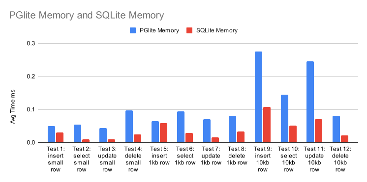
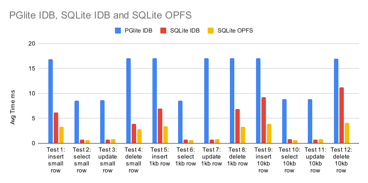
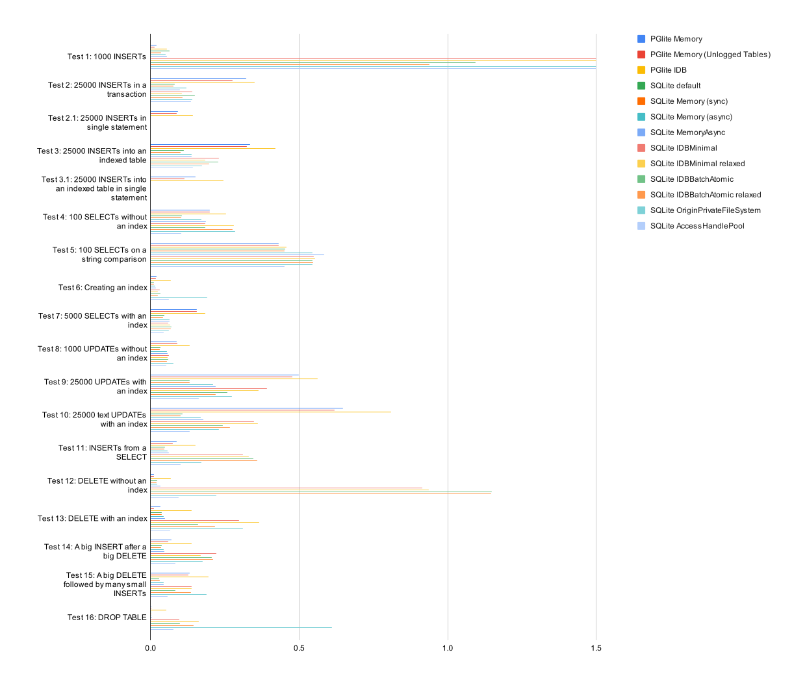
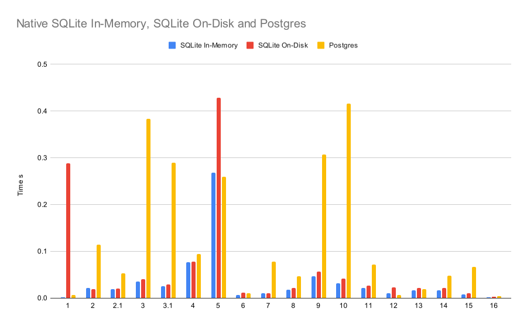

# Benchmarks

There are two sets of benchmarks, one testing [round trip time](#round-trip-time-benchmarks) for both PGlite and wa-sqlite, and [another](#pglite-results-from-wa-sqlite-benchmark-suite) based on the [wa-sqlite bechmarks](https://rhashimoto.github.io/wa-sqlite/demo/benchmarks.html).

To run, start a web server in this directory and open `index.html` for the benchmarks based on the wa-sqlite set, and `rtt.html` for the round trip time benchmarks.

There is also a script `baseline.ts` that generates a set of native baseline results for the wa-sqlite benchmark suite, see [comparative native (none wasm) results below](#native-baseline).

These results below were run on a M2 Macbook Air.

These initial benchmarks show good performance, albeit not quite on par with wa-sqlite yet. We have many plans for improving upon these, including dropping the need for the [emscripten option `EMULATE_FUNCTION_POINTER_CASTS`](https://github.com/electric-sql/pglite/issues/56) and moving to [OPFS for persistance](https://github.com/electric-sql/pglite/issues/9).

## Round trip time benchmarks:

These tests run a series of inserts/updates/deletes to find the average time to execute the type of CRUD operations that are regularly used in an app.





<details>
<summary>Round trip time results</summary>
<table>
  <thead>
    <tr>
      <th>Test</th>
      <th>PGlite Memory</th>
      <th>PGlite IDB</th>
      <th>SQLite Memory</th>
      <th>SQLite IDB</th>
      <th>SQLite OPFS</th>
    </tr>
  </thead>
  <tbody>
    <tr>
      <td>Test 1: insert small row</td>
      <td>0.050</td>
      <td>16.905</td>
      <td>0.030</td>
      <td>6.156</td>
      <td>3.315</td>
    </tr>
    <tr>
      <td>Test 2: select small row</td>
      <td>0.054</td>
      <td>8.591</td>
      <td>0.010</td>
      <td>0.705</td>
      <td>0.639</td>
    </tr>
    <tr>
      <td>Test 3: update small row</td>
      <td>0.044</td>
      <td>8.674</td>
      <td>0.009</td>
      <td>0.705</td>
      <td>0.811</td>
    </tr>
    <tr>
      <td>Test 4: delete small row</td>
      <td>0.097</td>
      <td>17.026</td>
      <td>0.024</td>
      <td>3.891</td>
      <td>2.825</td>
    </tr>
    <tr>
      <td>Test 5: insert 1kb row</td>
      <td>0.065</td>
      <td>17.071</td>
      <td>0.059</td>
      <td>6.983</td>
      <td>3.402</td>
    </tr>
    <tr>
      <td>Test 6: select 1kb row</td>
      <td>0.094</td>
      <td>8.589</td>
      <td>0.029</td>
      <td>0.711</td>
      <td>0.661</td>
    </tr>
    <tr>
      <td>Test 7: update 1kb row</td>
      <td>0.070</td>
      <td>17.030</td>
      <td>0.016</td>
      <td>0.761</td>
      <td>0.821</td>
    </tr>
    <tr>
      <td>Test 8: delete 1kb row</td>
      <td>0.081</td>
      <td>17.037</td>
      <td>0.034</td>
      <td>6.886</td>
      <td>3.349</td>
    </tr>
    <tr>
      <td>Test 9: insert 10kb row</td>
      <td>0.275</td>
      <td>17.047</td>
      <td>0.107</td>
      <td>9.267</td>
      <td>3.856</td>
    </tr>
    <tr>
      <td>Test 10: select 10kb row</td>
      <td>0.145</td>
      <td>8.824</td>
      <td>0.051</td>
      <td>0.832</td>
      <td>0.681</td>
    </tr>
    <tr>
      <td>Test 11: update 10kb row</td>
      <td>0.245</td>
      <td>8.835</td>
      <td>0.071</td>
      <td>0.746</td>
      <td>0.851</td>
    </tr>
    <tr>
      <td>Test 12: delete 10kb row</td>
      <td>0.081</td>
      <td>17.006</td>
      <td>0.021</td>
      <td>11.224</td>
      <td>4.079</td>
    </tr>
  </tbody>
</table>
</details>

## wa-sqlite benchmark suite

The wa-sqlite benchmark suite performs a number of large queries to test the performance of the sql engin.



<details>
  <summary>PGlite results</summary>

<table>
  <thead>
    <tr>
      <th>Test</th>
      <th>Memory</th>
      <th>Memory (Unlogged Tables)</th>
      <th>Emscripten IndexedDB FS</th>
    </tr>
  </thead>
  <tbody>
    <tr>
      <td>Test 1: 1000 INSERTs</td>
      <td>0.020</td>
      <td>0.013</td>
      <td>0.054</td>
    </tr>
    <tr>
      <td>Test 2: 25000 INSERTs in a transaction</td>
      <td>0.322</td>
      <td>0.277</td>
      <td>0.351</td>
    </tr>
    <tr>
      <td>Test 2.1: 25000 INSERTs in single statement</td>
      <td>0.092</td>
      <td>0.087</td>
      <td>0.142</td>
    </tr>
    <tr>
      <td>Test 3: 25000 INSERTs into an indexed table</td>
      <td>0.336</td>
      <td>0.325</td>
      <td>0.421</td>
    </tr>
    <tr>
      <td>Test 3.1: 25000 INSERTs into an indexed table in single statement</td>
      <td>0.151</td>
      <td>0.115</td>
      <td>0.245</td>
    </tr>
    <tr>
      <td>Test 4: 100 SELECTs without an index</td>
      <td>0.200</td>
      <td>0.200</td>
      <td>0.254</td>
    </tr>
    <tr>
      <td>Test 5: 100 SELECTs on a string comparison</td>
      <td>0.431</td>
      <td>0.431</td>
      <td>0.457</td>
    </tr>
    <tr>
      <td>Test 6: Creating an index</td>
      <td>0.019</td>
      <td>0.018</td>
      <td>0.069</td>
    </tr>
    <tr>
      <td>Test 7: 5000 SELECTs with an index</td>
      <td>0.155</td>
      <td>0.156</td>
      <td>0.185</td>
    </tr>
    <tr>
      <td>Test 8: 1000 UPDATEs without an index</td>
      <td>0.087</td>
      <td>0.089</td>
      <td>0.131</td>
    </tr>
    <tr>
      <td>Test 9: 25000 UPDATEs with an index</td>
      <td>0.499</td>
      <td>0.477</td>
      <td>0.563</td>
    </tr>
    <tr>
      <td>Test 10: 25000 text UPDATEs with an index</td>
      <td>0.648</td>
      <td>0.620</td>
      <td>0.810</td>
    </tr>
    <tr>
      <td>Test 11: INSERTs from a SELECT</td>
      <td>0.088</td>
      <td>0.075</td>
      <td>0.151</td>
    </tr>
    <tr>
      <td>Test 12: DELETE without an index</td>
      <td>0.012</td>
      <td>0.011</td>
      <td>0.068</td>
    </tr>
    <tr>
      <td>Test 13: DELETE with an index</td>
      <td>0.033</td>
      <td>0.011</td>
      <td>0.138</td>
    </tr>
    <tr>
      <td>Test 14: A big INSERT after a big DELETE</td>
      <td>0.071</td>
      <td>0.059</td>
      <td>0.139</td>
    </tr>
    <tr>
      <td>Test 15: A big DELETE followed by many small INSERTs</td>
      <td>0.132</td>
      <td>0.127</td>
      <td>0.196</td>
    </tr>
    <tr>
      <td>Test 16: DROP TABLE</td>
      <td>0.002</td>
      <td>0.002</td>
      <td>0.053</td>
    </tr>
  </tbody>
</table>

</details>

<details>
  <summary>WASM SQLite results</summary>

<table>
  <thead>
    <tr>
      <th>Test</th>
      <th>default</th>
      <th>Memory (sync)</th>
      <th>Memory (async)</th>
      <th>MemoryAsync</th>
      <th>IDBMinimal</th>
      <th>IDBMinimal relaxed</th>
      <th>IDBBatchAtomic</th>
      <th>IDBBatchAtomic relaxed</th>
      <th>OriginPrivateFileSystem</th>
      <th>AccessHandlePool</th>
    </tr>
  </thead>
  <tbody>
    <tr>
      <td>Test 1: 1000 INSERTs (very slow on IDB &amp; OPFS)</td>
      <td>0.064</td>
      <td>0.035</td>
      <td>0.051</td>
      <td>0.055</td>
      <td>2.384</td>
      <td>2.588</td>
      <td>1.094</td>
      <td>0.939</td>
      <td>18.847</td>
      <td>24.67</td>
    </tr>
    <tr>
      <td>Test 2: 25000 INSERTs in a transaction</td>
      <td>0.082</td>
      <td>0.077</td>
      <td>0.12</td>
      <td>0.098</td>
      <td>0.14</td>
      <td>0.105</td>
      <td>0.15</td>
      <td>0.107</td>
      <td>0.141</td>
      <td>0.137</td>
    </tr>
    <tr>
      <td>Test 3: 25000 INSERTs into an indexed table</td>
      <td>0.112</td>
      <td>0.1</td>
      <td>0.138</td>
      <td>0.138</td>
      <td>0.23</td>
      <td>0.185</td>
      <td>0.228</td>
      <td>0.198</td>
      <td>0.174</td>
      <td>0.143</td>
    </tr>
    <tr>
      <td>Test 4: 100 SELECTs without an index</td>
      <td>0.106</td>
      <td>0.104</td>
      <td>0.17</td>
      <td>0.187</td>
      <td>0.185</td>
      <td>0.281</td>
      <td>0.185</td>
      <td>0.275</td>
      <td>0.285</td>
      <td>0.103</td>
    </tr>
    <tr>
      <td>Test 5: 100 SELECTs on a string comparison</td>
      <td>0.454</td>
      <td>0.451</td>
      <td>0.546</td>
      <td>0.584</td>
      <td>0.549</td>
      <td>0.553</td>
      <td>0.546</td>
      <td>0.548</td>
      <td>0.545</td>
      <td>0.452</td>
    </tr>
    <tr>
      <td>Test 6: Creating an index</td>
      <td>0.012</td>
      <td>0.012</td>
      <td>0.016</td>
      <td>0.018</td>
      <td>0.031</td>
      <td>0.024</td>
      <td>0.033</td>
      <td>0.024</td>
      <td>0.191</td>
      <td>0.061</td>
    </tr>
    <tr>
      <td>Test 7: 5000 SELECTs with an index</td>
      <td>0.046</td>
      <td>0.042</td>
      <td>0.064</td>
      <td>0.064</td>
      <td>0.06</td>
      <td>0.067</td>
      <td>0.071</td>
      <td>0.068</td>
      <td>0.061</td>
      <td>0.044</td>
    </tr>
    <tr>
      <td>Test 8: 1000 UPDATEs without an index</td>
      <td>0.033</td>
      <td>0.032</td>
      <td>0.055</td>
      <td>0.058</td>
      <td>0.062</td>
      <td>0.057</td>
      <td>0.059</td>
      <td>0.056</td>
      <td>0.077</td>
      <td>0.053</td>
    </tr>
    <tr>
      <td>Test 9: 25000 UPDATEs with an index</td>
      <td>0.131</td>
      <td>0.131</td>
      <td>0.211</td>
      <td>0.22</td>
      <td>0.391</td>
      <td>0.364</td>
      <td>0.258</td>
      <td>0.219</td>
      <td>0.274</td>
      <td>0.163</td>
    </tr>
    <tr>
      <td>Test 10: 25000 text UPDATEs with an index</td>
      <td>0.108</td>
      <td>0.101</td>
      <td>0.168</td>
      <td>0.177</td>
      <td>0.348</td>
      <td>0.362</td>
      <td>0.244</td>
      <td>0.267</td>
      <td>0.23</td>
      <td>0.132</td>
    </tr>
    <tr>
      <td>Test 11: INSERTs from a SELECT</td>
      <td>0.049</td>
      <td>0.047</td>
      <td>0.057</td>
      <td>0.062</td>
      <td>0.311</td>
      <td>0.33</td>
      <td>0.347</td>
      <td>0.358</td>
      <td>0.171</td>
      <td>0.102</td>
    </tr>
    <tr>
      <td>Test 12: DELETE without an index</td>
      <td>0.023</td>
      <td>0.02</td>
      <td>0.023</td>
      <td>0.034</td>
      <td>0.915</td>
      <td>0.936</td>
      <td>1.148</td>
      <td>1.146</td>
      <td>0.222</td>
      <td>0.094</td>
    </tr>
    <tr>
      <td>Test 13: DELETE with an index</td>
      <td>0.037</td>
      <td>0.038</td>
      <td>0.044</td>
      <td>0.049</td>
      <td>0.298</td>
      <td>0.365</td>
      <td>0.161</td>
      <td>0.217</td>
      <td>0.31</td>
      <td>0.065</td>
    </tr>
    <tr>
      <td>Test 14: A big INSERT after a big DELETE</td>
      <td>0.037</td>
      <td>0.036</td>
      <td>0.045</td>
      <td>0.047</td>
      <td>0.221</td>
      <td>0.169</td>
      <td>0.207</td>
      <td>0.21</td>
      <td>0.175</td>
      <td>0.084</td>
    </tr>
    <tr>
      <td>Test 15: A big DELETE followed by many small INSERTs</td>
      <td>0.029</td>
      <td>0.031</td>
      <td>0.043</td>
      <td>0.045</td>
      <td>0.138</td>
      <td>0.138</td>
      <td>0.083</td>
      <td>0.137</td>
      <td>0.189</td>
      <td>0.058</td>
    </tr>
    <tr>
      <td>Test 16: DROP TABLE</td>
      <td>0.002</td>
      <td>0.003</td>
      <td>0.002</td>
      <td>0.004</td>
      <td>0.096</td>
      <td>0.163</td>
      <td>0.098</td>
      <td>0.144</td>
      <td>0.61</td>
      <td>0.077</td>
    </tr>
  </tbody>
</table>

</details>

## Native baseline:

All tests run with Node, [Better-SQLite3](https://www.npmjs.com/package/better-sqlite3) and [node-postgres](https://www.npmjs.com/package/pg) (via [embedded-postgres](https://github.com/leinelissen/embedded-postgres))

To run:

```
# in this dir
npm install
npx tsx baseline.ts
```



<details>
<summary>Native Results</summary>

<table cellspacing="0" cellpadding="0">
  <thead>
    <tr>
      <th>Test</th>
      <th>SQLite In-Memory</th>
      <th>SQLite On-Disk</th>
      <th>Postgres</th>
    </tr>
  </thead>
  <tbody>
    <tr>
      <td>Test 1: 1000 INSERTs</td>
      <td>0.002</td>
      <td>0.288</td>
      <td>0.007</td>
    </tr>
    <tr>
      <td>Test 2: 25000 INSERTs in a transaction</td>
      <td>0.022</td>
      <td>0.019</td>
      <td>0.114</td>
    </tr>
    <tr>
      <td>Test 2.1: 25000 INSERTs in single statement</td>
      <td>0.019</td>
      <td>0.02</td>
      <td>0.053</td>
    </tr>
    <tr>
      <td>Test 3: 25000 INSERTs into an indexed table</td>
      <td>0.035</td>
      <td>0.04</td>
      <td>0.383</td>
    </tr>
    <tr>
      <td>Test 3.1: 25000 INSERTs into an indexed table in single statement</td>
      <td>0.025</td>
      <td>0.029</td>
      <td>0.29</td>
    </tr>
    <tr>
      <td>Test 4: 100 SELECTs without an index</td>
      <td>0.076</td>
      <td>0.078</td>
      <td>0.094</td>
    </tr>
    <tr>
      <td>Test 5: 100 SELECTs on a string comparison</td>
      <td>0.268</td>
      <td>0.429</td>
      <td>0.259</td>
    </tr>
    <tr>
      <td>Test 6: Creating an index</td>
      <td>0.007</td>
      <td>0.011</td>
      <td>0.01</td>
    </tr>
    <tr>
      <td>Test 7: 5000 SELECTs with an index</td>
      <td>0.01</td>
      <td>0.01</td>
      <td>0.078</td>
    </tr>
    <tr>
      <td>Test 8: 1000 UPDATEs without an index</td>
      <td>0.018</td>
      <td>0.021</td>
      <td>0.047</td>
    </tr>
    <tr>
      <td>Test 9: 25000 UPDATEs with an index</td>
      <td>0.047</td>
      <td>0.056</td>
      <td>0.307</td>
    </tr>
    <tr>
      <td>Test 10: 25000 text UPDATEs with an index</td>
      <td>0.032</td>
      <td>0.041</td>
      <td>0.416</td>
    </tr>
    <tr>
      <td>Test 11: INSERTs from a SELECT</td>
      <td>0.022</td>
      <td>0.027</td>
      <td>0.072</td>
    </tr>
    <tr>
      <td>Test 12: DELETE without an index</td>
      <td>0.01</td>
      <td>0.023</td>
      <td>0.007</td>
    </tr>
    <tr>
      <td>Test 13: DELETE with an index</td>
      <td>0.017</td>
      <td>0.021</td>
      <td>0.019</td>
    </tr>
    <tr>
      <td>Test 14: A big INSERT after a big DELETE</td>
      <td>0.017</td>
      <td>0.021</td>
      <td>0.048</td>
    </tr>
    <tr>
      <td>Test 15: A big DELETE followed by many small INSERTs</td>
      <td>0.008</td>
      <td>0.01</td>
      <td>0.067</td>
    </tr>
    <tr>
      <td>Test 16: DROP TABLE</td>
      <td>0.001</td>
      <td>0.003</td>
      <td>0.004</td>
    </tr>
  </tbody>
</table>
</details>
